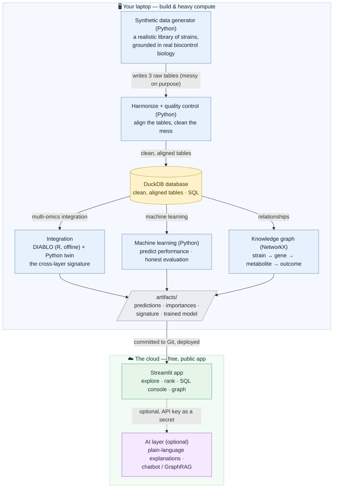
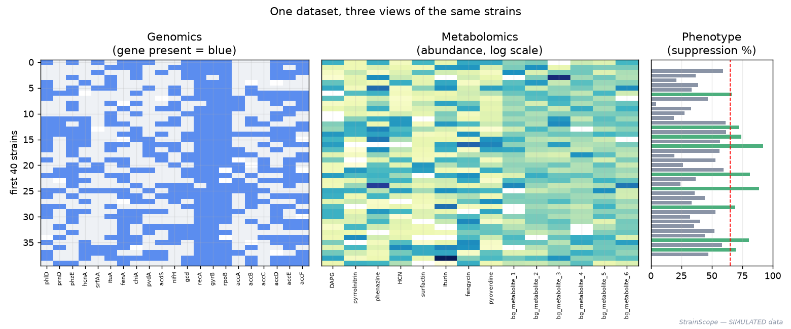

# StrainScope 🧫🧬📊

<!-- Cover image goes here once the app exists:
[](docs/img/cover_strainscope.png) -->

**▶ Live app — coming after the deployment phase** · **v0.1.0 (in development)**
· 


-6f42c1)


-informational)

**Reading several different molecular "fingerprints" of beneficial microbes at
once, and predicting which ones are worth developing further — built from
scratch, in public, fully explained.**

> Every term used anywhere in this repo — biological or technical — is defined
> in plain language in [`docs/GLOSSARY.md`](docs/GLOSSARY.md). If a word isn't
> there, that's a documentation bug.

---

## Contents

- [What is a beneficial microbe? (start here)](#what-is-a-beneficial-microbe-start-here)
- [The problem this project tackles](#the-problem-this-project-tackles)
- [How it works](#how-it-works)
- [The data at a glance](#the-data-at-a-glance)
- [Results, phase by phase](#results-phase-by-phase) — fills in as each phase completes
- [Build log](#build-log) — every phase, linked to its guide, with status
- [**The tutorial, in order**](#the-tutorial-in-order) — the documents that teach every step from a blank laptop
- [Roadmap](#roadmap) — the AI features and upgrades that come after the core, with reasons each waits
- [About the data (honesty notes)](#about-the-data-honesty-notes)
- [Repository map](#repository-map) — every file, annotated
- [How to run](#how-to-run)
- [How I work on this repo (branch model)](#how-i-work-on-this-repo-branch-model)
- [Why the documentation is so detailed](#why-the-documentation-is-so-detailed)

## What is a beneficial microbe? (start here)

Imagine a farmer whose crop is under attack by a fungal disease. Instead of
spraying a synthetic chemical, they treat the field with a *living* helper: a
harmless soil bacterium that naturally out-competes the fungus, or produces a
compound that keeps it in check. That helper is a **beneficial microbe**, and
using nature's own organisms this way — to protect plants or improve soil —
is the world of **biologicals**.

Here's the catch that makes it a data problem. There are thousands of candidate
microbes, and only a few actually work well in the real world. Testing each one
properly is slow and expensive. But every microbe carries molecular "fingerprints"
we *can* measure cheaply:

- its **genome** — the microbe's blueprint, i.e. which useful genes it carries
  (think of it as a list of tools in the microbe's toolbox);
- its **metabolites** — the small-molecule chemicals it actually *produces*
  (think of it as the products coming off the microbe's production line);
- its measured **performance** — how well it suppressed a disease in a trial
  (the "job-performance score").

One microbe = one **strain**. One strain's row in this project's data = its three
fingerprints plus its score.

**StrainScope's question:** *can we read those cheap fingerprints, combine them
intelligently, and predict which strains are worth the expensive trials — and
explain why?*

## The problem this project tackles

**The pain point.** Choosing which natural strains to develop is mostly
trial-and-error: screen hundreds, test them one slow assay at a time, and hope.
Teams would love to *predict* the winners from cheap molecular profiles first —
but the data fights back in a specific way:

- **It comes in incompatible pieces.** The genomic fingerprint, the metabolomic
  fingerprint, and the performance score are three completely different kinds of
  table, in different units and scales. Most analyses look at **one** at a time
  and miss the signal that only appears when you read them **together**.
- **It's dirty.** Real measurements have missing values, batch-to-batch drift,
  duplicates, and outliers. Building anything trustworthy means cleaning that up
  first — and being able to show you did.
- **The useful strains are rare.** Most candidates don't work, so a naive model
  can score well just by always guessing "won't work" — which is useless.

**Why it matters.** Better prediction means fewer wasted trials, faster discovery
of effective biologicals, and more sustainable crop protection that leans on
nature instead of synthetic chemistry. The methods to do this — multi-omics
integration, machine learning, network analysis — are established in the
research literature, but clear, end-to-end, *beginner-reproducible* examples are
scarce.

**What StrainScope is.** An end-to-end, open workflow that does the whole thing
honestly: a Python script **generates** a realistic, biologically-grounded
synthetic library of strains with three fingerprint layers; a cleaning step
**harmonizes and quality-controls** the mess; the layers are **integrated** with a
recognised multi-omics method (DIABLO, from the R package mixOmics) *and* a
plain-Python counterpart; **machine-learning models** predict strain performance
with honest cross-validation and error analysis; a **knowledge graph** captures
the strain → gene → metabolite → outcome relationships; and an interactive
**Streamlit app**, deployed free for anyone to use, ties it together — with an
optional AI layer that explains results in plain language. Every step is
documented so a complete beginner can rebuild and understand all of it — **the
repository is the tutorial.**

## How it works



In words: **make** the data with a transparent script; **clean** it into a single
queryable database; **integrate** the layers and **train** models on your laptop,
saving small result files; **build** a relationship graph from the same data;
then **serve** everything in a public app, with optional AI explanations layered
on top. The heavy work happens once, offline; the app just reads the small
results, which is what keeps the public deployment fast and free.

## The data at a glance

*StrainScope's dataset is **simulated** — created by the generator in
[`src/strainscope/generate_data.py`](src/strainscope) with a fixed random seed, so
anyone who clones the repo reproduces it exactly. It is designed to mirror a real
biocontrol-screening scenario and is grounded in real gene families and compound
classes, but it is not real measurement data. See [About the data](#about-the-data-honesty-notes).*

The planned shape of the dataset (final numbers from the generator, fixed seed):

| Fact | Value |
| --- | --- |
| Samples (microbial strains) | 600 (+8 deliberate duplicate rows = 608 raw rows) |
| Genomic layer | 21 columns: real biocontrol gene families (`phlD`, `srfAA`, `ituA`, `chiA`, `pvdA`, …) plus housekeeping (`recA`/`gyrB`/`rpoB`) and accessory-noise genes |
| Metabolomic layer | 14 columns: secreted-compound abundances (DAPG, surfactin, iturin, fengycin, pyoverdine, …) plus background-noise compounds |
| Phenotype (the target) | `suppression_score` (0–100 %) and an `is_effective` label — **142 effective (23.7 %)**, plus a secondary `growth_promotion` score |
| Built-in realism | cross-layer correlations, class imbalance (~24 % positives), 491 missing metabolite cells, 245 missing gene calls, 86 outliers, 8 duplicated strains, a batch effect across 6 batches, and 6 impossible scores |
| Reproducibility | one generator script, fixed seed (42) — identical data on every machine |

## Results, phase by phase

*Each phase leaves a visible artifact — a table, a chart, the app. As phases
complete, one figure per phase appears here with what it means, exactly as in the
build log below. Nothing is shown before it exists.*

- **Phase 1 — Data generation:** ✅ a reproducible generator (`src/strainscope/generate_data.py`, fixed seed) builds 600 strains across three grounded-in-real-biology omics layers, with class imbalance, missing values, batch effects, outliers, and duplicates injected on purpose. One picture — the same strains across all three layers:

  

  The winners are deliberately rare (23.7 % effective), and the hidden signal is real: strains producing more antifungal compounds tend to suppress disease more — with the honest noise and artifacts that make the later cleaning and modelling phases meaningful. Interactive version: `docs/interactive/signal_scatter.html`.
- **Phase 2 — Harmonization & QC:** *(pending)* before/after cleaning ledger —
  rows in, rows out, what each check caught.
- **Phase 3 — Integration:** *(pending)* the cross-layer signature (which genes
  and metabolites, together, separate performers from non-performers).
- **Phase 4 — Machine learning:** *(pending)* model comparison with honest
  cross-validated scores and an error analysis.
- **Phase 5 — Knowledge graph:** *(pending)* the strain–gene–metabolite network,
  with the most connected "hub" features.
- **Phase 6 — The app:** *(pending)* screenshot of the deployed explorer.
- **Phase 7 — Deployment & AI layer:** *(pending)* the live URL and the
  plain-language explanation feature in action.

## Build log

| # | Document | Status |
| --- | --- | --- |
| — | [Glossary — every term in plain words](docs/GLOSSARY.md) | 🔨 living document |
| 0 | [Architecture — how it all fits together](docs/00-architecture.md) | ✅ |
| 0 | [Environment setup from a blank laptop](docs/01-setup.md) | ✅ |
| 1 | [Data generation: a realistic synthetic library](docs/02-data-generation.md) | ✅ |
| 2 | [Harmonization & quality control](docs/03-harmonization-qc.md) | ⬜ planned |
| 3 | [Multi-omics integration (DIABLO + Python)](docs/04-integration.md) | ⬜ planned |
| 4 | [Machine learning & honest evaluation](docs/05-machine-learning.md) | ⬜ planned |
| 5 | [Knowledge graph (core AI feature)](docs/06-knowledge-graph.md) | ⬜ planned |
| 6 | [The Streamlit app](docs/07-app.md) | ⬜ planned |
| 7 | [Deployment + AI explanation layer](docs/08-deployment-ai.md) | ⬜ planned |
| 8 | [Packaging: release notes, roadmap, 1.0](docs/09-packaging.md) | ⬜ planned |

*Legend: ✅ done · 🔨 in progress · ⬜ planned.*

## The tutorial, in order

Every step of this project — from an empty laptop to a deployed app — is taught in
`docs/`, written for a complete beginner, with every term defined
([glossary](docs/GLOSSARY.md)) and every command shown with its expected output.
Read in order:

| # | Guide | What it teaches |
| --- | --- | --- |
| 00 | [Architecture](docs/00-architecture.md) | How all the pieces fit together; backend/frontend/database in plain words |
| 01 | [Setup](docs/01-setup.md) | Blank laptop → working workshop (Python, R, Git, `.venv`, `renv`, the `master`/`beta`/`develop` model) |
| 02 | [Data generation](docs/02-data-generation.md) | Random seeds & reproducibility; designing realistic synthetic multi-omics data |
| 03 | [Harmonization & QC](docs/03-harmonization-qc.md) | Aligning tables; missingness, duplicates, outliers, batch effects; the cleaning ledger |
| 04 | [Integration](docs/04-integration.md) | What multi-omics integration *is*; DIABLO in R and a Python counterpart; the same task in two languages |
| 05 | [Machine learning](docs/05-machine-learning.md) | Train/test splits, cross-validation, class imbalance, metrics, error analysis |
| 06 | [Knowledge graph](docs/06-knowledge-graph.md) | Ontologies & graphs (a "family tree for concepts"); building and querying one with NetworkX |
| 07 | [The app](docs/07-app.md) | Streamlit; turning analysis into buttons; a read-only SQL console |
| 08 | [Deployment & AI layer](docs/08-deployment-ai.md) | Streamlit Community Cloud; secrets; an LLM explanation layer that degrades gracefully |
| 09 | [Packaging](docs/09-packaging.md) | Versions, release notes, roadmap, license, the 1.0 tag |
| — | [Glossary](docs/GLOSSARY.md) | Every term, plain language, by phase |

## Roadmap

What comes after the core is built, and why each item waits — deferrals with
reasons, not promises:

- **RAG / GraphRAG chatbot** — a chat box that answers questions about the
  project in plain English, grounded in its own data and docs; the GraphRAG
  version answers by *walking the knowledge graph*. Waits on: the core knowledge
  graph (Phase 5) and the explanation layer (Phase 7), which it builds on.
- **MCP server** — wrap the model and data as a small [Model Context
  Protocol](https://modelcontextprotocol.io) server so an AI assistant can query
  StrainScope directly and operate the ranking model live. Waits on: a stable
  prediction API to expose. Flagged as a strong, modern differentiator.
- **Read-only AI agent** — an assistant that *acts* (plans, queries, predicts,
  summarises) rather than just answering, scoped so it can never modify data.
  Waits on: the MCP server and careful guardrails — a half-built agent is worse
  than none.
- **Swap in real data** — a documented path to replace the synthetic layers with
  a real public metabolomics/microbiome dataset, demonstrating environment
  portability. Waits on: the core, so the "before/after" is a clean, small change.
- **Graph database (Neo4j)** — move the NetworkX graph into a real graph database
  for larger networks and richer queries. Waits on: a real need for scale.
- **Level-up deployment** — an always-on host with a custom domain, and container
  packaging (Docker) for one-command reproducible runs. Waits on: the free tier
  being genuinely outgrown.

## About the data (honesty notes)

- **The dataset is simulated, and this is stated everywhere.** No part of
  StrainScope claims the numbers are real measurements. The data is produced by a
  single, commented generator script with a fixed random seed, so it is identical
  on every machine and fully inspectable.
- **Why synthetic, honestly:** clean, matched multi-omics data on the *same*
  strains — genomics *and* metabolomics *and* a performance score, all aligned —
  is not something you can download as one tidy package. Rather than pretend
  otherwise, StrainScope *builds* the data transparently. Designing realistic
  synthetic data (with correlations, imbalance, and messiness on purpose) is
  itself a demonstrated skill, and companies use synthetic data for real reasons:
  privacy, rare events, and the absence of public data.
- **Grounded in real biology:** the gene families and compound classes used are
  real ones known to matter for microbes that protect plants (antibiotic-
  biosynthesis genes, siderophores, chitinases, ACC-deaminase; lipopeptides such
  as surfactin, iturin, and fengycin). This keeps the exercise realistic and
  educational without passing invented numbers off as measured ones.
- **The honest limitation:** a model trained on synthetic data proves the
  *workflow* is correct — the integration, the cleaning, the evaluation, the app —
  **not** that the predictions would hold on real-world strains. That boundary is
  stated in the docs and is exactly how synthetic-data work should be presented.
- **Optional real-data path:** the roadmap includes swapping in a real public
  dataset, for anyone who wants to push from "workflow proven" toward
  "performance measured".

## Repository map

The full tree, annotated with the phase that creates each piece (⬜ = created in a
later phase):

```
strainscope/
├── README.md                      ← you are here
├── LICENSE                        ← MIT (added at packaging)
├── check-public-safe.sh           ← pre-push safety gate (run before every push)
├── requirements.txt               ← Python deps (the R side: renv.lock)
├── renv.lock                      ← exact R package versions (the R "receipt")
├── strainscope.Rproj              ← RStudio project file (optional; open it in RStudio)
├── .Rprofile                      ← auto-activates renv in this project
├── .gitignore                     ← incl. .venv/, data/, secrets, renv library
├── .streamlit/
│   ├── config.toml                ← app config (committed)
│   └── secrets.toml               ← API keys — GITIGNORED, never committed
│
├── docs/                          ← the tutorial (the repo IS the tutorial)
│   ├── 00-architecture.md         ← how it all fits together                     ✅
│   ├── 01-setup.md                ← blank laptop → working workshop              ✅
│   ├── 02-data-generation.md      ← the synthetic library                        ✅
│   ├── 03-harmonization-qc.md     ← cleaning & quality control                   ⬜
│   ├── 04-integration.md          ← multi-omics integration (DIABLO + Python)    ⬜
│   ├── 05-machine-learning.md     ← models & honest evaluation                   ⬜
│   ├── 06-knowledge-graph.md      ← the graph (core AI feature)                  ⬜
│   ├── 07-app.md                  ← the Streamlit app                            ⬜
│   ├── 08-deployment-ai.md        ← going live + AI explanation layer            ⬜
│   ├── 09-packaging.md            ← release notes, roadmap, license              ⬜
│   ├── GLOSSARY.md                ← every term, plain language, by phase         🔨
│   └── interactive/               ← self-contained interactive charts (Plotly)   ✅
│       └── signal_scatter.html    ← Phase 1: hover any strain (open in browser)
│
├── figures/                       ← teaching figures, generated from the data
│   ├── make_phase1_figures.py     ← Phase 1: regenerates every figure below      ✅
│   └── *.png                      ← class balance, 3-layer overview, signal, …   ✅
│
├── src/strainscope/               ← the reusable backend code (Python)
│   ├── __init__.py
│   ├── generate_data.py           ← Phase 1: the synthetic data generator        ✅
│   ├── harmonize.py               ← Phase 2: harmonization + QC                   ⬜
│   ├── database.py                ← Phase 2: load into / query DuckDB             ⬜
│   ├── integrate.py               ← Phase 3: Python multi-omics integration       ⬜
│   ├── model.py                   ← Phase 4: ML training + evaluation             ⬜
│   ├── graph.py                   ← Phase 5: build the knowledge graph            ⬜
│   └── explain.py                 ← Phase 7: LLM explanation layer (optional)     ⬜
│
├── R/                             ← the one specialised R step
│   └── diablo_integration.R       ← Phase 3: DIABLO integration (run offline)     ⬜
│
├── artifacts/                     ← small precomputed outputs the app reads
│   ├── predictions.csv            ← per-strain predicted scores                   ⬜
│   ├── feature_importance.csv     ← which features drive predictions             ⬜
│   ├── diablo_signature.csv       ← the cross-layer signature from DIABLO        ⬜
│   └── model.pkl                  ← the trained model                            ⬜
│
├── app/
│   └── streamlit_app.py           ← the deployed app (Phases 6–7)                 ⬜
│
├── tests/                         ← automated checks (pytest), grown each phase   ⬜
├── notebooks/                     ← optional exploratory notebooks
│
├── data/                          ← NOT in Git; regenerated by the generator
│   ├── raw/                       ← the three raw fingerprint tables
│   └── processed/                 ← cleaned, harmonized tables + strainscope.duckdb
│
├── .venv/                         ← Python's sealed toolbox — NOT in Git
└── renv/                          ← R's sealed library — NOT in Git (rebuilt from renv.lock)
```

| Path | What lives here |
| --- | --- |
| root files | Release surface: README, LICENSE, the pre-push safety gate (`check-public-safe.sh`), the two dependency receipts (`requirements.txt`, `renv.lock`) |
| `docs/` | The beginner tutorial + glossary — the repo's teaching layer |
| `src/strainscope/` | The reusable Python backend: generate, clean, store, integrate, model, graph, explain |
| `R/` | The single specialised R script (DIABLO integration), run offline |
| `artifacts/` | Small precomputed outputs the app serves — the bridge from laptop to cloud |
| `app/` | The Streamlit app (the public frontend) |
| `tests/` | Automated checks that prove the code does what it claims |
| `data/` | Raw + processed data and the DuckDB file — **never in Git**; regenerated on demand |

Two kinds of "not in Git": `data/` because the generator recreates it (that's the
proof it works), and `.venv/` / `renv/library/` / `secrets.toml` because they're
either rebuildable or secret. Secrets never enter version control.

## How to run

*Full command listings arrive with each phase; this is the shape it will take once
the core phases exist.*

**Quick start** (Python 3.12 and R installed — see [`docs/01-setup.md`](docs/01-setup.md)
for installing them on Windows, macOS, or Linux/RHEL 8):

```bash
git clone https://github.com/akannan2987/strainscope.git
cd strainscope

# Python toolbox — create the environment (use the Python you installed)
python -m venv .venv          # RHEL 8: python3.12 -m venv .venv
# Activate it:
source .venv/bin/activate     # Windows PowerShell: .\.venv\Scripts\Activate.ps1
pip install -r requirements.txt

# R toolbox (for the integration step)
R -e 'renv::restore()'             # rebuilds the exact R packages from renv.lock

# Build everything on your laptop (generates data, cleans, integrates, models, graph)
python -m strainscope.generate_data      # Phase 1  (⬜ arrives with that phase)
python -m strainscope.harmonize          # Phase 2
Rscript R/diablo_integration.R           # Phase 3 (offline; saves a small artifact)
python -m strainscope.model              # Phase 4
python -m strainscope.graph              # Phase 5

# Run the app locally
streamlit run app/streamlit_app.py       # Phases 6–7
```

> **Runs the same on Windows, macOS, and Linux (including RHEL 8 VMs).** The code
> uses platform-neutral file paths, and every tool in the stack is cross-platform.
> Where a command differs by OS, the docs show each variant. Set up once per
> machine; after that, editing, committing, and redeploying are the same short
> commands everywhere.

For the guided path — every step explained from a blank machine — start at
[`docs/01-setup.md`](docs/01-setup.md).

## How I work on this repo (branch model)

This project uses three branches: **`master`** (the stable, official version),
**`beta`** (a release-candidate preview), and **`develop`** (where day-to-day work
happens). The rhythm is: make changes on `develop`, push `develop` up to all three
at once, then bring local `master` back in step. Every phase ends with exactly this:

```bash
# safety first, before staging anything
pytest -q                     # once tests exist (Phase 4 on)
./check-public-safe.sh        # must print "SAFE TO PUSH"

git switch develop
git add -A
git commit -m "clear message describing the change"
git push origin develop develop:beta develop:master

# bring local master in step with the remote master just updated
git switch master
git pull --ff-only origin master
git switch develop
```

Every push is gated by `./check-public-safe.sh`, which inspects what Git tracks
and refuses the all-clear if a secret (an API key, a `.env`, a database file) or
a hard-coded local path would be published — `.gitignore` is the lock on the
door, this is the guard checking the bag on the way out.

The push line sends local `develop` to remote `develop` and fast-forwards remote
`beta` and `master` to match — three branches kept in lock-step with one command.
The `master` sync-back keeps the local copy consistent with what was just pushed.
`--ff-only` means "update only if it's clean, otherwise stop and warn." Tags are
pushed with `--tags` only when a new version is cut. The full reasoning and the
"if it goes wrong" cases are in [`docs/01-setup.md`](docs/01-setup.md).

## Why the documentation is so detailed

Documentation quality is a deliberate deliverable here, not an afterthought. An
analysis that can't be reproduced and explained is worth very little — so this
repo is written so that a complete beginner can rebuild it from scratch and learn
every concept along the way. The glossary rule at the top of this file is part of
that contract: every term is defined in plain language, or it's a bug.

---

*StrainScope is a personal learning project built in the open. The data is
synthetic and disclosed as such; the goal is a correct, honest, end-to-end
workflow that others can learn from and reproduce.*
