# StrainScope

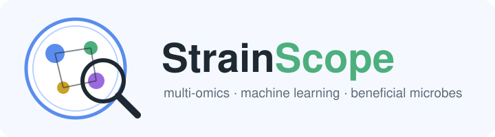

**Live app:** [strainscope.streamlit.app](https://strainscope.streamlit.app), online with nothing to install, or on your own computer ([how](#the-app)) · **Interactive figures:** [akannan2987.github.io/strainscope](https://akannan2987.github.io/strainscope/) · **Version:** v1.0.0, the first complete release ([changelog](CHANGELOG.md), [cite it](CITATION.cff))
· [](https://github.com/akannan2987/strainscope/actions/workflows/ci.yml)


-6f42c1)
[](LICENSE)

-informational)

Reading several molecular "fingerprints" of beneficial microbes at once, and
predicting which ones are worth developing further. Built from scratch in
public, with every step explained.

> **New here? Start with the [Handbook](docs/HANDBOOK.md).** It's one document
> that walks the whole journey from a blank laptop to the finished product,
> explains *why* at every step, and links to every specialised guide.
>
> Every term used anywhere in this repo, biological or technical, is defined
> in plain language in [`docs/GLOSSARY.md`](docs/GLOSSARY.md). If a word isn't
> there, that's a documentation bug.


---

## Contents

- [**The Handbook**](docs/HANDBOOK.md): the whole journey in one document (read this first)
- [What is a beneficial microbe? (start here)](#what-is-a-beneficial-microbe-start-here)
- [The problem this project tackles](#the-problem-this-project-tackles)
- [How it works](#how-it-works)
- [The app](#the-app): rank strains, see why, score your own, ask the database (online, on your computer, or in a container)
- [Ask StrainScope](#ask-strainscope): questions about the project, answered from its own documents with links
- [Ask the data, Ask the graph, and plain words](#ask-the-data-ask-the-graph-and-plain-words): questions about the data and how things connect, and every result in plain language
- [The MCP server](#the-mcp-server): ask your own AI assistant app about StrainScope, through nine read-only tools
- [The data at a glance](#the-data-at-a-glance)
- [Results, phase by phase](#results-phase-by-phase), Phases 1 to 8
- [Build log](#build-log): every phase, linked to its guide, with its status
- [The tutorial, in order](#the-tutorial-in-order), the documents that teach every step from a blank laptop
- [Roadmap](#roadmap): what was built, in which order and why, and the plans for a larger version
- [About the data (what's real and what's simulated)](#about-the-data-whats-real-and-whats-simulated)
- [Repository map](#repository-map), with every file annotated
- [How to run](#how-to-run): every command, the one-command pipeline, the container, updating and removing
- [Changelog](CHANGELOG.md): what changed, version by version
- [How I work on this repo (branch model)](#how-i-work-on-this-repo-branch-model)
- [Licence, citation, contributing](#licence-citation-contributing)
- [Why the documentation is so detailed](#why-the-documentation-is-so-detailed)

## What is a beneficial microbe? (start here)

Imagine a farmer whose crop is under attack by a fungal disease. Instead of
spraying a synthetic chemical, they treat the field with a *living* helper. That
could be a harmless soil bacterium that out-competes the pest, a fungus like
*Trichoderma* that parasitises the disease, a yeast that crowds it out, or an
oomycete that triggers the plant's own defences. Those helpers are **beneficial
microbes**, and using nature's own organisms like this (to protect plants or
improve soil) is the field known as **biologicals**.

Different microbes fight with different weapons. Bacteria use antibiotics and
lipopeptides, fungi use wall-digesting enzymes and toxins, and yeasts win by
competition. That variety is part of what makes picking the good ones hard.

Here's the catch that makes it a data problem. There are thousands of candidate
microbes, and only a few actually work well in the real world. Testing each one
properly is slow and expensive. But every microbe carries molecular "fingerprints"
we *can* measure cheaply:

- its **genome**, the microbe's blueprint: which useful genes it carries
  (a list of the tools in its toolbox, if you like);
- its **metabolites**, the small-molecule chemicals it actually *produces*
  (picture the goods coming off a factory's production line);
- its measured **performance**: how well it suppressed a disease in a trial
  (think of it as the microbe's grade on a field test).

One microbe is one **strain**. In this project's data, each strain gets one row
holding its three fingerprints plus its score.

**StrainScope's question:** *can we read those cheap fingerprints, combine them
sensibly, predict which strains are worth the expensive trials, and explain
why?*

## The problem this project tackles

Choosing which natural strains to develop is mostly trial and error: screen
hundreds, test them one slow assay at a time, and hope. Teams would love to
*predict* the winners from cheap molecular profiles first, but the data fights
back in some specific ways:

- **It comes in incompatible pieces.** The genomic fingerprint, the metabolomic
  fingerprint and the performance score are three very different kinds of
  table, with different units and scales. Most analyses look at one at a time
  and miss the signal that only shows up when you read them *together*.
- **It's dirty.** Real measurements have missing values, batch-to-batch drift,
  duplicates and outliers. Anything trustworthy has to start by cleaning that
  up, and you need to be able to show that you did.
- **The useful strains are rare.** Most candidates don't work, so a naive model
  can get a good score by always guessing "won't work", which tells you nothing
  useful.

Why does this matter? Better prediction means fewer wasted trials and faster
discovery of effective biologicals, and with them more sustainable crop
protection that leans on nature instead of synthetic chemistry. The methods for
this (multi-omics integration, machine learning, network analysis) are
established in the research literature, but clear end-to-end examples that a
*beginner can reproduce* are hard to find.

StrainScope is an open workflow that covers the whole process from end to end.
A Python script generates a realistic synthetic library of strains with three
fingerprint layers, grounded in real biology. A cleaning step harmonizes and
quality-controls the mess. The layers are then integrated with a recognised
multi-omics method (DIABLO, from the R package mixOmics) *and* a plain-Python
counterpart. Machine-learning models predict strain performance, checked with
careful cross-validation and error analysis, and a knowledge graph links each
strain to its genes, its compounds, the way each weapon works and the outcome,
so every ranking can be explained with sources. An interactive Streamlit
app, deployed free for anyone to use, ties it all together. Alongside it come
Ask StrainScope, a documentation assistant that answers questions about the
project from its own documents (and refuses questions that aren't about it), an
optional AI layer that explains results in plain language, and an MCP server
through which AI assistants can use the project's tools directly. Every step is
documented so that a complete beginner can rebuild and understand all of it: the
repository is the tutorial.

## How it works

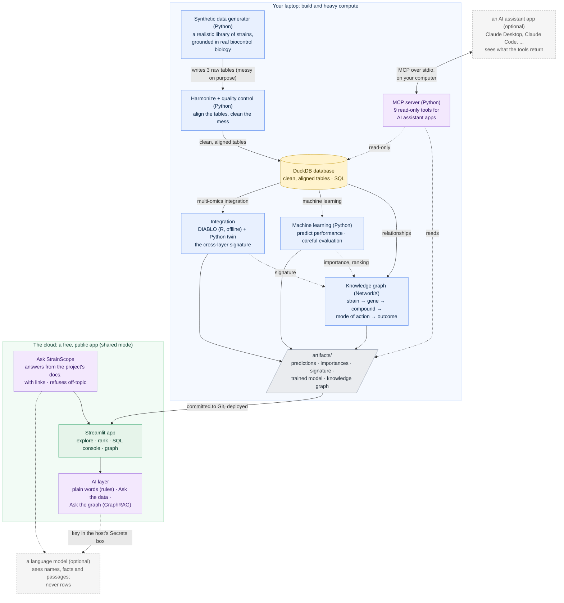
```mermaid
flowchart TD
    subgraph LAPTOP["Your laptop: build and heavy compute"]
        A["Synthetic data generator (Python)<br/>a realistic library of strains,<br/>grounded in real biocontrol biology"]
        B["Harmonize + quality control (Python)<br/>align the tables, clean the mess"]
        C[("DuckDB database<br/>clean, aligned tables · SQL")]
        D["Integration<br/>DIABLO (R, offline) + Python twin<br/>the cross-layer signature"]
        E["Machine learning (Python)<br/>predict performance · careful evaluation"]
        F["Knowledge graph (NetworkX)<br/>strain → gene → compound →<br/>mode of action → outcome"]
        G[/"artifacts/<br/>predictions · importances · signature ·<br/>trained model · knowledge graph"/]
        M["MCP server (Python)<br/>9 read-only tools for<br/>AI assistant apps"]
    end
    subgraph CLOUD["The cloud: a free, public app (shared mode)"]
        H["Streamlit app<br/>explore · rank · SQL console · graph"]
        I["AI layer<br/>plain words (rules) · Ask the data ·<br/>Ask the graph (GraphRAG)"]
        Q["Ask StrainScope<br/>answers from the project's docs,<br/>with links · refuses off-topic"]
    end
    L["a language model (optional)<br/>sees names, facts and passages;<br/>never rows"]
    N["an AI assistant app (optional)<br/>Claude Desktop, Claude Code, ...<br/>sees what the tools return"]
    A -->|"writes 3 raw tables (messy on purpose)"| B
    B -->|clean, aligned tables| C
    C -->|multi-omics integration| D
    C -->|machine learning| E
    C -->|relationships| F
    D --> G
    E --> G
    D -.->|signature| F
    E -.->|importance, ranking| F
    F --> G
    G -->|committed to Git, deployed| H
    H --> I
    I -.->|"key in the host's Secrets box"| L
    Q -.-> L
    Q --> H
    M -.->|read-only| C
    M -.->|reads| G
    N <-->|"MCP over stdio,<br/>on your computer"| M

    classDef laptop fill:#E8F0FE,stroke:#5B8DEF,color:#0B2545;
    classDef store fill:#FFF3CD,stroke:#C9A227,color:#4A3B00;
    classDef artifact fill:#EAECEF,stroke:#8A94A6,color:#1F2933;
    classDef cloud fill:#E6F4EA,stroke:#4CAF7D,color:#0B3D2E;
    classDef ai fill:#F3E8FD,stroke:#9C6ADE,color:#3A1D6E;
    classDef roadmap fill:#F5F5F5,stroke:#B0B0B0,color:#555555,stroke-dasharray:4 3;
    class A,B,D,E,F laptop
    class C store
    class G artifact
    class H cloud
    class I,Q,M ai
    class L,N roadmap
    style LAPTOP fill:#F5F9FF,stroke:#B9D2FF,color:#0B2545
    style CLOUD fill:#F2FBF5,stroke:#B7E4C7,color:#0B3D2E
```

In words: make the data with a transparent script and clean it into a single
queryable database. Then integrate the layers and train models on your laptop,
saving small result files, and build a relationship graph from the same data.
Finally, serve everything in a public app, with three assistants (about the
project, the data and the graph) that answer on their own and can use an
optional language model only to rewrite what they found. On your own computer,
an MCP server offers the same results to an AI assistant app through nine
read-only tools. The heavy work happens once, offline.
The app only reads the small results, and that's what keeps the public
deployment fast and free.

## The app


The app shows everything the analysis found, without any code to write. It runs
online at [strainscope.streamlit.app](https://strainscope.streamlit.app) with nothing to install (Phase 7; after a
quiet spell it sleeps, and the button on the page wakes it), or on your own
computer. After the setup in
[`docs/01-setup.md`](docs/01-setup.md), from the project folder:

```bash
python -m streamlit run app/streamlit_app.py
```

A browser tab opens on the Home page (press *Build the database now* if it asks;
it takes about 15 seconds). Then:

- **Ranking**: every strain, best first. A slider asks the question a screening
  team asks: *if we can test 50 strains, how many would work?* (47; picking at
  random would find about 12.)
- **Strain page**: one strain's chance of being effective, the same *in plain
  words*, the reasons behind it as walks through the knowledge graph (each with
  its source), and its corner of the graph drawn as five columns.
- **Knowledge graph**: the network, a path finder ("how is accE linked to disease
  suppression?" gets a single statistics-only step, with no mechanism behind it), and a look-up for anything.
- **Data**: upload your own strains as a CSV file. They're checked (with a plain
  message for every problem), scored by the saved model and explained by the
  graph, and never written to disk. On your own computer, the same page rebuilds
  every result from scratch with one button and compares the numbers with the
  committed ones (Phase 8).
- **SQL console**: ask the database anything, read-only, with the
  [Query Cookbook](docs/QUERY_COOKBOOK.md)'s recipes one click away.
- **Ask StrainScope, Ask the data, Ask the graph**: questions in plain words
  (next sections).
- **About this copy**: the version, a health check, and whether the AI features
  use a language model.

It runs the same on Windows, macOS and a RHEL 8 virtual machine (reach a VM
through an SSH tunnel), online on Streamlit Community Cloud, and in a container
with Docker or Podman. It works with a keyboard alone and with a screen reader,
which is checked on every page at every push. The guides are
[`docs/07-app.md`](docs/07-app.md), for the online copy
[`docs/08-deployment-ai.md`](docs/08-deployment-ai.md), and for the container and
the accessibility check [`docs/09-packaging.md`](docs/09-packaging.md).

## Ask StrainScope


A question about the project, answered from its own documents: the guides, the
Handbook, the glossary, the roadmaps and the code's docstrings. Every answer is a
passage quoted word for word, with a link to the exact heading it comes from, so
it can be checked. A question the documents don't cover is refused instead of
guessed. In the app it's the *Ask StrainScope* page; from a terminal:

```bash
python src/strainscope/ask.py "How do I score my own strains?"
```

It runs on your computer with what's already installed (a word-based search with
scikit-learn), and a set of golden questions checks its answers with every test
run. If you like, a language model can also write a short answer from the
passages found, either on your own computer (Ollama) or through a hosted
provider; it's off by default, and all it ever sees is its rules, the question and the
passages. The answer must cite the passages, or it isn't shown, and
`python src/strainscope/service.py check-model` tells you whether your model does.
How to switch one on and off, at home or online, and how the check works:
[`docs/LANGUAGE_MODEL.md`](docs/LANGUAGE_MODEL.md). The guide is [`docs/07b-docs-assistant.md`](docs/07b-docs-assistant.md).

## Ask the data, Ask the graph, and plain words


Two more assistants answer questions about the data and the graph, and every
result can be read as a short paragraph (Phase 7, [`docs/08-deployment-ai.md`](docs/08-deployment-ai.md)):

```bash
python src/strainscope/ask_data.py "Which strains are borderline?"         # a tested SQL recipe, shown, run read-only
python src/strainscope/ask_graph.py "How does iturin suppress disease?"    # a walk through the graph, every step sourced
python src/strainscope/narrate.py STRAIN_0485                              # one strain's rank in plain words
```

- **Ask the data** answers with a SQL query you can see and the table it returns.
  A tested recipe from the Query Cookbook comes first; with a language model
  switched on, a new query is written only when no recipe fits. That query
  passes a fifth guard (one read-only statement) and the SQL console's four,
  and the model is sent table and column names, never a row.
- **Ask the graph** (GraphRAG) finds what the question names, walks the
  knowledge graph and lists each step as a numbered fact with its source; a
  question about a strain gets that strain's explanation, by rules.
- **In plain words** is written by rules from the results, with no model, so
  every number in it can be traced. A test checks that for all 600 strains.

Both assistants are pages in the app with their own golden questions, run with
the tests, and the optional model of Ask StrainScope (local or hosted) serves
them too. The plain words appear on the Strain and Ranking pages.

## The MCP server

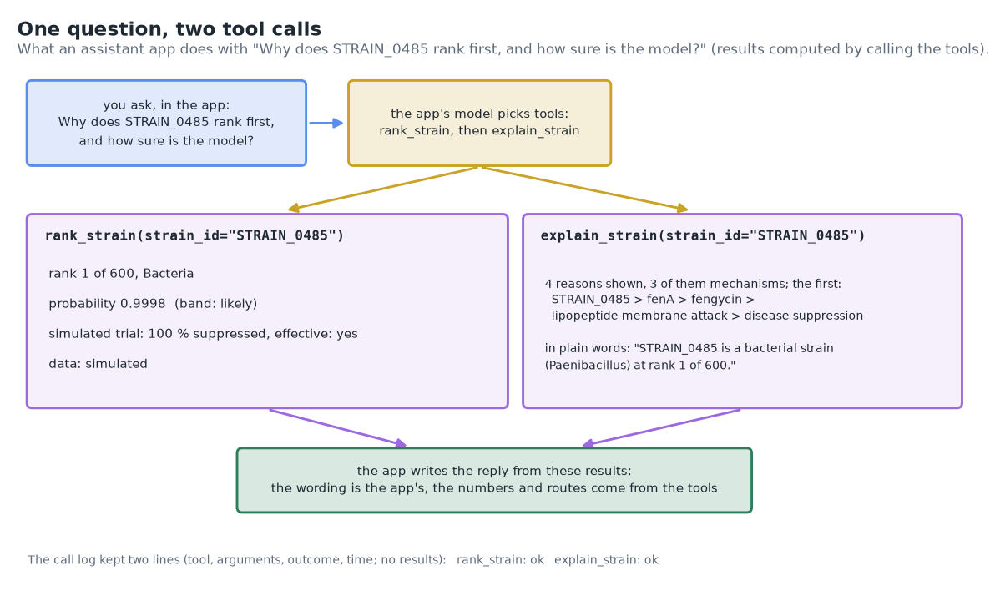

Many people now ask an AI assistant first. The MCP server lets an assistant app
on your computer (Claude Desktop, Claude Code, or any other app that speaks the
[Model Context Protocol](https://modelcontextprotocol.io)) use StrainScope's
results directly: ask it "why does STRAIN_0485 rank first?" and it calls
`rank_strain` and `explain_strain` and writes its reply from what they return
(Phase 7b, [`docs/08b-mcp-server.md`](docs/08b-mcp-server.md)).

```bash
python src/strainscope/mcp_server.py tools                                  # the nine tools and their inputs
python src/strainscope/mcp_server.py call rank_strain strain_id=STRAIN_0485 # one tool, here, as JSON
python src/strainscope/mcp_server.py check                                  # talk to it the way an app does
python src/strainscope/mcp_server.py config                                 # the settings for your app
```

- **Nine tools, all read-only:** the three assistants (`ask_docs`, `ask_data`,
  `ask_graph`), the database (`describe_database`, and `query_database` for one
  `SELECT` behind five guards, at most 200 rows), the DIABLO signature, a
  strain's rank and its explanation, and what testing the best N would bring.
- **Checked and logged:** a bad strain id, an over-long question or anything but
  one `SELECT` is refused with a sentence the assistant can act on, and every
  call adds a line to `data/processed/mcp_calls.log` (never the result).
- **Local:** the app starts the server and talks to it through its input and
  output; no network port is opened. What a tool returns goes to the app and
  its model, and the data is simulated.

## The data at a glance

*StrainScope's dataset is **simulated**. It's created by the generator in
[`src/strainscope/generate_data.py`](src/strainscope/generate_data.py) with a fixed random seed, so
anyone who clones the repo gets exactly the same data. It's designed to mirror a
real biocontrol-screening scenario and is grounded in real gene families and
compound classes, but it isn't real measurement data. See [About the data](#about-the-data-whats-real-and-whats-simulated).*

The shape of the dataset (numbers from the generator, fixed seed):

| Fact | Value |
| --- | --- |
| Samples (microbial strains) | 600 across 4 kingdoms: Bacteria 267, Fungi 183, Yeast 95, Oomycete 55 (+8 duplicate rows = 608 raw rows) |
| Genomic layer | 31 columns of real biocontrol gene families, grouped by kingdom: bacterial antibiotics/lipopeptides (`phlD`, `srfAA`, `ituA`, `pvdA`…), fungal/oomycete mycoparasitism & toxins (`ech42`, `prb1`, `dtxS`, `olpA`…), yeast killer-toxin/siderophore (`kilT`, `sidA`), plus housekeeping and accessory-noise genes |
| Metabolomic layer | 20 columns of secreted-compound abundances (DAPG, surfactin, iturin, six_PP, destruxin, oligandrin, killer_toxin…) plus background-noise compounds |
| Phenotype (the target) | `suppression_score` (0-100 %) and an `is_effective` label: 145 effective (24.2 %), with every kingdom producing winners (19-28 %); plus a secondary `growth_promotion` score |
| Built-in realism | different weapons per kingdom, cross-layer correlations, class imbalance (~24 %), 714 missing metabolite cells, 338 missing gene calls, 120 outliers, 8 duplicated strains, a batch effect across 6 batches, and a few impossible scores |
| What's in scope | the four cellular kingdoms that share a genome+metabolome basis are modelled; viruses and protozoa are mentioned as biocontrol agents too, but I chose not to force them into the molecular matrix |
| Reproducibility | one generator script with a fixed seed (42), so the data is identical on every machine |

## Results, phase by phase

*Each phase leaves something you can look at: a table, a chart, the app. As
phases are finished, one figure per phase appears here with a note on what it
means, matching the build log below. Nothing is shown before it exists.*

- **Phase 1 (data generation):** ✅ a reproducible generator (`src/strainscope/generate_data.py`, fixed seed) builds 600 strains across four kingdoms of biocontrol microbes (bacteria, fungi, yeasts, oomycetes), each fighting with its own real weapons, plus three omics layers based on real biology. Class imbalance, missing values, batch effects, outliers and duplicates are injected on purpose. Each kingdom carries its own arsenal:

  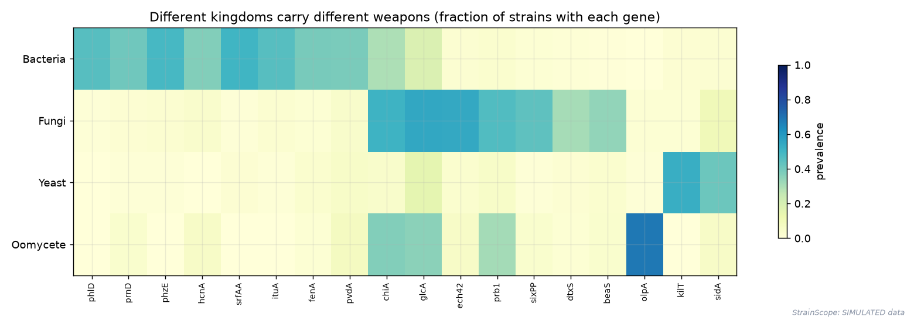

  Winners are rare by design (24.2 % effective) and every kingdom produces some, so a model has to learn *how each group fights* instead of just reading the kingdom label. Interactive version: `docs/interactive/signal_scatter.html`.
- **Phase 1b (real data lands):** ✅ a pluggable ingestion framework (one contract: probe → fetch → tidy) pulls **real** data from three reference databases: real bacterial strains from BacDive (DSMZ), verified chemistry for our metabolites from PubChem (NIH), and curated compound→pathway links from KEGG (attributed; academic use). Every request is logged to a provenance file, and every raw response is kept untouched in an evidence locker. Here's the framework diagram:

  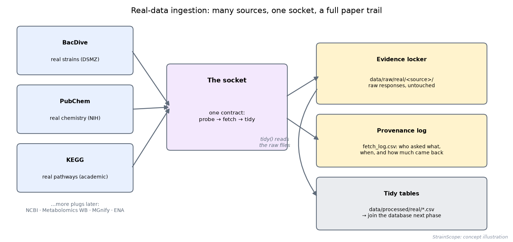

  These real tables *complement* the synthetic library (no public source offers matched multi-omics with an outcome); the KEGG links become the knowledge graph's first real edges. Offline tests (`pytest`) verify all parsing without touching the live APIs.
- **Phase 1c (more real sources, and the secrets lesson):** ✅ two more plugs in the same socket. NCBI Datasets brings real genome metadata for all four kingdoms, so the multi-kingdom story is finally backed by real records. Metabolomics Workbench brings RefMet standard names and classification for our metabolites, plus real studies. The framework and the database loader took in both with zero changes elsewhere. This phase also introduces proper secrets handling: an optional free NCBI key lives in the environment (`.env` / shell) and never in the repository, guarded by `.gitignore` *and* the safety gate:

  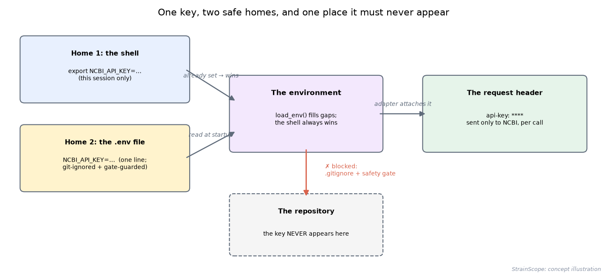
- **Phase 2 (cleaning and the database):** ✅ a six-rule cleaning pipeline with a full ledger (8 duplicate strains removed per table, 657 text cells harmonised, 3 impossible scores clipped, 41 provably absurd outlier cells capped, batch drift removed by median-scaling, 1,052 missing cells counted and left as NULLs instead of being guessed). The clean tables and the real Phase 1b tables are loaded into one DuckDB database that you can query with SQL (see the [Query Cookbook](docs/QUERY_COOKBOOK.md)). The ledger paid off straight away: it caught a textbook outlier rule quietly flattening real biology. Bimodal data breaks one-humped fences, and the doc keeps that as a lesson.

  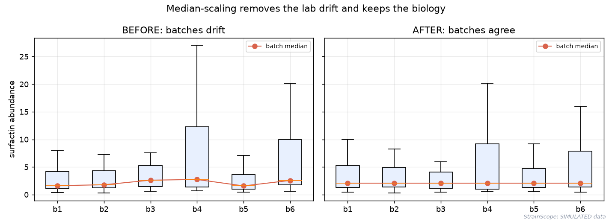
- **Phase 3 (multi-omics integration):** ✅ genes and chemistry read *together*, in three ways: early (glue the tables together), intermediate (DIABLO, R/mixOmics) and late (average the per-block models). All of them are scored on the same repeated cross-validation folds against two negative controls that should behave like coin flips (and do). Integration beats either block on its own, and centring each feature within its kingdom cut DIABLO's error by a third (0.22 → 0.145). Because the data is simulated, every signature can be **graded against the planted truth**. DIABLO's robust list (features picked in at least 80 % of re-fits) has 29 features, all 29 of them true drivers with no decoys, and every feature the Python lasso picks is also on DIABLO's list. R and Python talk only through plain hand-off files, checked by a contract test.

  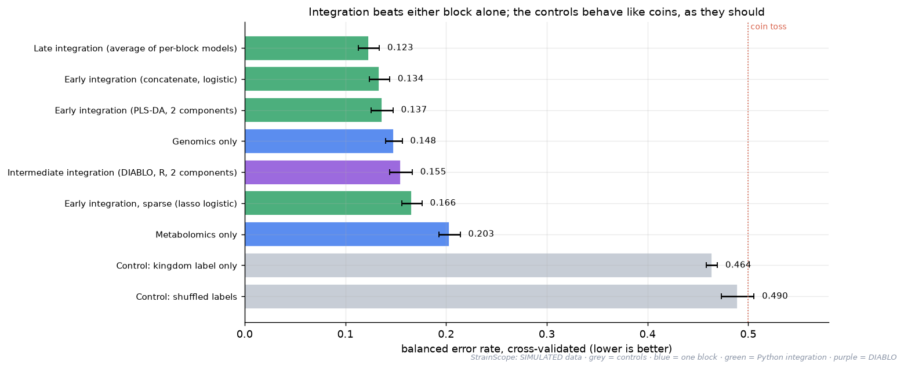

  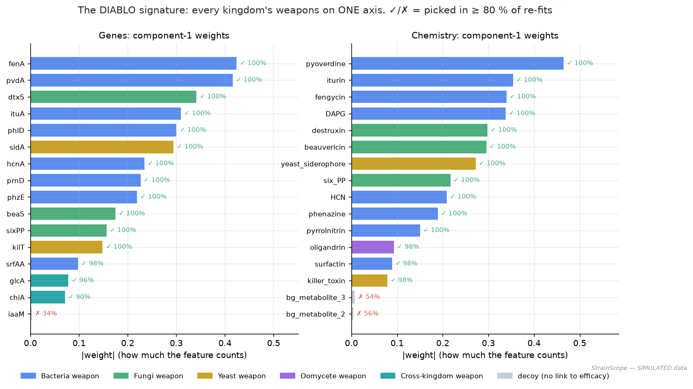

  Every kingdom's weapons on one axis; ✓ = picked in at least 80 % of re-fits. There's an interactive version in `docs/interactive/integration_explorer.html` (download it and open it in a browser; it works offline). The results are also in the database as `int_*` tables (see the [Query Cookbook §8](docs/QUERY_COOKBOOK.md#8-integration-results-phase-3)).
- **Phase 4 (machine learning):** ✅ a baseline, an elastic net, a random forest and gradient boosting compete on the same 50 folds, with the data preparation re-learned *inside* every fold. Phase 3's small leak is measured (it turns out to be harmless) and closed, and it's shown next to a real leak that "finds" signal in pure noise. The elastic net wins (balanced error 0.128 ± 0.007, AUC 0.948), which makes sense: the planted truth is a weighted sum of weapons, and a weighted sum is exactly what an elastic net is. Its probabilities are calibrated (calibration error 0.081 → 0.033), its reliably important features are graded against the planted truth (22 of 23 true drivers), and its mistakes crowd around the 65 % line that defines "effective". Here's what that means for a screening team:

  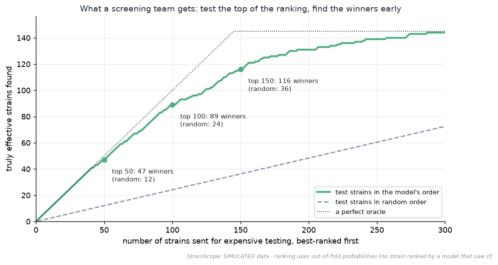

  Of the 50 best-ranked strains, 47 are truly effective; picking at random would find 12. The calibrated model is saved (under 20 KB) together with a model card. To explore it yourself, open `docs/interactive/model_explorer.html`. The results are in the database as `ml_*` tables too (see the [Query Cookbook §9](docs/QUERY_COOKBOOK.md#9-machine-learning-results-phase-4)).
- **Phase 5 (knowledge graph):** ✅ everything the project knows becomes one network you can walk: strains, genes, compounds, modes of action and outcomes (plus real KEGG pathways, RefMet classes and BacDive strains when fetched), with a source on every connection and every connection checked against a written-down ontology. The graph keeps two kinds of evidence apart: a *mechanism* (ituA makes iturin, which attacks the pathogen's membrane) and a *statistical association* (the model leans on it). That lets it flag the one decoy the model relies on as "statistics only". Communities of features that turn up together match the planted kingdom arsenals (purity 0.94), and the most connected genes turn out to be housekeeping genes that tell you nothing. Every ranking is explained as walks through the graph:

  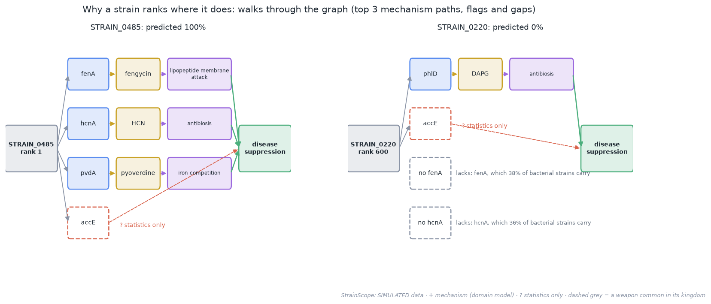

  Ask it yourself with `python src/strainscope/graph.py why STRAIN_0485`, `path ituA "disease suppression"` or `show iturin`, open `docs/interactive/graph_explorer.html`, or query the `kg_*` tables (see the [Query Cookbook §10](docs/QUERY_COOKBOOK.md#10-the-knowledge-graph-phase-5)). This completes **v0.2.0**.
- **Phase 6 (the app):** ✅ a Streamlit app over everything above, on a thin, tested service layer (`src/strainscope/service.py`) that the terminal, the app and the later AI features share. The Ranking page answers "if we can test N strains, how many would work?"; each strain gets a page with its reasons and its corner of the knowledge graph; the SQL console sits behind four guards (read-only, no file access, a time limit, a row limit); and you can upload your own strains to have them checked, scored and explained, with every problem in the file named by column and row:

  

  An uploaded copy of a library strain gets exactly the explanation of the original (a test checks every strain of a hand-made project), and a slightly different score, because the ranking uses out-of-fold predictions while an upload is scored by the final model. Run it with `python -m streamlit run app/streamlit_app.py`; the guide is [`docs/07-app.md`](docs/07-app.md).
- **Phase 6b (Ask StrainScope):** ✅ a documentation assistant that searches every guide, glossary entry and docstring (1198 sections) and answers with the matching passages, word for word, with links. Before anything is shown, a gate of four checks decides between *answered*, *closest* and *refused*, and 70 golden questions keep it in check: every in-scope one is answered from a right section, every off-topic question and instruction is refused, and one known limitation is reported rather than hidden. No single score threshold separates the two groups; the extra checks do:

  

  Optional written answers come from a model on your own computer (Ollama) or a hosted one, only for questions the search answered, and only from the passages found, which they must cite. Ask with `python src/strainscope/ask.py "your question"` or on the app's *Ask StrainScope* page; explore the scores in `docs/interactive/ask_explorer.html`. This completes **v0.3.0**.
- **Phase 7 (deployment and the AI layer):** ✅ the app goes online on Streamlit Community Cloud ([strainscope.streamlit.app](https://strainscope.streamlit.app)) in shared mode, with exact package versions, settings kept in the host's Secrets box, a database built on its first start and a health page. Three assistants share one shape: find first, decide before showing anything, and let an optional language model do no more than rewrite what was found. Ask the data answers with a tested SQL recipe (or a model's query behind five guards, the model never seeing a row), Ask the graph with walks through the knowledge graph as numbered, sourced facts, and every strain's rank can be read in plain words, written by rules. 37 and 23 new golden questions keep the two new assistants in check:

  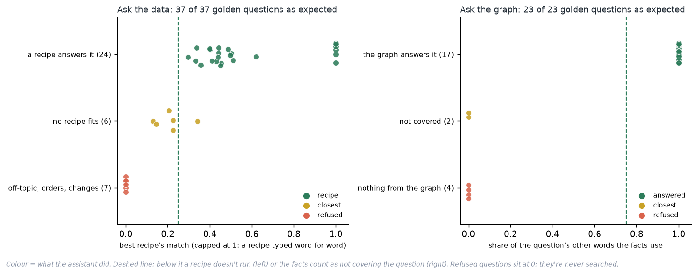

  Building it also caught a flaw from Phase 6: the path picture assumed every edge points along the walk, so a route between two genes lost one of them. Explore the scores in `docs/interactive/assistants_explorer.html`; the guide is [`docs/08-deployment-ai.md`](docs/08-deployment-ai.md).
- **Fix after Phase 7 (Handbook Stage 12.1):** ✅ switching on a small language model (llama3.2:3b with Ollama, on an Intel Mac) showed that it wrote correct answers without citing anything, so the citation check hid every one. The request now shows the model what a citation looks like (a rule with an example sentence, one worked example, a reminder at the end): with the same four questions, 0 of 4 answers were shown before and 4 of 4 after. `python src/strainscope/service.py check-model` runs the same check on any model. Ask StrainScope also gives the model only the strong matches, after a weak third match steered one written answer off the question, and it no longer suggests a bare *Steps* heading. The test is described in [`docs/LANGUAGE_MODEL.md` §9](docs/LANGUAGE_MODEL.md#9-how-a-written-answer-is-asked-for-and-checked).

  
- **Phase 7b (the MCP server):** ✅ nine read-only tools through which AI assistant apps such as Claude Desktop or Claude Code answer from StrainScope's own results: the three assistants, the database (one `SELECT` behind five guards, at most 200 rows), the DIABLO signature, a strain's rank and explanation, and the shortlist. Each tool is a thin door onto the service layer the app uses, so an assistant gets the same numbers as the app (46.2 strains expected among the best 50, for one); bad input is refused with a sentence the assistant can act on, and every call is logged without its result. `python src/strainscope/mcp_server.py check` talks to the server over stdio the way an app does:

  

  Explore the tools, their input schemas and real calls in `docs/interactive/mcp_explorer.html`; the guide is [`docs/08b-mcp-server.md`](docs/08b-mcp-server.md).
- **Phase 8 (release 1.0):** ✅ one command rebuilds every result from the seed (`python src/strainscope/pipeline.py`, also a button in the app), and `python src/strainscope/pipeline.py compare` checks every rebuilt number against the committed one: all 34 compared files match. Building it caught a real difference between computers (strains with tied chances came out in another order on Linux than on my Mac), so ties are now in strain-id order. At every push to master, GitHub tests the project on eleven jobs: Windows, macOS and Linux with Python 3.12 and 3.14, RHEL 8 inside Red Hat's own image, the online copy's exact versions, a keyboard and screen-reader check, the safety gate and the container.

  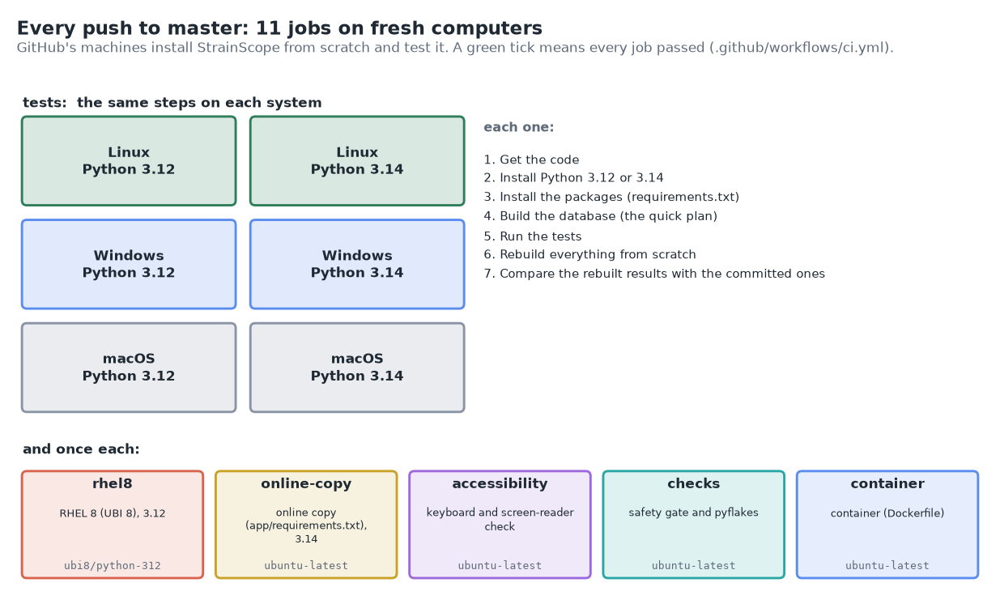

  The accessibility check (axe-core, a walk with the Tab key, and what a screen reader reads) found faint small text, skipped heading levels, charts without their numbers, hidden buttons that took the focus and pictures without a description, all fixed. A licence (MIT), a citation file, a contribution guide, a security policy, a container and an uninstall guide complete the release. Explore it in `docs/interactive/release_explorer.html`; the guide is [`docs/09-packaging.md`](docs/09-packaging.md).

## Build log

| # | Document | Status |
| --- | --- | --- |
| n/a | [Handbook: the whole journey, day 0 to the finished product](docs/HANDBOOK.md) | 🔨 living document |
| n/a | [Glossary: every term in plain words](docs/GLOSSARY.md) | 🔨 living document |
| n/a | [Roadmap](docs/ROADMAP.md) · [Product roadmap](docs/PRODUCT_ROADMAP.md) · [Changelog](CHANGELOG.md) | 🔨 living documents |
| 0 | [Architecture: how it all fits together](docs/00-architecture.md) | ✅ |
| 0 | [Environment setup from a blank laptop](docs/01-setup.md) | ✅ |
| 1 | [Data generation: a realistic synthetic library](docs/02-data-generation.md) | ✅ |
| 1b | [Real data lands: BacDive · PubChem · KEGG](docs/02b-real-data-ingestion.md) | ✅ |
| 1c | [More real sources: NCBI Datasets · Metabolomics Workbench + the secrets lesson](docs/02c-more-real-sources.md) | ✅ |
| 2 | [Harmonization & quality control → DuckDB + SQL](docs/03-harmonization-qc.md) | ✅ |
| 3 | [Multi-omics integration (DIABLO in R + a Python twin)](docs/04-integration.md) | ✅ **v0.1.0** |
| 3.1 | [Fix release: a safety gate that also checks new files, copy-safe commands](docs/HANDBOOK.md#stage-71-fix-release-v011-a-safer-safety-gate-and-copy-safe-commands) | ✅ **v0.1.1** |
| 4 | [Machine learning, evaluated carefully](docs/05-machine-learning.md) | ✅ |
| 5 | [Knowledge graph: ontology, sourced edges, communities, explanations](docs/06-knowledge-graph.md) | ✅ **v0.2.0** |
| 6 | [The app: ranking, strain pages, the graph, uploads, a safe SQL console](docs/07-app.md) | ✅ |
| 6b | [Ask StrainScope: answers from the project's own documents, a gate, golden questions](docs/07b-docs-assistant.md) | ✅ **v0.3.0** |
| 7 | [Deployment and the AI layer: the online copy, plain words, Ask the data, Ask the graph](docs/08-deployment-ai.md) | ✅ |
| 7.1 | [Fix: small language models cite their sources, the model check, clearer suggestions](docs/HANDBOOK.md#stage-121-fix-for-small-language-models-the-model-check-and-clearer-suggestions) | ✅ |
| 7b | [The MCP server: nine read-only tools for AI assistant apps](docs/08b-mcp-server.md) | ✅ |
| 8 | [Packaging & release 1.0: one command, tests on every system, a container, reuse and citation](docs/09-packaging.md) | ✅ **v1.0.0** |

*Legend: ✅ done · 🔨 living / in progress · ⏳ next · ⬜ planned. Every phase is built; fixes found through use become patch releases.*

## The tutorial, in order

Every step of this project, from an empty laptop to a deployed app, is taught in
`docs/`. The guides are written for a complete beginner, with every term defined
([glossary](docs/GLOSSARY.md)) and every command shown with its expected output.
Read them in this order:

| # | Guide | What it teaches |
| --- | --- | --- |
| first | [Handbook](docs/HANDBOOK.md) | The whole journey in order: what, why, how long, the checkpoint and the commit for every stage. Read it first and come back to it often |
| 00 | [Architecture](docs/00-architecture.md) | How all the pieces fit together; backend/frontend/database in plain words |
| 01 | [Setup](docs/01-setup.md) | Blank laptop → working workshop (Python, R, Git, `.venv`, `renv`, the `master`/`beta`/`develop` model, the safety gate) on Windows, macOS, RHEL 8 |
| 02 | [Data generation](docs/02-data-generation.md) | Random seeds & reproducibility; designing realistic synthetic multi-omics data |
| 02b | [Real-data ingestion](docs/02b-real-data-ingestion.md) | APIs, JSON, rate limits & politeness; the evidence locker and provenance log; one socket, many source plugs |
| 02c | [More real sources + secrets](docs/02c-more-real-sources.md) | API keys done right: the environment, `.env` and `.env.example`; real genomes across four kingdoms; RefMet classification |
| 03 | [Harmonization & QC](docs/03-harmonization-qc.md) | The cleaning ledger; duplicates, text, outliers (and why the textbook rule fails on bimodal data), batch correction; DuckDB + first SQL |
| 04 | [Integration](docs/04-integration.md) | What multi-omics integration *is*, three ways; DIABLO in R and a Python twin; repeated cross-validation, balanced error rate, negative controls, stability; grading against planted truth; R ↔ Python contracts; the same task in three languages |
| n/a | [Query Cookbook](docs/QUERY_COOKBOOK.md) | Tested, explained SQL recipes against the project database (it grows every phase) |
| 05 | [Machine learning](docs/05-machine-learning.md) | Four kinds of model; leak-proof pipelines and what a real leak looks like; why accuracy lies; tuning without peeking; calibration; permutation importance; error analysis; model cards |
| 06 | [Knowledge graph](docs/06-knowledge-graph.md) | Graphs in six words; ontologies (a "family tree for concepts") written before the data; a source on every edge; mechanism vs statistical association; hubs, communities and how to grade them; explaining a ranking by walking the graph; SQL vs NetworkX |
| 07 | [The app](docs/07-app.md) | Streamlit and why every click reruns the page; caching and session state; a service layer shared by every front door; SQL behind four guards; accepting somebody else's file safely; out-of-fold vs final-model scores; running on Windows, macOS and a RHEL 8 VM |
| 07b | [Ask StrainScope](docs/07b-docs-assistant.md) | How a word search ranks passages (TF-IDF, cosine similarity); refusing instead of guessing; golden question sets as tests for answers; retrieval-augmented generation, hallucinations and prompt injection; an optional local (Ollama) or hosted language model, and what leaves your computer |
| 08 | [Deployment and the AI layer](docs/08-deployment-ai.md) | Deploying on Streamlit Community Cloud: shared mode, pinned versions, secrets on a host, a first-start build; text-to-SQL with tested recipes first and five guards; GraphRAG as numbered, sourced facts; explanations written by rules; what a language model may and may not see |
| n/a | [Switching on a language model](docs/LANGUAGE_MODEL.md) | Optional written answers for the three assistants: Ollama on your computer, a hosted provider at home or for the online copy, switching off, and what to do when something goes wrong |
| 08b | [The MCP server](docs/08b-mcp-server.md) | The Model Context Protocol: servers, clients and tools; stdio and why standard output belongs to the protocol; input schemas and tool annotations; read-only tools with checked input, refusals as sentences and a call log; connecting Claude Desktop, Claude Code or another app on Windows, macOS and RHEL 8; what an assistant sees |
| 09 | [Packaging and release 1.0](docs/09-packaging.md) | A pipeline in one command, and checking that a rebuild gives the same numbers; continuous integration (workflows, jobs, runners, a matrix) on Windows, macOS, Linux and RHEL 8; containers with Docker or Podman; licence, citation file, contribution guide, security policy; Dependabot; accessibility checked with axe-core, the Tab key and a screen reader's view; Git hooks; releases |
| n/a | [Uninstalling](docs/UNINSTALL.md) | Every place StrainScope can leave something, on your computer and online, and how to remove each in a safe order |
| n/a | [Roadmap](docs/ROADMAP.md) · [Product roadmap](docs/PRODUCT_ROADMAP.md) | What is built next and why; what an industrial version would add, with a verdict for every technology |
| n/a | [Glossary](docs/GLOSSARY.md) | Every term, plain language, by phase |

## Roadmap

The full plan lives in [`docs/ROADMAP.md`](docs/ROADMAP.md). It covers every
phase, why each one sits where it does in the order, and the deferred items,
each with the event that would put it on the schedule. In short, after
integration came machine learning (Phase 4) and the knowledge graph (5), which
complete the analysis (v0.2.0), then the app (6), which puts it all behind
buttons, and Ask StrainScope (6b), which answers questions about the project
from its own documents (v0.3.0). Then came the online copy and the AI layer
(Phase 7): plain-language explanations, Ask the data and Ask the graph, and the
MCP server (Phase 7b), which offers StrainScope's tools to AI assistant apps
through the [Model Context Protocol](https://modelcontextprotocol.io), read-only,
checked and logged. Last came packaging and release 1.0 (Phase 8): one
command that rebuilds every result and checks the numbers, automatic tests on
Windows, macOS, Linux and RHEL 8 at every push, a container, a licence, a
citation file and a contribution guide (v1.0.0). Every row of the roadmap's
product checklist is done; fixes found through use become patch releases.

What a larger, industrial version would add is laid out in
[`docs/PRODUCT_ROADMAP.md`](docs/PRODUCT_ROADMAP.md): real matched laboratory
data, a multi-user web front end and API, PostgreSQL, scheduling, ontologies and
monitoring. Every technology there gets a verdict and a trigger, because I'd
rather add a tool when something calls for it than pile tools up in advance.

## About the data (what's real and what's simulated)

- **The dataset is simulated, and this is stated everywhere.** No part of
  StrainScope claims the numbers are real measurements. The data is produced by a
  single, commented generator script with a fixed random seed, so it's identical
  on every machine and anyone can read exactly how it was made.
- **Why synthetic?** Clean, matched multi-omics data on the *same* strains
  (genomics *and* metabolomics *and* a performance score, all aligned) isn't
  something you can download as one tidy package. So instead of pretending
  otherwise, StrainScope *builds* the data in the open. Designing realistic
  synthetic data (with correlations, imbalance and messiness on purpose) is a
  useful skill in its own right, and companies use synthetic data for real
  reasons: privacy, rare events, and the absence of public data.
- **Grounded in real biology:** the gene families and compound classes used are
  real ones known to matter for microbes that protect plants (antibiotic-
  biosynthesis genes, siderophores, chitinases, ACC-deaminase; lipopeptides such
  as surfactin, iturin and fengycin). That keeps the exercise realistic and
  useful for learning, without passing invented numbers off as measured ones.
- **Real data now sits alongside the synthetic library, with notes of its
  own.** Phase 1b fetches real strains (BacDive), real chemistry (PubChem),
  and real pathway links (KEGG, attributed, academic-use) through a logged,
  provenance-first ingestion framework. These tables *complement* the synthetic
  core rather than replacing it. When a source has no answer for an entry
  (proteins in a small-molecule database, for instance), that's recorded
  openly instead of hidden.
- **The main limitation:** a model trained on synthetic data shows that the
  *workflow* is correct (the integration, the cleaning, the evaluation, the
  app). It does **not** show that the predictions would hold on real-world
  strains. The docs state that limit clearly, and I think that's how
  synthetic-data work should be presented.
- **Optional real-data path:** the [roadmap](docs/ROADMAP.md#deferred-items-and-their-triggers)
  keeps a slot for swapping in a real matched dataset if one ever becomes
  available. It would plug in at the Phase 3 hand-off files.

## Repository map

The full tree, annotated with the phase that creates each piece (✅ = exists;
since v1.0.0, every piece does). The [Handbook's file index](docs/HANDBOOK.md#every-file-in-the-repository-and-where-it-is-explained)
says which guide explains each file.

```
strainscope/
├── README.md                      ← you are here
├── CHANGELOG.md                   ← what changed, version by version               ✅
├── LICENSE                        ← MIT: what anyone may do with it (Phase 8)      ✅
├── CITATION.cff                   ← how to cite it (GitHub's Cite button, Phase 8) ✅
├── CONTRIBUTING.md                ← how to help, and what a change must pass      ✅
├── SECURITY.md                    ← how to report a security problem privately    ✅
├── Dockerfile, .dockerignore      ← the app in a container (Phase 8, optional)     ✅
├── check-public-safe.sh           ← pre-push safety gate (run before every push)   ✅
├── .githooks/pre-push             ← runs the gate before every push (optional)     ✅
├── .github/                       ← GitHub's own settings files (Phase 8)
│   ├── workflows/ci.yml           ← the automatic tests: eleven jobs every push    ✅
│   ├── dependabot.yml             ← monthly update suggestions                     ✅
│   ├── ISSUE_TEMPLATE/            ← the forms behind "New issue"                   ✅
│   └── pull_request_template.md   ← the checklist in every pull request            ✅
├── requirements.txt               ← Python packages (the R side: renv.lock)        ✅
├── renv.lock                      ← exact R package versions (the R "receipt")     ✅
├── strainscope.Rproj              ← RStudio project file (optional)                ✅
├── .Rprofile                      ← auto-activates renv in this project            ✅
├── renv/activate.R, settings.json ← renv's switch (the library itself is ignored)  ✅
├── .env.example                   ← template for optional keys (copy to .env)      ✅
├── .gitignore                     ← incl. .venv/, data/, secrets, renv library     ✅
├── .streamlit/config.toml         ← the app's settings (no secrets in it)           ✅
├── .streamlit/secrets.toml.example← what the online copy's Secrets box holds       ✅
│
├── docs/                          ← the tutorial (the repo IS the tutorial)
│   ├── HANDBOOK.md                ← ★ the whole journey, day 0 → product            ✅
│   ├── 00-architecture.md         ← how it all fits together                       ✅
│   ├── 01-setup.md                ← blank laptop → working workshop                ✅
│   ├── 02-data-generation.md      ← Phase 1: the synthetic library                 ✅
│   ├── 02b-real-data-ingestion.md ← Phase 1b: BacDive · PubChem · KEGG             ✅
│   ├── 02c-more-real-sources.md   ← Phase 1c: NCBI · Metabolomics WB · secrets     ✅
│   ├── 03-harmonization-qc.md     ← Phase 2: cleaning, the ledger, DuckDB + SQL    ✅
│   ├── 04-integration.md          ← Phase 3: DIABLO + Python twin                  ✅
│   ├── 05-machine-learning.md     ← Phase 4: models, leaks, calibration            ✅
│   ├── 06-knowledge-graph.md      ← Phase 5: ontology, graph, explanations         ✅
│   ├── 07-app.md                  ← Phase 6: the app                               ✅
│   ├── 07b-docs-assistant.md      ← Phase 6b: Ask StrainScope                      ✅
│   ├── 08-deployment-ai.md        ← Phase 7: online, plain words, Ask the data/graph ✅
│   ├── 08b-mcp-server.md          ← Phase 7b: the MCP server                       ✅
│   ├── 09-packaging.md            ← Phase 8: one command, CI, container, release   ✅
│   ├── UNINSTALL.md               ← removing StrainScope, completely and safely    ✅
│   ├── ROADMAP.md                 ← what is built next, and why                    ✅
│   ├── PRODUCT_ROADMAP.md         ← beyond the repo: verdicts and triggers         ✅
│   ├── QUERY_COOKBOOK.md          ← tested SQL recipes (grows every phase)         ✅
│   ├── LANGUAGE_MODEL.md          ← switching a language model on and off          ✅
│   ├── GLOSSARY.md                ← every term, plain language, by phase           ✅
│   ├── img/                       ← logo, icon, wordmark, journey map, app screenshots ✅
│   ├── index.html, .nojekyll      ← the optional GitHub Pages front page (Phase 7)  ✅
│   └── interactive/               ← self-contained interactive charts (Plotly)     ✅
│       ├── plotly.min.js          ← the shared chart library (works offline)
│       ├── signal_scatter.html    ← Phase 1: hover any strain
│       ├── batch_before_after.html← Phase 2: cleaning, before and after
│       ├── real_genomes.html, real_compounds.html ← Phases 1b-1c
│       ├── integration_explorer.html ← Phase 3: four linked views
│       ├── model_explorer.html    ← Phase 4: scoreboard, calibration, every strain
│       ├── graph_explorer.html    ← Phase 5: the network, communities, explanations
│       ├── ask_explorer.html      ← Phase 6b: how each question scored
│       ├── assistants_explorer.html ← Phase 7: Ask the data and Ask the graph
│       ├── mcp_explorer.html      ← Phase 7b: the nine tools, their inputs, real calls
│       ├── release_explorer.html  ← Phase 8: the plans, the CI jobs, the checklist
│       └── journey.html           ← the Handbook's journey, clickable
│
├── figures/                       ← teaching figures, each regenerated by a script
│   ├── make_phase1_figures.py     ← Phase 1                                        ✅
│   ├── make_phase2b_figures.py    ← Phase 1b: framework diagram + real-data charts ✅
│   ├── make_phase2c_figures.py    ← Phase 1c: the secrets diagram + genome charts  ✅
│   ├── make_phase2_figures.py     ← Phase 2: before/after cleaning evidence        ✅
│   ├── make_phase3_figures.py     ← Phase 3: concepts, results, the explorer       ✅
│   ├── make_phase4_figures.py     ← Phase 4: pictographs, results, model explorer  ✅
│   ├── make_phase5_figures.py     ← Phase 5: graph concepts, results, explorer     ✅
│   ├── make_phase6_figures.py     ← Phase 6: how the app works, uploads, guards    ✅
│   ├── make_phase6b_figures.py    ← Phase 6b: the search, the gate, golden scores  ✅
│   ├── make_phase7_figures.py     ← Phase 7: deployment, the assistants, the guards ✅
│   ├── make_phase7b_figures.py    ← Phase 7b: the MCP pictures + tool explorer     ✅
│   ├── make_phase8_figures.py     ← Phase 8: pipeline, CI, release, container, ... ✅
│   ├── take_app_screenshots.py    ← Phases 6 to 8: screenshots (optional, Playwright) ✅
│   ├── make_illustrations.py      ← logo, icon, journey map + interactive journey  ✅
│   └── *.png                      ← the figures themselves                         ✅
│
├── src/strainscope/               ← the reusable backend code (Python)
│   ├── __init__.py                ← marks the folder as a Python package           ✅
│   ├── generate_data.py           ← Phase 1: the synthetic data generator          ✅
│   ├── fetch_real.py              ← Phase 1b: the real-data command (probe/fetch)  ✅
│   ├── sources/                   ← Phases 1b-1c: one plug per source (BacDive ·
│   │                                 PubChem · KEGG · NCBI · Metabolomics WB)      ✅
│   ├── harmonize.py               ← Phase 2: cleaning + ledger + database loader   ✅
│   ├── sql.py                     ← Phase 2: the read-only SQL console             ✅
│   ├── integrate.py               ← Phase 3: blocks, Python twin, grading, publish ✅
│   ├── model.py                   ← Phase 4: compare, calibrate, explain, final    ✅
│   ├── ontology.py                ← Phase 5: the domain model (types, relations)   ✅
│   ├── graph.py                   ← Phase 5: build, analyse, explain, ask          ✅
│   ├── service.py                 ← Phase 6: the service layer behind the app      ✅
│   ├── ask.py                     ← Phase 6b: Ask StrainScope                      ✅
│   ├── llm.py                     ← Phase 7: one connection to a language model    ✅
│   ├── narrate.py                 ← Phase 7: results in plain words (rules)         ✅
│   ├── ask_data.py                ← Phase 7: Ask the data (recipes, five guards)   ✅
│   ├── ask_graph.py               ← Phase 7: Ask the graph (GraphRAG)              ✅
│   ├── mcp_server.py              ← Phase 7b: the MCP server (nine read-only tools) ✅
│   └── pipeline.py                ← Phase 8: the one-command pipeline + compare    ✅
│
├── R/
│   └── diablo_integration.R       ← Phase 3: DIABLO (mixOmics), run on the laptop  ✅
│
├── tools/
│   └── check_accessibility.py     ← Phase 8: keyboard + screen-reader check (optional) ✅
│
├── artifacts/                     ← small results the app reads (committed)
│   ├── integration/*.csv          ← Phase 3: signature, scores, scoreboards …      ✅
│   ├── model/                     ← Phase 4: scoreboard, ranking, model + card     ✅
│   └── graph/                     ← Phase 5: nodes, edges, communities, reasons    ✅
│
├── app/                           ← the app (Phase 6; online since Phase 7)
│   ├── streamlit_app.py           ← its front door: sidebar, page list, first start ✅
│   ├── ui.py, charts.py           ← what the pages share; every chart               ✅
│   ├── requirements.txt           ← the online copy's packing list (exact versions) ✅
│   └── views/                     ← eleven pages: home, about, ask, ask_data,
│                                     ask_graph, ranking, strain, knowledge_graph,
│                                     integration, data, sql_console                ✅
│
├── tests/                         ← automated checks (pytest): 447 today           ✅
│   ├── test_sources.py            ← ingestion parsers, offline
│   ├── test_harmonize.py          ← cleaning rules and the database loader
│   ├── test_integrate.py          ← integration, grading, the R ↔ Python contract
│   ├── test_model.py              ← leak-proof preparation, metrics, the whole ML chain
│   ├── test_graph.py              ← the ontology, sourced edges, explanations, paths
│   ├── test_service.py            ← SQL guards, cookbook recipes, uploads, explanations
│   ├── test_app.py                ← the app clicked through without a browser
│   ├── test_ask.py                ← Ask StrainScope: splitting, the gate, written answers
│   ├── test_ask_data.py, test_ask_graph.py ← the Phase 7 assistants and their guards
│   ├── test_narrate.py, test_llm.py ← plain words; the model connection and daily cap
│   ├── test_deploy.py             ← what the online copy and a release rely on
│   ├── test_mcp.py                ← the MCP server: tools, checks, the log, over stdio
│   ├── test_pipeline.py           ← the one-command pipeline, compare, the button
│   ├── conftest.py                ← the stand-in model server the tests share
│   ├── golden_questions.csv       ← the golden questions and what must happen to each
│   ├── golden_data_questions.csv, golden_graph_questions.csv ← the same, Phase 7
│   └── test_safety_gate.py        ← the safety gate and its hook, in throw-away repos
│
├── data/                          ← NOT in Git; regenerated on demand
│   ├── raw/                       ← raw synthetic tables + real-data evidence locker
│   └── processed/                 ← clean tables, integration blocks, strainscope.duckdb,
│                                     the MCP server's call log, the accessibility report
│
├── .venv/                         ← Python's sealed toolbox (NOT in Git)
└── renv/library/                  ← R's sealed library, NOT in Git (rebuilt from renv.lock)
```

| Path | What lives here |
| --- | --- |
| root files | Release surface: README, CHANGELOG, LICENSE, CITATION.cff, CONTRIBUTING.md, SECURITY.md, the container recipe, the pre-push safety gate, the two dependency receipts (`requirements.txt`, `renv.lock`) |
| `.github/` | GitHub's settings files: the automatic tests (`workflows/ci.yml`), Dependabot, the issue forms and the pull-request checklist |
| `tools/` | Optional tools for checking the project, beyond the tests: the keyboard and screen-reader check |
| `docs/` | The Handbook, the phase-by-phase tutorial, glossary, cookbook and roadmaps (the repo's teaching layer) |
| `src/strainscope/` | The reusable Python backend: generate, fetch, clean, query, integrate, then model, graph, serve, ask, explain in plain words, and the MCP server for AI assistant apps |
| `R/` | The single specialised R script (DIABLO integration), run on the laptop |
| `artifacts/` | Small precomputed outputs the app serves; they're the bridge from laptop to cloud |
| `app/` | The Streamlit app (the frontend): eleven pages over the service layer in `src/strainscope/service.py` and the assistants; `app/requirements.txt` is the online copy's packing list |
| `tests/` | Automated checks that confirm the code does what it claims |
| `data/` | Raw + processed data and the DuckDB file. **Never in Git**; regenerated on demand |

Two kinds of "not in Git": `data/` because the scripts recreate it (that's the
proof they work), and `.venv/`, `renv/library/`, `.env` and `.streamlit/secrets.toml`
because they're either rebuildable or secret. Secrets never enter version control.

## How to run

Every command below works today; each phase guide explains its own in full.
Python 3.12 and R 4.x are installed per [`docs/01-setup.md`](docs/01-setup.md)
on Windows, macOS or Linux (RHEL 8).

```bash
git clone https://github.com/akannan2987/strainscope.git
cd strainscope

# Python toolbox
python -m venv .venv                      # RHEL 8: python3.12 -m venv .venv
source .venv/bin/activate                 # Windows PowerShell: .\.venv\Scripts\Activate.ps1
pip install -r requirements.txt

# R toolbox (only for the DIABLO step) - rebuilds the exact R packages from renv.lock
Rscript -e 'renv::restore()'              # Windows PowerShell: Rscript -e "renv::restore()"

# Build everything with one command (Phase 8), then check the numbers
python src/strainscope/pipeline.py        # Phases 1 to 5 in order (5 to 10 minutes); --list shows the plans
python src/strainscope/pipeline.py compare   # every rebuilt number against the committed one
git restore artifacts/                       # the committed results back, so a rebuild never ends up in a commit
python src/strainscope/pipeline.py database  # or just the database, from the committed results (15 s)

# ... or phase by phase, the same steps by hand
python src/strainscope/generate_data.py   # Phase 1  - the synthetic library
python src/strainscope/fetch_real.py      # Phase 1b/1c - real data (optional, needs internet)
python src/strainscope/harmonize.py       # Phase 2  - clean + build the database
python src/strainscope/integrate.py all   # Phase 3  - prepare, DIABLO (if R is present), Python twin, publish
python src/strainscope/model.py all       # Phase 4  - compare, calibrate, explain, final model, publish
python src/strainscope/graph.py all       # Phase 5  - build the knowledge graph, analyse, explain, publish

# Look at the results
python src/strainscope/service.py status  # what the app can read, and how to fix what's missing
python src/strainscope/service.py check-model   # with a language model on: does it cite its sources?
python -m streamlit run app/streamlit_app.py   # the app (Phase 6): opens in your browser, Ctrl+C stops it
python src/strainscope/ask.py "How do I start the app?"   # Ask StrainScope (Phase 6b), also a page in the app
python src/strainscope/ask.py --golden    # the golden questions, scored
python src/strainscope/ask_data.py "Which strains are borderline?"     # Ask the data (Phase 7)
python src/strainscope/ask_graph.py "How does iturin suppress disease?"   # Ask the graph (Phase 7)
python src/strainscope/narrate.py STRAIN_0485   # one strain in plain words (Phase 7)
python src/strainscope/mcp_server.py tools      # the MCP server's tools (Phase 7b); also: call, check, config
python src/strainscope/mcp_server.py check      # talk to the MCP server the way an assistant app does
python src/strainscope/sql.py             # the read-only SQL console (see docs/QUERY_COOKBOOK.md)
python figures/make_phase3_figures.py     # redraw the Phase 3 figures + interactive explorer
python figures/make_phase4_figures.py     # redraw the Phase 4 figures + model explorer
python figures/make_phase5_figures.py     # redraw the Phase 5 figures + graph explorer
python figures/make_phase6_figures.py     # redraw the Phase 6 figures
python figures/make_phase6b_figures.py    # redraw the Phase 6b figures + Ask explorer
python figures/make_phase7_figures.py     # redraw the Phase 7 figures + assistants explorer
python figures/make_phase7b_figures.py    # redraw the Phase 7b figures + MCP tool explorer
python figures/make_phase8_figures.py     # redraw the Phase 8 figures + release explorer
python src/strainscope/graph.py why STRAIN_0485   # why does this strain rank first?

# Check everything
pytest -q                                 # 446 passed, 1 skipped
python tools/check_accessibility.py      # optional: keyboard and screen-reader check (needs Playwright)

# Or run the app in a container: only Docker (or Podman) and this folder needed
docker build -t strainscope .
docker run --rm -it -p 8501:8501 strainscope   # then open http://localhost:8501
```

To put your own copy online, follow [`docs/08-deployment-ai.md`](docs/08-deployment-ai.md) §9
(Streamlit Community Cloud, free); to connect an AI assistant app, §9 of
[`docs/08b-mcp-server.md`](docs/08b-mcp-server.md) (for Claude Desktop,
`python src/strainscope/mcp_server.py config --write` does it). To update to a newer
release: `git restore artifacts/` (if you rebuilt), `git pull`, `pip install -r requirements.txt`, `python src/strainscope/pipeline.py database`.
To remove StrainScope completely: [`docs/UNINSTALL.md`](docs/UNINSTALL.md).

> **Runs the same on Windows, macOS, and Linux (including RHEL 8 VMs).** The code
> uses platform-neutral file paths, and every tool in the stack is cross-platform.
> Where a command differs by OS, the docs show each variant. Set up once per
> machine; after that, editing, committing, and redeploying are the same short
> commands everywhere. Since v1.0.0 that's checked at every push: GitHub runs every
> test and a full rebuild on Windows, macOS, Linux and RHEL 8 (the badge at the top).

For the guided path, with every step explained from a blank machine, start at
the [Handbook](docs/HANDBOOK.md).

## How I work on this repo (branch model)

This project uses three branches: **`master`** (the stable, official version),
**`beta`** (a release-candidate preview), and **`develop`** (where day-to-day work
happens). The rhythm is: make changes on `develop`, push `develop` up to all three
at once, then bring local `master` back in step. Every phase ends with exactly this:

```bash
# safety first, before staging anything
pytest -q                     # all tests pass
./check-public-safe.sh        # must print "SAFE TO PUSH"  (Windows: bash check-public-safe.sh in Git Bash)

git switch develop
git add -A
git commit -m "clear message describing the change"
git push origin develop develop:beta develop:master

## --tags is optional, only when a release tag was created in this phase
## then switch back to local master and pull in the remote changes

git switch master
git pull --ff-only origin master
git switch develop
```

Every push is gated by `./check-public-safe.sh`. It inspects what Git tracks
**and** the new files `git add -A` is about to add, and it refuses the all-clear
if a secret (an API key, a `.env`, a database file) or a hard-coded local path
would be published. Think of `.gitignore` as the lock on the door; the script is
the guard checking your bag on the way out. Every command, commit message and
tag message in this repository uses plain keyboard characters only, because
look-alike characters such as a long dash can be garbled when pasted into a
terminal ([why](docs/01-setup.md#copy-commands-safely-plain-keyboard-characters-only)).

The push line sends local `develop` to remote `develop` and fast-forwards remote
`beta` and `master` to match, so one command keeps all three branches in
lock-step. The `master` sync-back keeps the local copy consistent with what was
just pushed. `--ff-only` means "update only if it's clean, otherwise stop and
warn." Tags (`v0.1.0`, `v0.1.1`, `v0.2.0`, `v0.3.0`, `v1.0.0`; [why these](docs/ROADMAP.md#version-tags))
are pushed with `--tags` only when a new version is cut, and since v1.0.0 only after
every automatic test on GitHub has passed on that commit. The full reasoning and the
"if it goes wrong" cases are in [`docs/01-setup.md`](docs/01-setup.md#part-h-initialise-git-and-push-with-the-master--beta--develop-workflow);
how to help is in [`CONTRIBUTING.md`](CONTRIBUTING.md). The optional hook
`.githooks/pre-push` runs the safety gate by itself before every push
([how to switch it on](docs/09-packaging.md#9-step-5-optional-let-git-run-the-safety-gate-before-every-push)).

## Licence, citation, contributing

The code and the documents are under the [MIT licence](LICENSE): use, copy,
change and share them, also commercially, as long as the licence text travels
with them. The few facts from public databases in `artifacts/graph/` keep their
sources' own terms, and every such row names its source (KEGG's are for academic
use; BacDive, PubChem, NCBI and Metabolomics Workbench are named in
[`docs/02b-real-data-ingestion.md`](docs/02b-real-data-ingestion.md) and
[`docs/02c-more-real-sources.md`](docs/02c-more-real-sources.md)).
`docs/interactive/plotly.min.js` is Plotly's, under its own MIT licence.

To cite StrainScope, use **Cite this repository** on GitHub, which reads
[`CITATION.cff`](CITATION.cff). To help, report a problem or suggest an idea,
see [`CONTRIBUTING.md`](CONTRIBUTING.md); a security problem goes privately, as
[`SECURITY.md`](SECURITY.md) explains. Accessibility is checked at every push
(axe-core rules against WCAG 2.1 AA, a walk with the Tab key, and what a screen
reader reads); what it found and what's still Streamlit's own is in
[`docs/09-packaging.md` §10](docs/09-packaging.md#10-step-6-the-keyboard-and-screen-reader-check).

## Why the documentation is so detailed

Good documentation is one of the things this project sets out to deliver,
alongside the code. An analysis that can't be reproduced and explained is worth
very little, so I've written this repo so that a complete beginner can rebuild
it from scratch and learn every concept along the way. The
[Handbook](docs/HANDBOOK.md) holds it all together: one document from day 0 to
the finished product, updated in the same commit as every change. The glossary
rule at the top of this file comes from the same promise. Every term gets a
plain-language definition, and a missing one counts as a bug.

---

*StrainScope is a personal learning project built in the open. The data is
synthetic and disclosed as such. What I'm aiming for is a correct, end-to-end
workflow that is open about its limits, so that others can learn from it and
reproduce it.*
