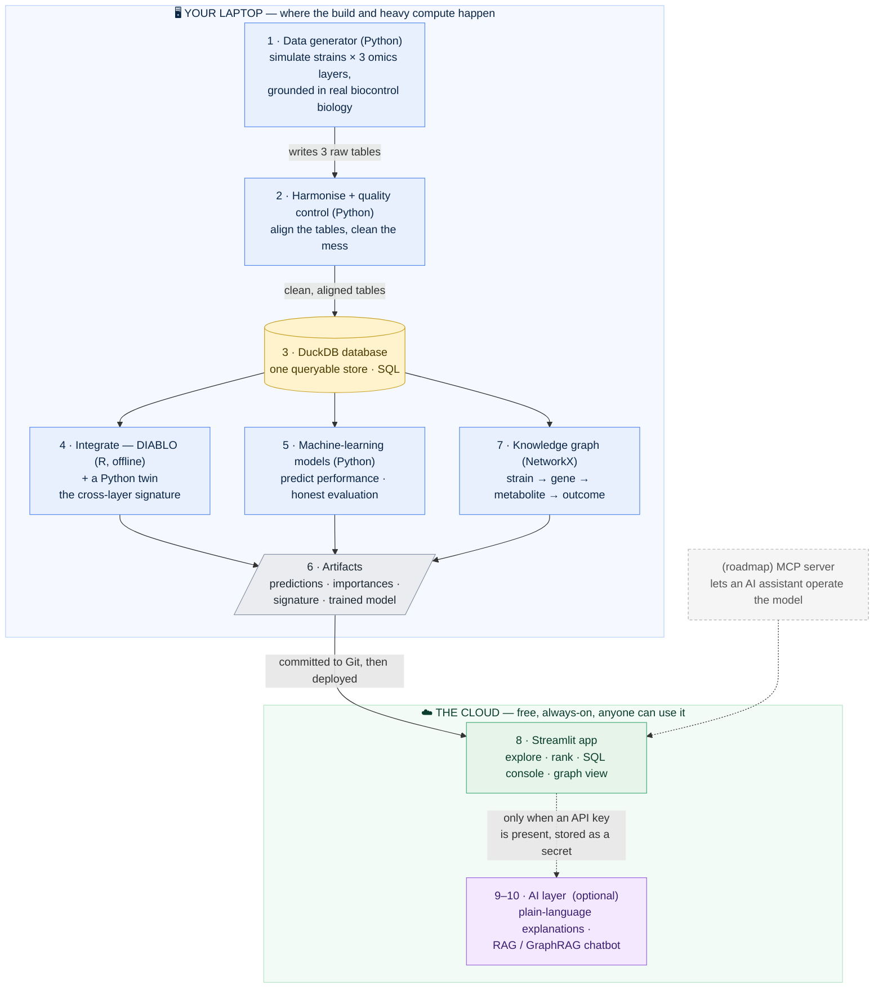

# 00 · Architecture, Explained From Scratch

[← README](../README.md) · [All docs in order](../README.md#the-tutorial-in-order) · [Glossary](GLOSSARY.md)

**Prerequisites:** none. This is the first thing to read.
**Learning goal:** after this page you will understand what every part of StrainScope does, why it exists, and how data flows from a blank folder all the way to a public website that anyone in the world can use — even if you have never built software before.
**Checkpoint:** you can explain, in your own words, the difference between a *backend*, a *frontend*, and a *database*, and you can name the ten boxes in the StrainScope diagram and say what each one is for.

---

## 1. What is StrainScope, in one honest sentence?

StrainScope is a small, self-contained data-science project that takes several different kinds of biological measurements about a collection of microbes, combines them intelligently, and uses machine learning to predict which microbes are most likely to be useful — then serves those predictions in a website that anyone can open and explore.

That's it. Everything below is just *how* we do that, one plain step at a time.

If you know nothing about biology or software, here is the everyday version of the idea:

> Imagine you run a talent agency for tiny helpers (microbes). Each helper has a résumé made of three very different documents: its "birth certificate" (its genes), a "receipt of what it actually produces" (its chemicals), and a "job-performance score" from a trial. You have hundreds of these helpers and can only develop a handful further. StrainScope reads all three documents at once for every helper and predicts which ones are worth betting on — and, crucially, *explains why*.

---

## 2. The three words you must know first

Almost every confusing software conversation becomes clear once you know these three words. We will use a restaurant as the running analogy, because it maps perfectly.

### Backend — "the kitchen"
The **backend** is everything that happens behind the scenes: preparing ingredients, cooking, plating. Customers never walk into the kitchen. In software, the backend is the code that does the real work — reading data, cleaning it, running calculations, training models. Nobody "sees" the backend directly; they only see its results.

In StrainScope, the backend is where we generate the data, clean it, store it, integrate it, and train the model.

### Frontend — "the dining room"
The **frontend** is the part the customer actually sits in and interacts with: the menu, the table, the plated dish. In software, the frontend is the screen a person looks at and clicks — buttons, dropdowns, charts.

In StrainScope, the frontend is the **Streamlit app**: the web page where someone picks a microbe from a dropdown, sees its predicted score, and reads an explanation.

### Database — "the pantry"
A **database** is an organised store of ingredients that you fetch from quickly and precisely, instead of rummaging through random bags on the floor. You ask it for exactly what you want using a language called **SQL** (think of SQL as a very polite, very literal way of saying "bring me all the microbes whose performance score is above 80").

In StrainScope, the database is a single file called a **DuckDB** database. It lives on disk like any other file, but you can ask it questions in SQL.

> **Why bother with a database at all, if we already have files?**
> Because "ask me a precise question and get an instant, correct answer" is a skill the project needs to demonstrate, and because once data lives in a database, the app, the charts, and the AI features can all pull from *one* trusted source instead of five slightly-different copies. One pantry, not five half-empty cupboards.

---

## 3. A few more terms, defined once (you'll see them everywhere)

- **Omics / multi-omics.** An "-omics" is one *type* of biological measurement. Think of one microbe as a car. Its **genome** is the blueprint (what it *could* do). Its **metabolites** are what comes out of the tailpipe and cabin — the actual chemical products of everything the cell is doing. Looking at several "-omics" together is **multi-omics**: several camera angles on the same car, so you're not fooled by any single angle. **Integration** means analysing those angles *jointly*, not one at a time.
- **Feature.** One measured column — one gene, one chemical. One clue about a sample. A model looks at many features to make a prediction.
- **Sample.** One thing you measured. Here, one microbial strain.
- **Model.** A recipe learned from examples. You show it many strains where you already know the performance score, and it learns to predict the score for strains it has never seen.
- **Supervised learning.** Learning with an answer key (we know the true score for the training strains). The opposite, *unsupervised*, has no answer key and just looks for natural groupings.
- **Pipeline.** A fixed sequence of steps that runs in order, like an assembly line: raw material in one end, finished product out the other. Our pipeline is: generate → clean → store → integrate → model → serve.
- **Artifact.** A saved output file — a prediction table, a trained model, a chart. We compute artifacts once (slowly, on your laptop) and reuse them many times (instantly, in the app).
- **Deployment.** Putting your app onto a computer on the internet so other people can use it, instead of it only running on your laptop.

---

## 4. The ten boxes, and why each one exists

Here is the whole system as a diagram, and then a plain-language tour of every box. GitHub renders the diagram below automatically. Read it slowly the first time; you will refer back to it constantly.

*(If you're reading this as raw text — for example in a plain editor that
doesn't render diagrams — picture it top-to-bottom: the generator feeds the
cleaner, which fills the database; the database feeds integration, machine
learning, and the graph; those write small artifact files; the artifacts are
deployed into the public app; and the AI layer switches on only when a key is
present. The box-by-box tour below says the same thing in words.)*

### Box 1 — Data Generator (Python) · *backend*
**What it does:** creates our dataset from scratch, in code. It invents a realistic library of microbial strains and, for each one, three tables of measurements plus a performance score.
**Why it exists:** clean, matched multi-omics data on the same microbes is not something you can simply download in one tidy package. So instead of pretending, we *build* the data transparently with a script — and we ground it in real biology (real gene families and chemical classes known to matter for microbes that protect plants). Anyone who clones the repo runs this one script and gets the exact same data, because we fix the "random seed" (a starting number that makes randomness repeatable — like shuffling a deck the same way every time).
**Honest note baked into the project:** this data is *simulated*. We say so plainly everywhere. Designing a realistic synthetic dataset is a genuine, valuable skill; but a model trained on it proves that the *workflow* is correct, not that the numbers would hold on real-world microbes. That honesty is part of what makes the project trustworthy.

### Box 2 — Harmonise + Quality Control (Python) · *backend*
**What it does:** takes the three raw tables and makes them *align* (same strains, same order, same identifiers) and *clean* (handles missing values, removes duplicates, flags outliers, corrects obvious mess).
**Why it exists:** real data is dirty, and combining several dirty tables multiplies the mess. "Harmonisation" is the unglamorous work of getting three differently-shaped tables to agree on who's who. "Quality control" (QC) is checking the data is trustworthy before you build anything on top of it. We deliberately inject realistic messiness in Box 1 so that Box 2 has something real to fix — that's how you *show* the skill rather than just claim it.
**Everyday analogy:** three people each hand you a guest list for the same party — one uses nicknames, one has duplicates, one is missing phone numbers. Harmonisation is making them into one clean master list.

### Box 3 — Store in DuckDB (SQL) · *backend + pantry*
**What it does:** loads the cleaned tables into a single database file you can query with SQL.
**Why it exists:** one trusted source of truth that the model, the app, and the AI features all read from. It also lets us demonstrate SQL — and DuckDB happens to be a great *local stand-in* for the big cloud "data warehouses" companies use, so the same SQL you write here transfers to those later. (You get a portability skill for free.)

### Box 4 — Integrate (DIABLO in R, plus a Python version) · *backend, the specialised heart*
**What it does:** this is the multi-omics **integration** — the part that finds the *combination* of genes and chemicals that, taken together across all layers at once, best separates high-performing strains from low-performing ones.
**Why it exists:** this is the headline skill of the whole project. Anyone can analyse one table. Integrating several, properly, is the hard and valuable thing. We use **DIABLO**, a well-established method from a free R package called **mixOmics** that specialists trust for exactly this job — and we *also* provide a plain-Python version so the project can run without R if you prefer. Using the recognised specialist tool is a real signal of competence; providing the Python twin keeps it approachable.
**Why R runs offline (important design choice):** R is a little awkward to run on the free hosting we'll use. So DIABLO runs on your laptop, and we *save its results as a small CSV* (an artifact). The website reads that CSV instantly. This "compute once, serve many times" pattern is normal, professional engineering — not a shortcut.

### Box 5 — ML Models (Python) · *backend*
**What it does:** trains machine-learning models (random forest, elastic-net, gradient boosting) to predict a strain's performance score, and — this is the part most beginner projects skip — *evaluates them honestly* using cross-validation, sensible metrics, and an error analysis that admits what the model gets wrong.
**Why it exists:** prediction is the point. But an unchecked model is worthless, so the evaluation is as important as the model. We also handle "class imbalance" (when good strains are rare) so the model doesn't cheat by always guessing "bad."

### Box 6 — Artifacts · *the hand-off between laptop and cloud*
**What it does:** stores the small, finished outputs — the predictions table, the feature-importance table, the DIABLO results, the trained model file.
**Why it exists:** artifacts are the bridge between the slow backend on your laptop and the fast frontend on the internet. The app never re-runs the heavy work; it just reads these files. This is what keeps the free deployment fast and within its memory budget.

### Box 7 — Knowledge Graph (NetworkX) · *backend, our core AI feature*
**What it does:** turns the data into a *network* of entities and relationships — strain → carries → gene → encodes → metabolite → suppresses → pathogen — that you can query and visualise.
**Why it exists:** two reasons. First, "network-based methods" are a named part of this field, and a graph is the natural way to express *relationships* that a flat table hides. Second, the graph is the foundation for the smarter AI features later (a chatbot that answers by *walking* the graph). We build it with **NetworkX**, a free Python library that needs no database to start.
**Everyday analogy:** an ontology is a "family tree for concepts" (the rules of what connects to what); the knowledge graph is the filled-in family tree you can actually trace.

### Box 8 — Streamlit App · *frontend, deployed to the cloud*
**What it does:** the website. A person opens a URL and can browse strains, see predictions and the reasons behind them, run their own SQL queries in a safe read-only console, view the knowledge graph, and rank new candidate strains.
**Why it exists:** a result nobody can touch isn't a product. The app turns the analysis into something a non-specialist can *use*. **Streamlit** lets us build this entire web page in plain Python — no web-development knowledge required. We deploy it free on **Streamlit Community Cloud**, which connects to your GitHub repo and gives it a public URL; every time you push new code, the site updates itself.

### Box 9 — AI Explanation Layer · *frontend feature (staged)*
**What it does:** turns a model's terse output ("top features: phlD gene, surfactin, siderophore") into a plain sentence a non-specialist can read.
**Why it exists:** communicating findings to non-technical audiences is a real, valued skill, and this is the cheapest way to demonstrate it. It needs access to a language model (an API key, stored safely as a secret). The app is built so that if there's no key, this feature simply switches off and everything else still works.

### Box 10 — RAG / GraphRAG Chatbot · *frontend feature (staged)*
**What it does:** a chat box where someone asks a question in ordinary language ("which chemicals are most linked to high performance?") and gets an answer grounded in *your* project's data and docs — the GraphRAG version answers by tracing the knowledge graph.
**Why it exists:** it's the most natural way for a non-expert to interrogate the project, and it's a strong, modern capability. Staged as a later feature because it builds on Boxes 7 and 9.

### (Roadmap) MCP Server
**What it does:** exposes a few of the project's functions so an AI assistant like an AI assistant can call them directly and operate the model live.
**Why it exists:** it turns your repo from "code someone reads" into "a tool an AI can use" — an unusual, forward-looking capability. Documented as roadmap, honestly labelled as not-yet-built until you build it.

---

## 5. How data flows, start to finish (the one-paragraph story)

You run the **generator** (Box 1), which writes three raw tables. You run **harmonise + QC** (Box 2), which turns them into clean, aligned tables. Those load into **DuckDB** (Box 3). From the database, the **integration** step (Box 4) finds the cross-layer signature and saves it as an artifact; the **ML models** (Box 5) train and save predictions and a trained model as artifacts (Box 6); the **knowledge graph** (Box 7) is built from the same clean data. You commit everything to **GitHub**. **Streamlit Community Cloud** notices the new commit and (re)builds your **app** (Box 8), which reads the small artifacts and serves them fast to anyone on the internet — with the optional **AI features** (Boxes 9–10) switching on when an API key is present.

That is the whole system. Ten boxes, one straight line with a couple of branches, no magic anywhere.

---

## 5b. The one design rule that makes it reproducible

If you remember one thing about how StrainScope is built, make it this: **data flows one way, and no step edits its own input.**

Follow the arrows in the diagram — they only ever point *forward*. The generator writes raw tables; cleaning *reads* raw and *writes* clean (it never overwrites raw); the database is filled from clean tables; integration, machine learning, and the graph *read* from the database and *write* artifacts; the app *reads* artifacts. Nothing ever loops back and quietly rewrites something an earlier step produced.

Why this matters so much: it means the whole project is **reproducible**. Delete everything except the *code* and the *fixed random seed*, run the pipeline again, and you get an identical result — because the raw data is regenerated from the seed, and every later step is a pure "read input, write output" transformation with no hidden state. Reproducibility is the difference between "it worked on my laptop once" and "anyone, anywhere, can rebuild this and get the same answer" — and the second is the entire point of publishing a project others can learn from.

**Everyday analogy:** think of a factory line where each station takes the part from the station before it, does one job, and passes it on — nobody reaches back to re-cut a piece that already moved down the line. If the final product is ever wrong, you can walk backwards station by station and find exactly where, because each station's output is preserved. A pipeline that edits its own inputs is like a kitchen that keeps re-seasoning the same pot with no memory of what went in — you can never reproduce the dish.

There's a second half to the rule, the one that makes the *free public deployment* possible: **compute the expensive things once, offline, and save small results the app just reads.** The heavy work (integration, model training) runs on your laptop and leaves behind small artifact files; the online app never re-runs it. One-way flow keeps the project *correct and reproducible*; compute-once-serve-many keeps it *fast and free*.

---

## 6. Two ways to run everything (a promise the project keeps)

Every capability in StrainScope can be run in **two** ways, and the docs always show both:

1. **Manually, as scripts you run line by line** — so you can see, test, and understand each step. This is how you *learn*.
2. **Automatically, through the app (and a single "run everything" command)** — so a stranger can reproduce the whole thing without understanding the internals. This is how you *ship*.

Neither is an afterthought. If a feature only worked one way, the docs would be lying about it, so we keep both honest.

---

## 7. Why this shape, and not something fancier?

You might wonder why there's no Docker, no Airflow, no cloud warehouse, no separate database server. The answer is a principle worth internalising: **match the tool to the job, and no more.** Every extra tool is another thing to install, break, and explain. StrainScope's job is to demonstrate multi-omics integration, honest machine learning, a knowledge graph, and a usable deployed product — and it does all of that with a handful of free, well-chosen tools a beginner can actually install in an afternoon. The README lists the "level-up" tools (Docker, a graph database, a cloud warehouse, a React frontend) as a visible roadmap, so the ambition is on record without drowning the build.

Simplicity that works and is fully explained beats complexity that impresses nobody because it never ran.

## 7b. One more principle: it runs the same everywhere

StrainScope is built to behave identically on **Windows**, **macOS**, and **Linux** (including enterprise **RHEL 8** / Rocky / Alma servers). This isn't luck — it's a design choice, and it rests on three habits:

- **Every tool in the stack is cross-platform.** Python, R, DuckDB, NetworkX, Streamlit, and Git all run on all three operating systems. Nothing here is tied to one OS.
- **File paths are written the neutral way.** Windows separates folders with backslashes (`data\raw`) and everyone else with forward slashes (`data/raw`). Our Python code never hard-codes either — it builds paths with Python's `pathlib`, which quietly does the right thing on whatever machine it runs on. Everyday analogy: it's like writing an address in a format the postal service of every country understands, so the letter arrives no matter where you mail it.
- **Heavy setup happens once; daily work is identical.** Installing the tools differs slightly per OS (a different "app store" command on each), but that's a one-time step. Once set up, generating data, running the app, committing, and redeploying are the *same* commands on every platform.

The practical payoff: you can develop on a Windows or Mac laptop and deploy to a Linux VM without rewriting anything, and a collaborator on a different OS can clone the repo and get an identical result. The setup guide (`01-setup.md`) gives the per-OS install commands side by side so nobody is left guessing.

---

## 7c. Where each phase of the build lives

Every box in the diagram is built and explained by one numbered document in `docs/`. This table is your map from "the picture" to "the guide that builds that part" — so at any point you know which doc owns which piece.

| Phase | Guide | Which box(es) of the diagram it builds |
| --- | --- | --- |
| 1 | `02-data-generation.md` | Box 1 — the synthetic data generator → `data/raw/` |
| 2 | `03-harmonization-qc.md` | Boxes 2–3 — harmonisation + QC → the DuckDB database |
| 3 | `04-integration.md` | Box 4 — multi-omics integration (DIABLO in R + a Python twin) → an artifact |
| 4 | `05-machine-learning.md` | Boxes 5–6 — ML models + honest evaluation → prediction & model artifacts |
| 5 | `06-knowledge-graph.md` | Box 7 — the knowledge graph (core AI feature) |
| 6 | `07-app.md` | Box 8 — the Streamlit app (local first) |
| 7 | `08-deployment-ai.md` | Box 8 online + Boxes 9–10 — free public deployment + the AI explanation/chat layer |
| 8 | `09-packaging.md` | The whole picture — release notes, roadmap, license, the 1.0 tag |

The roadmap items (the RAG/GraphRAG chatbot's fuller form, the MCP server, and a read-only agent) are documented in the README's roadmap and become their own guides if and when they're built — honestly labelled as not-yet-built until then.

---

## 8. What's next

Go to **`01-setup.md`**. It assumes a completely blank laptop and walks you, one command at a time, through installing everything and creating your repository — with the exact output you should see after each step, and fixes for the errors people most commonly hit. By the end of it you'll have an empty-but-real project, version-controlled and pushed to GitHub, ready for Box 1.
