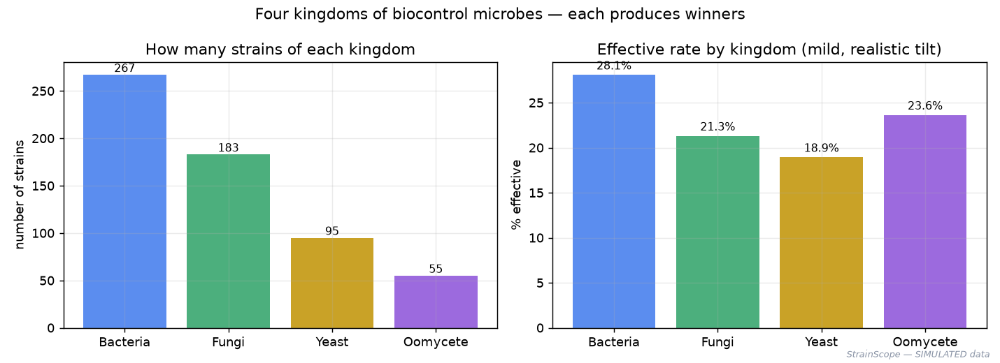
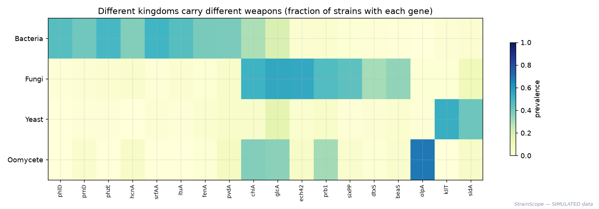
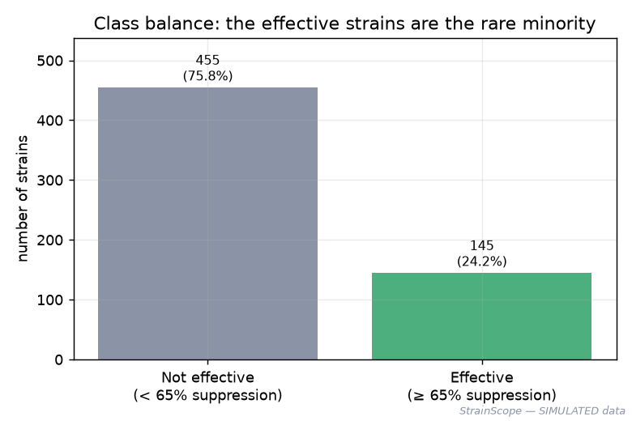
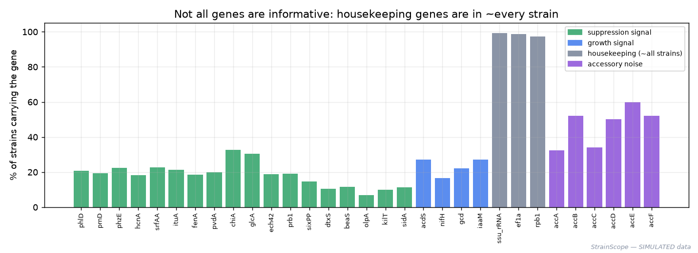
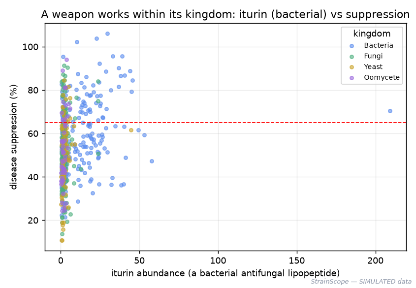
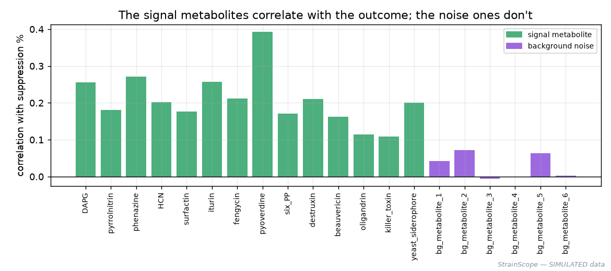
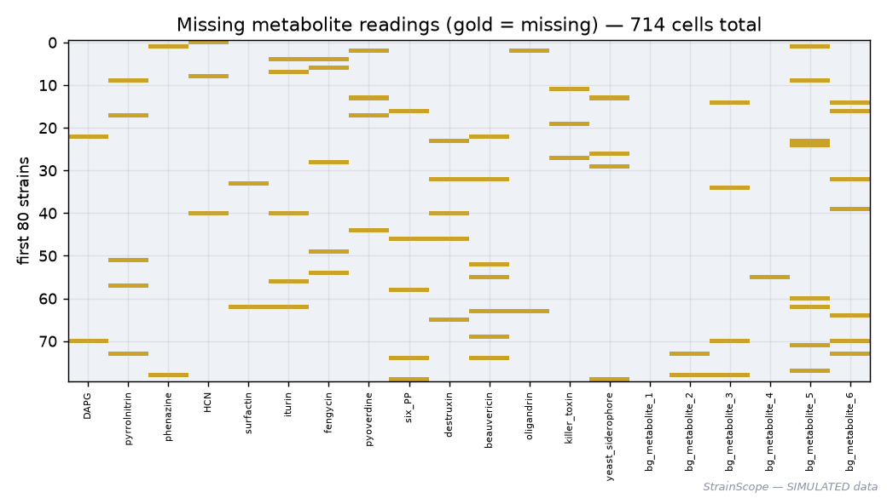
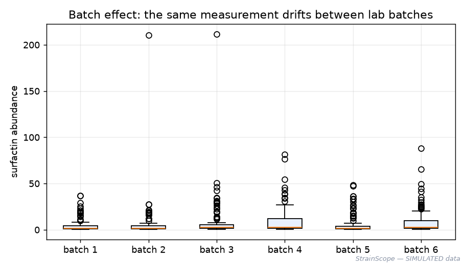

# 02 · Phase 1 — Generating the Data (a realistic, honest synthetic library)

[← Setup](01-setup.md) · [All docs in order](../README.md#the-tutorial-in-order) · [Glossary](GLOSSARY.md)

**Prerequisites:** you finished `01-setup.md` — Python works inside your `.venv`, and the packages import. That's all.
**Learning goal:** by the end you will understand *what data science even needs to start*, what our three "omics" tables are and the real biology behind them, what a **random seed** is and why reproducibility depends on it, why we deliberately build **imperfect** data, and you'll have generated the actual dataset with one command and looked at it with your own eyes.
**Checkpoint:** running one command produces three CSV files in `data/raw/` and prints a summary "ledger"; you can open a CSV and recognise what's inside; and you can explain, in plain words, why the data has missing values and duplicates *on purpose*.

**Session plan** (this phase splits cleanly into two short sittings, so a week-long gap between them is fine — each ends at a natural checkpoint):
- **Session A (~1–1.5 h):** read the concepts (§1–4) — the biology, synthetic data, the random seed, the design — then run the generator and inspect the CSVs with your own eyes (§5). Stop after the Step-4 peek.
- **Session B (~1 h):** generate and study the figures (§6), skim the data dictionary (§4d) as reference, then commit and push (§10).

> **New here?** Every technical or biological term is defined in plain language in [`GLOSSARY.md`](GLOSSARY.md). This page adds its new terms there too.

---

## 1. The big picture: what are we actually doing, and why?

Let me set the scene with zero assumed knowledge — biology *or* software.

Farmers lose a huge share of their crops to diseases and pests. The usual defence is synthetic chemical sprays, but those have downsides (cost, resistance, environmental harm). There's a gentler alternative: **biologicals** — using *living helpers from nature* to protect plants. A helper is a **microbe**: a tiny living organism that, for example, produces a natural compound that keeps a crop disease in check, or simply out-competes the pest.

Crucially, "microbe" is not one kind of thing. Beneficial biocontrol microbes span several very different groups (biologists call them **kingdoms**), and — this is the important part — **each group fights with different weapons**:

- **Bacteria** (e.g. *Bacillus*, *Pseudomonas*) — release **antibiotics and soap-like lipopeptides** that poison or dissolve pests.
- **Fungi** (e.g. *Trichoderma*, *Beauveria*) — practise **mycoparasitism** (literally attacking other fungi with wall-digesting enzymes) and make antifungal or insect-killing toxins.
- **Yeasts** (single-celled fungi) — mostly **out-compete** pests for space and nutrients, and some release "killer toxins".
- **Oomycetes** (e.g. *Pythium oligandrum*) — fungus-like organisms that **parasitise other microbes** and trigger the plant's own defences.

> **Everyday analogy:** think of a team of bodyguards from different backgrounds — one is a boxer, one a wrestler, one wins by sheer stamina. They all protect you, but *how* they do it differs. A good scout (our model) has to recognise each fighting style, not just look for one.

There are two more groups in the real biocontrol world — **viruses** and **protozoa** — that genuinely matter, but they work so differently that they don't fit the same molecular measurements (a virus has no "chemistry output" to measure). We name them as part of the landscape and, honestly, leave them out of the molecular dataset — more on that, and *why*, in §4.

"one strain" = one specific isolate of a microbe. Every strain in our data is one row, tagged with its **kingdom** and **genus**.

Here's the problem that turns this into a *data* problem:

> A research team might have **hundreds or thousands of candidate microbes** (each one is called a **strain** — think of a strain as one specific "breed" of a microbe). Only a **small fraction actually work well** in the real world. Testing each one properly — growing it, challenging it against a disease, measuring the result — is slow and expensive. So the dream is: **measure something cheap about each strain, and predict which ones are worth the expensive testing.**

What can we measure cheaply? Molecular "fingerprints." Picture each strain as a **car**:

- Its **genome** (its DNA) is the **blueprint** — which useful *parts* the car was designed with. In our data this becomes the **genomics** table: for each strain, which helpful genes it carries (yes/no).
- Its **metabolites** (the small-molecule chemicals it produces) are what actually **comes out of the car** — the exhaust, the products. In our data this becomes the **metabolomics** table: for each strain, how much of each chemical it makes.
- Its **performance** is the **road test** — how well the car actually drives. In our data this is the **phenotype** table: for each strain, a measured *disease-suppression score*.

"**-omics**" is just the word scientists use for "measuring a whole category at once" — *genomics* = all the genes, *metabolomics* = all the metabolites. Looking at several of these together is **multi-omics**. One fingerprint can mislead you; several together, read jointly, give a far more trustworthy picture. That "read them jointly" step is the valuable, hard skill this whole project is built around — and it starts with having the data. Which is what this phase creates.

---

## 2. Where does the data come from? (and why we build it ourselves — honestly)

In an ideal world we'd download a ready-made public dataset with all three fingerprints measured on the *same* strains, neatly lined up. In reality, matched multi-omics data like that is scattered, inconsistent, and rarely downloadable as one tidy package. Rather than pretend otherwise, **we generate the data ourselves, with a script** — and we're completely open about that.

**What is "synthetic data"?** Data created by a computer program instead of measured in a lab. It sounds like cheating, but it's a genuine, widely-used tool. Companies use synthetic data when the real thing is **private** (patient records), **rare** (a failure that happens once a year), or **doesn't exist yet**. The skill of *designing realistic synthetic data* — with the right patterns, the right messiness — is itself valuable and respected.

> **Everyday analogy:** a **flight simulator**. No real plane, no real risk — but if the simulator is built well (realistic controls, weather, failures), a pilot who trains in it genuinely learns to fly. Our synthetic data is a flight simulator for the whole analysis workflow.

**The honest limitation, stated plainly (and repeated in the README and every write-up):** a model trained on synthetic data proves the **workflow** is correct — the integration, the cleaning, the evaluation, the app all work — **not** that the predictions would hold on real-world microbes. We never claim otherwise. To keep the simulator realistic, we ground every gene and chemical in **real biology** (real names, real roles), so what you learn transfers.

---

## 3. What is a "random seed", and why everything depends on it

Our generator makes lots of "random" choices (which strain carries which gene, how much of a chemical it makes). But we need **everyone who runs the script to get the *exact same* dataset** — otherwise your results, my results, and a stranger's results would all differ, and nothing could be reproduced.

Here's the trick. Computers don't make *true* randomness; they run a formula that spits out numbers that *look* random. That formula starts from a chosen number called the **seed**. **Same seed → same sequence of "random" numbers, every single time.**

> **Everyday analogy:** shuffling a deck of cards the *exact same way* every time. If everyone shuffles identically, everyone deals the identical hands. The seed is the instruction "shuffle like *this*." We fix it to `42` (a traditional choice), so the dataset is identical on your Mac, a Windows laptop, and a Linux server.

**Reproducibility** — the property that anyone can rerun your work and get the same answer — is the entire point of a project others can learn from. The random seed is where it begins.

---

## 4. The design: what our dataset will contain

We create **600 strains**, and for each strain, three tables plus some metadata. Here's the shape, in plain terms:

| Table (file) | What each row is | What the columns are |
|---|---|---|
| `genomics.csv` | one strain | for each **gene family**, a `1` (the strain carries it) or `0` (it doesn't) |
| `metabolomics.csv` | one strain | for each **chemical**, how much the strain produces (a number) |
| `phenotype.csv` | one strain | the **kingdom** and **genus**, the **outcome** (`suppression_score`, `is_effective`), plus metadata (site, batch, date) |

All three tables share a **`strain_id`** column (like `STRAIN_0001`) — that's the shared key that lets us line the fingerprints up later. (Lining tables up on a shared key is exactly what a database `JOIN` does — you'll meet it next phase.)

### 4a. Signal, housekeeping, and noise — why we plant distractions on purpose

This is the single most important design idea, so here it is slowly. In real data, **not every measurement matters.** Some genes/chemicals genuinely drive the outcome (**signal**); some are present in nearly every strain and so tell you nothing (**housekeeping**); some vary but are simply irrelevant (**noise**). We build all three kinds in **on purpose**, because:

> If every column mattered, the problem would be a toy. The real challenge — and the skill worth demonstrating — is **finding the signal among the distractions.** A dataset with planted noise forces the later machine-learning step to actually do that.

> **Everyday analogy:** finding which ingredients make a dish taste good. Some ingredients matter enormously (the spice), some are in every dish so they don't distinguish anything (salt and water = housekeeping), and some are just... there (a garnish = noise). Good cooking — and good modelling — is knowing which is which.

### 4b. The real biology (so the names aren't just gibberish)

Every gene and chemical below is a **real** one known to matter for microbes that protect plants. You don't need to memorise these — but seeing that they're real (not invented) is what makes the simulator trustworthy. Here's the friendly version:

Because different kingdoms fight differently, the genes are grouped by *whose weapon they are*. You don't need to memorise these — seeing that they're real, and that each kingdom has its own kit, is the point.

**Bacterial weapons** (antibiotics, lipopeptides, iron-theft):

| Gene | What it does, in plain words |
|---|---|
| `phlD` | makes **DAPG**, a natural antifungal |
| `prnD` | makes **pyrrolnitrin**, another antifungal antibiotic |
| `phzE` | makes **phenazine**, a broad antibiotic |
| `hcnA` | makes **hydrogen cyanide**, which suppresses fungi and some pests |
| `srfAA` | makes **surfactin**, a soap-like molecule that damages microbe membranes |
| `ituA` | makes **iturin**, a strong antifungal lipopeptide |
| `fenA` | makes **fengycin**, an antifungal lipopeptide |
| `pvdA` | makes **pyoverdine**, which "steals" iron so pathogens starve |

**Fungal & oomycete weapons** (mycoparasitism — attacking other microbes — plus toxins):

| Gene | What it does, in plain words |
|---|---|
| `chiA`, `glcA` | **chitinase** and **glucanase** — enzymes that dissolve fungal cell walls (their armour); used by bacteria, fungi *and* oomycetes |
| `ech42`, `prb1` | *Trichoderma*'s **mycoparasitism** enzymes (a wall-digesting chitinase and a protease) |
| `sixPP` | makes **6-pentyl-α-pyrone**, an antifungal aroma compound (the "coconut" smell of *Trichoderma*) |
| `dtxS`, `beaS` | insect-killing fungi (*Metarhizium*, *Beauveria*) making the toxins **destruxin** and **beauvericin** |
| `olpA` | *Pythium oligandrum*'s **oligandrin**, which alerts the plant's own immune system |

**Yeast weapons** (competition & killer toxins):

| Gene | What it does, in plain words |
|---|---|
| `kilT` | a yeast **killer toxin** that kills rival microbes |
| `sidA` | a yeast **siderophore** — iron competition, like the bacterial one |

**Not weapons** (present in the data, but for different reasons):

| Gene | What it does, in plain words |
|---|---|
| `acdS`, `nifH`, `gcd`, `iaaM` | help the **plant grow** (stress relief, nitrogen, phosphate, auxin) — a *second* outcome |
| `ssu_rRNA`, `ef1a`, `rpb1` | **housekeeping** — conserved genes in ~every microbe of every kingdom, so they carry no signal |
| `accA…accF` | stand-in **accessory** genes: they vary but don't affect the outcome (noise) |

The **metabolites** (chemicals) mirror the genes: if a strain has the producing gene, it *tends* to make the matching chemical — but not perfectly, because biology has regulation and randomness. That imperfect gene→chemical link is precisely why looking at **both** layers together beats looking at either alone. (A few genes, like the wall-digesting enzymes, are *enzymes* rather than small molecules, so they show up only in the genomics layer — a small honest realism: not every mechanism leaves a chemical trace.)

> **Why viruses and protozoa aren't in the data (an honest scoping choice).** They're real biocontrol agents — baculoviruses kill insect pests, some protozoa attack pathogens. But a virus has **no genome-plus-metabolome fingerprint** in the sense the other groups do (it has a handful of genes and produces no secreted chemicals of its own). Forcing them into the same three-table structure would mean inventing measurements that don't exist — which an expert would rightly distrust. So we cover the **four cellular kingdoms that genuinely share this molecular basis** (bacteria, fungi, yeasts, oomycetes) and name viruses/protozoa as context. Knowing *what not to model, and why*, is as much a part of good data science as the modelling.

### 4c. The mess we build in on purpose

Real lab data is dirty. To make the simulator honest — and to give the *next* phase (cleaning) something real to fix — we deliberately introduce:

- **Missing values** — some readings just aren't there (instruments drop out, genome assemblies have gaps). Shown as blank/`NaN`.
- **A batch effect** — strains are processed in **6 batches**, and each batch's chemical readings drift by a systematic factor. (Real instruments/reagents drift between runs.)
- **Outliers** — a few chemical readings spike to absurd values (measurement errors).
- **Duplicate rows** — a handful of strains get recorded **twice** (classic data-entry mistake).
- **Messy text** — the `collection_site` and `genus` columns have inconsistent capitalisation, stray spaces, and deliberate typos (`Psuedomonas` for *Pseudomonas*, lowercase `trichoderma`), so the cleaning phase has real text to harmonise across all kingdoms.
- **A few "impossible" values** — a suppression score can't really be below 0% or above 100%, but noise pushes a few outside that range, so cleaning has to catch and clip them.

None of this is sloppiness — it's **realism, on purpose**, and each item is documented so nothing is a surprise later.

### 4d. The data dictionary (every column, defined)

A **data dictionary** is a reference table that says, for every column: what it's called, what type of value it holds, and what it means. It's the first thing a stranger needs to understand your data — and writing one is a professional habit worth building. Here are all three files.

**`genomics.csv`** — one row per strain; `1` = gene present, `0` = absent, blank = missing call.

| Column | Type | Meaning |
|---|---|---|
| `strain_id` | text | unique strain key (`STRAIN_0001`…); the shared key across all three files |
| `phlD, prnD, phzE, hcnA, srfAA, ituA, fenA, pvdA` | 0/1 (some blank) | **bacterial** signal genes — antibiotics, lipopeptides, siderophore |
| `chiA, glcA, ech42, prb1, sixPP, dtxS, beaS, olpA` | 0/1 | **fungal / oomycete** signal genes — wall-digesting enzymes, mycoparasitism, antifungal & insecticidal toxins, elicitor |
| `kilT, sidA` | 0/1 | **yeast** signal genes — killer toxin, siderophore |
| `acdS, nifH, gcd, iaaM` | 0/1 | **growth-promotion** genes — linked to the secondary outcome |
| `ssu_rRNA, ef1a, rpb1` | 0/1 | **housekeeping** genes — present in ~all strains of every kingdom, so no signal |
| `accA … accF` | 0/1 | **accessory noise** genes — vary, but unrelated to any outcome |

**`metabolomics.csv`** — one row per strain; abundances are non-negative numbers (blank = missing reading).

| Column | Type | Meaning |
|---|---|---|
| `strain_id` | text | shared key |
| `DAPG, pyrrolnitrin, phenazine, HCN, surfactin, iturin, fengycin, pyoverdine` | float ≥ 0 (some blank) | **bacterial** signal metabolites |
| `six_PP, destruxin, beauvericin, oligandrin` | float ≥ 0 | **fungal / oomycete** signal metabolites |
| `killer_toxin, yeast_siderophore` | float ≥ 0 | **yeast** signal metabolites |
| `bg_metabolite_1 … bg_metabolite_6` | float ≥ 0 | **background noise** metabolites — measured, but unrelated to the outcome |

*(Note: some signal genes — `chiA`, `glcA`, `ech42`, `prb1` — are enzymes, not small molecules, so they have no metabolite column; they contribute through genomics only.)*

**`phenotype.csv`** — one row per strain; the outcome plus sample metadata.

| Column | Type | Meaning |
|---|---|---|
| `strain_id` | text | shared key |
| `kingdom` | text | one of **Bacteria / Fungi / Yeast / Oomycete** — the microbe group |
| `genus` | text (messy) | microbe genus label — inconsistent case, stray spaces, deliberate typos |
| `collection_site` | text (messy) | where the strain was isolated — inconsistent case/whitespace |
| `isolation_date` | date (ISO `YYYY-MM-DD`) | a plausible fake isolation date (from Faker) |
| `batch_id` | integer 1–6 | the processing batch — the source of the batch effect |
| `suppression_score` | float | disease suppression, **% (0–100 nominal)** — a few values fall outside 0–100 on purpose |
| `growth_promotion` | float | the secondary plant-growth outcome |
| `is_effective` | 0/1 | `1` when `suppression_score ≥ 65` — the rare "winner" label |

---

## 5. Build it: the generator script

Now we write the code that produces all of the above. This phase introduces two files — here's what they are and where they live:

| File | Goes in | Its job |
|---|---|---|
| `generate_data.py` | `src/strainscope/` | the generator: invents the strains and writes the three raw CSVs |
| `make_phase1_figures.py` | `figures/` | reads the CSVs and produces the teaching figures + interactive chart |

You'll create the generator, read it in sections, then run it.

### Step 1 — create the script file

The generator lives at `src/strainscope/generate_data.py`. **Save the provided `generate_data.py` into `src/strainscope/`** (it's a long, carefully-commented file; saving it avoids paste errors). You should also have an empty file `src/strainscope/__init__.py` — that empty file is what makes the `strainscope` folder importable as a Python "package"; if it's missing, create it:

```bash
touch src/strainscope/__init__.py
```

> **What is `__init__.py`?** An empty marker file that tells Python "this folder is a package you can import from." Think of it as the nameplate on a filing cabinet — without it, Python doesn't treat the folder as one importable unit.

### Step 2 — understand what the code does (the tour)

You don't need to memorise Python to follow this — the file is commented line by line. Here's the shape of it, in the order it runs:

1. **Settings block** — every knob (how many strains, the seed, the missing-value rate, the "effective" threshold) sits at the top so the whole design is visible in one place.
2. **The biology** — the real gene and chemical names, split into *signal*, *housekeeping*, and *noise* groups.
3. **`generate()`** — the heart of it:
   - seeds the random-number generator **once** (this is the reproducibility guarantee);
   - builds **genomics** (coin-flips per gene, weighted by how common each gene is);
   - builds **metabolomics** (high chemical amounts when the producing gene is present, low when absent — with realistic log-normal spread);
   - applies the **batch effect**;
   - computes the **hidden truth** — a latent "efficacy" from the *signal* features only — and turns it into the `suppression_score` and the `is_effective` label;
   - injects the **mess** (missing values, outliers, duplicates);
   - records a **ledger** of exactly what it produced.
4. **`main()`** — writes the three CSVs to `data/raw/` and prints the ledger.

> **One detail worth calling out — cross-platform paths.** The script figures out where to write files *relative to itself* using Python's `pathlib`, so it works identically whether you run it from the project root, from inside `src/`, on Windows, macOS, or Linux. It never hard-codes a personal path like `/Users/<your-name>/...`. (That's the "neutral paths" habit from the architecture doc, applied in practice.)

### Step 3 — run it

From the project root, with your `.venv` active (you should see `(.venv)` in your prompt):

```bash
python src/strainscope/generate_data.py
```

**Expected output** (your numbers will match exactly, because of the fixed seed):

```
  wrote data/raw/genomics.csv  (608 rows, 32 columns)
  wrote data/raw/metabolomics.csv  (608 rows, 21 columns)
  wrote data/raw/phenotype.csv  (608 rows, 9 columns)

  ── StrainScope synthetic dataset — ledger ──────────────────────
  strains (samples ....... 600
  effective strains ...... 145  (24.2%)  <- the rare winners
  kingdoms ............... Bacteria:267  Fungi:183  Yeast:95  Oomycete:55
  effective by kingdom ... Bacteria:28.1%  Fungi:21.3%  Oomycete:23.6%  Yeast:18.9%
  genes (genomics cols) .. 31
  metabolites (metab cols) 20
  missing metabolite cells 714  (instrument dropouts)
  missing gene cells ..... 338  (assembly gaps)
  outlier metabolite cells 120  (measurement spikes)
  duplicated strains ..... 8  (recorded twice)
  impossible scores ...... 3  (<0 or >100 %; QC will clip)
  ────────────────────────────────────────────────────────────────
  Reminder: this data is SIMULATED. It proves the workflow, not real-world accuracy.
```

> **Why 608 rows, not 600?** Because we deliberately duplicated 8 strains — those 8 extra rows are the mess the next phase will clean. And notice the **effective-by-kingdom** line: every kingdom produces some winners (18–28%), with a mild, realistic tilt toward bacteria — so a model can't just cheat by reading the kingdom label; it has to learn each group's weapons.

### Step 4 — look at the data with your own eyes

Numbers in a summary are abstract; open a file and *see* it. Two easy ways:

```bash
# Peek at the top of a file from the terminal:
head -3 data/raw/phenotype.csv
```
**Expected** (something like):
```
strain_id,kingdom,genus,collection_site,isolation_date,batch_id,suppression_score,growth_promotion,is_effective
STRAIN_0001,Yeast,Candida,Endosphere,2023-10-07,2,40.85,30.81,0
STRAIN_0002,Bacteria,Pseudomonas, rhizosphere,2018-11-07,6,46.25,27.78,0
```
Notice the mess already visible: `Pseudomonas` here has a leading space on the *site* (` rhizosphere`), and elsewhere you'll find trailing spaces, odd capitalisation, and the `Psuedomonas`/`trichoderma` typos. Good — that's real, and it now spans four kingdoms.

Or open `data/raw/genomics.csv` in VS Code and scroll: you'll see `1`s and `0`s, and some blank cells (the missing gene calls).

---

## 6. See the data as pictures (this is where it clicks)

A table of numbers is hard to feel. These figures — all generated from the exact data you just made, by `figures/make_phase1_figures.py` — turn it into something you can *see*. Run them yourself:

```bash
python figures/make_phase1_figures.py
```

That writes the PNGs below into `figures/` and an interactive chart into `docs/interactive/`.

### Four kingdoms, and each produces winners



Our 600 strains span four kingdoms (left): bacteria are the most common (they're the most-studied biocontrol agents), then fungi, yeasts, and oomycetes. On the right is each kingdom's **effective rate** — all of them produce some winners (roughly 19–28%), with a mild, realistic tilt toward bacteria. That balance is deliberate: it forces the model to learn *how each kingdom fights*, not just to memorise "bacteria good, yeast bad."

### Different kingdoms carry different weapons



This is the heart of the multi-kingdom idea. Each row is a kingdom, each column a "weapon" gene, and the colour is how common that gene is in that kingdom. See how the arsenals barely overlap: bacteria carry the antibiotics and lipopeptides (`phlD`…`pvdA`); fungi carry the mycoparasitism enzymes and toxins (`ech42`…`beaS`); oomycetes carry `olpA` plus the shared wall-digesting enzymes; yeasts carry `kilT`/`sidA`. *A strain's kingdom shapes which weapons it can even have* — which is exactly why a one-size-fits-all model would fail.

### The three layers, one set of strains


Read left to right: the same 40 strains appear in every panel. A thin **kingdom** strip (far left) colours each strain by group. **Genomics** is blue where a gene is present — notice the housekeeping genes (`ssu_rRNA`/`ef1a`/`rpb1`) are blue for almost everyone, and the white gaps are missing calls. **Metabolomics** is a heat-map of chemical amounts (darker = more), with white gaps for missing readings. **Phenotype** (right) is each strain's suppression score; green bars cross the red "effective" line, grey bars don't. *This one picture is the whole project in miniature: several fingerprints, one outcome.*

### The winners are rare



Only **24.2%** of strains are "effective." This **class imbalance** is realistic (most candidates don't work) and it matters later: a lazy model could score ~76% "accuracy" just by always guessing "not effective" — which is useless. Handling this honestly is a skill the modelling phase will teach.

### Not all genes are informative



The housekeeping genes (grey) sit near 100% — they're in almost every strain of every kingdom, so they can't help *distinguish* good strains from bad. The signal genes (green) and noise genes (purple) vary more. A good model must learn to **lean on the informative genes and ignore the rest** — exactly the "which ingredients matter?" problem.

### The hidden signal is really there



Each dot is a strain, coloured by **kingdom**: how much **iturin** (a *bacterial* antifungal lipopeptide) it makes (across) versus how well it suppresses disease (up). Look at the blue (bacteria) dots — the ones making more iturin tend to suppress more. The other kingdoms sit near zero iturin (it's not *their* weapon) yet many still suppress disease — because they fight with their *own* chemicals. That's the multi-kingdom story in one picture: **a weapon predicts success within the kingdom that wields it.** The relationship is real but noisy (honest), and you can still spot injected artifacts (a dot or two above 100%, the far-right outlier spikes) that the next phase cleans.

**▶ Try the interactive version:** [`docs/interactive/signal_scatter.html`](interactive/signal_scatter.html) — open it in any web browser (double-click the file). It plots **how many weapon genes a strain carries** against its suppression, coloured by kingdom, and **hovering any dot** shows that strain's ID, genus, kingdom, and score. You can see the same upward trend *within every kingdom*. Dragging to zoom and toggling a kingdom in the legend works too. *(On GitHub, this file renders as a live page only when published via GitHub Pages; opened locally it works straight away.)*

### Which chemicals carry the signal?



Each bar is how strongly a chemical tracks the outcome. All **signal** chemicals (green) — bacterial, fungal, oomycete *and* yeast — lean positive; the **background noise** chemicals (purple) hover around zero. Even though each weapon only helps its own kingdom, pooled across all strains the signal chemicals still carry real information and the noise ones don't. This is the "find the signal among distractions" challenge, made visible.

### The mess we must clean (next phase)



Gold cells are **missing** readings scattered through the metabolomics table (714 in total). Missing data can't be ignored — most models refuse to run with holes in the input — so the next phase decides, deliberately and documented, what to do about each gap.



Here's the **batch effect**: the *same* chemical (surfactin) sits at systematically different levels across the six processing batches. That drift is an artifact of *how* the data was collected, not a real biological difference — and if we don't correct it, a model might "learn the batch" instead of the biology. Spotting and correcting this is a core data-quality skill, coming up next.

---

## 7. Checkpoint — did the phase work?

You're done with Phase 1 when all of these are true:

0. **Files landed.** The generator and figure script are where they belong (a quick `ls` "screams" `No such file` for anything missing):
   ```bash
   ls src/strainscope/generate_data.py figures/make_phase1_figures.py
   ```
   → both paths echo back, no error.
1. `python src/strainscope/generate_data.py` prints the ledger and writes three files:
   ```bash
   ls data/raw/
   ```
   → `genomics.csv  metabolomics.csv  phenotype.csv` (plus the two `.gitkeep` files)
2. Each file has **608 rows** (600 strains + 8 duplicates). Quick check:
   ```bash
   wc -l data/raw/*.csv
   ```
   → each shows `609` (608 data rows + 1 header line).
3. You can open `data/raw/phenotype.csv` and recognise the columns, and you can spot at least one piece of deliberate mess (a trailing space, an odd capitalisation, or a blank cell).
4. `python figures/make_phase1_figures.py` runs without error and creates the PNGs in `figures/`.

If all four hold — the dataset exists, it's reproducible, and you've *seen* it — you've completed the hardest conceptual leap of the project: you now know exactly what data you have and why it looks the way it does.

---

## 8. What could go wrong (mini-FAQ)

- **`ModuleNotFoundError: No module named 'faker'` (or numpy, pandas).** Your `.venv` isn't active, or the packages aren't installed. Activate it (`source .venv/bin/activate`, or on Windows `.\.venv\Scripts\Activate.ps1`), then `pip install -r requirements.txt`. The `(.venv)` prefix must be showing.
- **`can't open file '.../generate_data.py'`.** You're not in the project root. `cd` into your `strainscope` folder first, then run the command exactly as written.
- **My numbers are different from the ledger above.** Almost always the seed was changed, or an older copy of the script is running. The seed is `SEED = 42` near the top of `generate_data.py`; with it unchanged, the output is identical everywhere.
- **The figures script fails on `plotly` or `matplotlib`.** Those install with `pip install -r requirements.txt`. If a single figure errors, the others still write — rerun after fixing the named package.
- **Should I commit the CSVs in `data/raw/`?** **No.** They're regenerated by the script (that's the proof it works), and `.gitignore` already excludes them. We commit the *generator* and the *figures*, not the data. Regenerating from code is more trustworthy than shipping a frozen copy.
- **The push fails with `HTTP 400` / `RPC failed` / `unexpected disconnect`.** This is the first push that includes the figures and the interactive HTML, so the upload is larger than Git's tiny default buffer. It's a transfer hiccup, not a problem with your commit (which is safe locally). Quick fix: `git config --global http.postBuffer 524288000`, then push again — full details and fallbacks are in [`01-setup.md`](01-setup.md) under the push workflow's "If it goes wrong".

---

## 8b. Notes from the build (kept on purpose)

Real work has bumps, and hiding them helps no one. Here are the honest ones from building this phase — each with the lesson, because *how you handle a bump* is a skill in itself.

- **The first version made too many "winners."** My first run marked **33.7%** of strains effective — too many for a realistic "rare winners" scenario. The fix was to lower the score's centre in the generator so ~24% pass the threshold. **Lesson:** designing synthetic data is *iterative* — you generate, check the result against your intent, and tune. Don't assume the first draft is right; look at the ledger and adjust.
- **The safety gate flagged this very document.** When I first ran `check-public-safe.sh`, it stopped the push because a doc contained an example that *looked* like a real home-directory path. It was only an illustration — but the scanner can't tell an example from a real leak, and that's exactly what you want it to do. **Lesson:** the honest fix is to make the text unmistakably an example (a `<placeholder>`), **never** to weaken the check. A gate that trusts you is not a gate.
- **A figure setting crashed the plotting script on the first run.** One styling option I used doesn't exist in this version of the plotting library, and the script stopped with a `KeyError` naming the bad setting. **Lesson:** read the actual error message — it usually names the exact problem. "Read the error, don't panic" is the single most useful debugging habit, and library options genuinely differ between versions.
- **The first multi-kingdom version made yeasts unwinnable.** When I first broadened the data to four kingdoms, bacteria (which have the most "weapons") ended up ~40% effective while yeasts were **0%** — so the outcome was almost decided by kingdom alone. The fix was to judge each strain *relative to its own kingdom's arsenal*, with only a mild realistic tilt toward bacteria. **Lesson:** when a dataset spans groups with very different feature sets, check that the outcome isn't accidentally a proxy for the group label — otherwise a model "learns" the label instead of the biology.
- **A package wasn't installed the first time.** The generator imports `faker`; on a fresh environment it wasn't there yet, so Python raised `ModuleNotFoundError`. **Lesson:** this is *precisely* what the virtual environment and `requirements.txt` exist to prevent — `pip install -r requirements.txt` inside your active `.venv` installs everything the project needs, so anyone who clones the repo gets an identical, complete toolbox.

None of these are failures — they're the normal texture of building software, and each left the project a little more robust.

---

## 9. Two ways to run everything (running tally)

Every capability in StrainScope has a **manual** path (so you learn it) and an **automated** path (so a stranger can reproduce it). We'll grow this table every phase, so by the end it's a complete map of the project.

| Capability | Manual path (now) | Automatic path (later) |
|---|---|---|
| Generate the data | `python src/strainscope/generate_data.py` | Phase 7's one-command pipeline runs generate → clean → integrate → model → serve |
| Make the figures | `python figures/make_phase1_figures.py` | regenerated on demand; the app (Phase 6+) shows interactive versions |
| Inspect the data | `head`/open the CSVs; read the ledger | the Streamlit app's data explorer (Phase 6) |

Both paths always work; neither is an afterthought.

## 9b. Same task, three languages (optional, 10 min)

StrainScope is built mainly in Python, but data work is genuinely multilingual, and seeing the *same* small task in different languages builds intuition for what each is good at. Here's one question — *"how many strains are effective?"* — answered three ways. You don't have to run these; reading them is the point.

**Python (pandas)** — what this project uses:
```python
import pandas as pd
df = pd.read_csv("data/raw/phenotype.csv").drop_duplicates("strain_id")
print(int(df["is_effective"].sum()), "effective of", len(df))
```

**R (dplyr)** — R's tidyverse style, which you'll meet properly in the R integration phase. This uses base R's built-in `read.csv` so it runs with no extra installation (`dplyr` came with your setup):
```r
library(dplyr)
read.csv("data/raw/phenotype.csv") |>
  distinct(strain_id, .keep_all = TRUE) |>
  summarise(effective = sum(is_effective), total = n())
```

> **Optional upgrade — the friendlier reader, and a real renv lesson.** The tidyverse has a faster, tidier CSV reader called `readr::read_csv` (it even reports the column types it detects). It isn't installed in this project yet, because renv keeps each project's toolbox minimal on purpose. Adding it is a good chance to learn the *reproducible* way to add an R package — do this once in the RStudio Console:
> ```r
> renv::install("readr")     # adds readr (and its dependencies) to THIS project
> ```
> Then you can swap `read.csv(...)` for `readr::read_csv(...)` in the snippet above. (renv only writes a package into `renv.lock` once a committed script actually uses it — so a `renv::snapshot()` may report "already up to date" here; that's expected, exactly as it was for mixOmics in setup.)

**SQL** — the language of databases, which arrives next phase with DuckDB:
```sql
SELECT SUM(is_effective) AS effective, COUNT(*) AS total
FROM (SELECT DISTINCT ON (strain_id) * FROM phenotype);
```

All three give the same answer (145 effective of 600). The takeaways, honestly: **pandas** is the everyday workhorse for Python data work; **dplyr** reads almost like English and shines for statistics and the specialised omics tools we'll use later; **SQL** is unbeatable when the data already lives in a database and you want a precise slice of it. Knowing *why* you'd reach for each matters more than memorising any one.

---

## 10. Save your work (commit ritual + safety gate)

You've added real code and figures — time to snapshot it. Run the **safety checks first**, then commit and push to all three branches, then sync `master` back (exactly as `01-setup.md` established):

```bash
# 0. Safety first
pytest -q                     # no tests yet this phase — harmless, prints "no tests ran"
./check-public-safe.sh        # must print: ✓ SAFE TO PUSH

# 1. Commit + push
git switch develop
git add -A
git commit -m "feat: add Phase 1 synthetic multi-omics data generator and figures"
git push origin develop develop:beta develop:master

# 2. Sync local master
git switch master
git pull --ff-only origin master
git switch develop
```

> **Why the commit message starts with `feat:`** — this phase adds a real *feature* (the generator). Documentation-only changes use `docs:`; tooling/config uses `chore:`. Consistent prefixes make your history readable.

---

## 11. What you learned, and what's next

**You learned:** what data science needs to begin; that beneficial microbes span several **kingdoms** (bacteria, fungi, yeasts, oomycetes) that fight with *different weapons*; what genomics / metabolomics / phenotype are, in plain terms and real biology; what a random seed is and why reproducibility rests on it; why realistic data must contain signal, housekeeping, *and* noise; why we build imperfection in on purpose; and why some real agents (viruses, protozoa) are honestly scoped *out* of the molecular matrix. You generated the dataset, made it reproducible, and — crucially — *saw* it.

**Try it yourself (extensions — optional, but this is how understanding sticks):**
- **Change the seed** at the top of `generate_data.py` (say `SEED = 7`), rerun, and watch *every* number in the ledger change — then set it back to `42` and confirm the original numbers return *exactly*. That's reproducibility, felt firsthand.
- **Make the winners rarer** by raising `EFFECTIVE_THRESHOLD` to `75`, rerun, and see the effective % drop. (This makes the class-imbalance challenge harder — good practice for later.)
- **Grow the library** by setting `N_STRAINS = 2000` and rerun; notice the figures still work and the signal becomes clearer with more data.
- **Add a new gene/metabolite pair** to the signal set and re-run the figures to see it appear. (A gentle way to explore how the generator is wired.)

Each experiment is safe — the generator is deterministic and rewrites the files cleanly every time.

**Next:** [`03-harmonization-qc.md`](03-harmonization-qc.md) — **Phase 2**, where we clean this mess. We'll line the three tables up on `strain_id`, remove the duplicates, decide what to do about the missing values, tame the outliers, correct the batch effect, harmonise the messy text, and clip the impossible scores — loading the result into a **DuckDB** database you can question with SQL. Every decision documented, with a before/after "cleaning ledger" so nothing vanishes silently.
