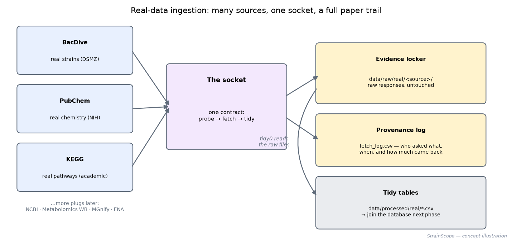

# 02b · Phase 1b — Real data lands in the project (BacDive · PubChem · KEGG)

[← Phase 1: the synthetic library](02-data-generation.md) · [All docs in order](../README.md#the-tutorial-in-order) · [Glossary](GLOSSARY.md)

**Prerequisites:** Phase 1 complete — the synthetic library generates and its checkpoint passed. You'll also need an internet connection for the fetch steps (the tidy and test steps work offline).
**Learning goal:** after this phase you will understand what an **API** is by having used three, what **JSON** is by having read some, why **rate limits** and **politeness** exist, what a **provenance log** is and why regulated industries treat it as sacred, and how one small "contract" lets a project support many data sources without turning into spaghetti. You'll fetch *real* strains, *real* chemistry, and *real* pathway links from three of the world's reference databases.
**Why this phase exists in a real workflow:** every serious data project eventually pulls from external sources, and teams that fetch ad-hoc (download a file, rename it, forget where it came from) cannot answer the first question an auditor — or a curious reviewer — asks: *"where did this number come from?"* Our ingestion leaves a paper trail by design. It also makes StrainScope tangibly authentic: the molecules and strains you'll fetch are the real things our synthetic library models.

**Session plan:**
- **Session A (~1–1.5 h):** concepts (§1–2) + touch the APIs with your bare hands in a browser (§3) + files in + probe (§4–5).
- **Session B (~1–1.5 h):** fetch for real + inspect the provenance log + tidy + figures + checkpoint + commit (§6–12).

---

## 1. Concepts, plainly

**API (Application Programming Interface).** A website designed for *programs* instead of people. You request a carefully-shaped URL; instead of a styled page, you get raw data back. Everyday analogy: a restaurant's **service hatch**. The dining room (the normal website) is for humans; the hatch is where orders go in and plates come out, fast and structured, for staff. Our scripts are the staff.

**JSON.** The format most APIs answer in — labelled boxes inside labelled boxes:

```json
{"count": 2, "results": [{"id": 1234, "genus": "Bacillus"},
                          {"id": 5678, "genus": "Pseudomonas"}]}
```

Curly braces `{}` = an object (labelled fields), square brackets `[]` = a list. That's 90% of JSON. (KEGG is even simpler — it answers in plain tab-separated text you can read directly.)

**Rate limits & politeness.** Public scientific APIs are free, shared resources, usually run by academic institutes on public money. Hammering them is both rude and self-defeating (you get blocked). Every request our code makes is preceded by a polite pause, carries an identifying "User-Agent" (who's calling and why), and retries gently on failure. Everyday analogy: **knocking and waiting**, not pounding the door.

**Provenance (the paper trail).** Every fetch appends one row to `data/raw/real/fetch_log.csv`: *when*, *which source*, *what was asked*, *which URL*, *how much came back*. And every raw response is saved untouched in `data/raw/real/<source>/` — the **evidence locker**. Together they answer "where did this number come from?" forever. This habit — *traceability by design* — is non-negotiable in regulated industries and a quiet mark of professionalism everywhere else.

**The socket and the plugs (our framework).** We support many sources without chaos by defining ONE contract — every source implements `probe()` ("what's out there?"), `fetch()` ("download raw + log it"), and `tidy()` ("raw → clean table") — and each source is a small adapter that fills in the details. Everyday analogy: a **wall socket**. One socket shape; every appliance brings a matching plug. Adding a new source later means writing one new plug, and nothing else in the project moves.



**One design detail worth noticing:** `fetch()` talks to the internet; `tidy()` only reads files already on disk. So you can re-run `tidy()` endlessly — to fix a parsing bug, say — without a connection and without bothering anyone's servers. This split is also what makes honest offline *testing* possible (§10).

**The honest boundary (unchanged, and worth repeating).** These real sources are *complements* to the synthetic library, not replacements. No public database offers matched multi-omics *with a biocontrol outcome* on one strain panel — that's precisely why Phase 1 generates one. What real data adds: **real strains** to browse, **real chemistry** that verifies our metabolites are genuine molecules, and **real pathway links** that will seed the knowledge graph with curated biology instead of invented edges.

## 2. Meet the three sources

| | **BacDive** | **PubChem** | **KEGG** |
|---|---|---|---|
| Who runs it | DSMZ (Germany's national microbe collection) | US NIH | Kanehisa Laboratories (Kyoto) |
| What it is | the world's largest strain-level bacterial database (~82,000 strains) | the world's chemistry reference (100M+ compounds) | the hand-curated encyclopedia of pathways — how genes, enzymes and compounds *connect* |
| What we take | real strain records for our bacterial genera (names, isolation source, country) | real properties for our metabolites (ID, formula, weight, structure) | each compound's KEGG ID + the real pathways it belongs to |
| Key needed | **No** (freely accessible since Feb 2026) | **No** | **No** |
| Licence note | open | open | ⚠ **academic use only**, max 3 requests/s — fine for this personal, educational project; we attribute KEGG wherever its data appears and pause 0.4 s between calls. (Commercial use would need a licence; the socket design makes swapping it a one-file change.) |

An honest scope note: BacDive covers **bacteria** (and archaea) only. Real strain-level databases for fungi/yeasts/oomycetes exist but are structured differently (MycoBank, FungiDB) — they're researched for a later tier so each source gets proper treatment rather than a rushed one. The chemistry and pathway sources already cover *all* kingdoms' metabolites, including the fungal toxins and the oomycete elicitor.

## 3. Touch an API with your bare hands (browser, no code)

Before any script runs, see the thing itself — this makes everything after concrete.

1. **PubChem.** Paste this into your browser's address bar:

   ```
   https://pubchem.ncbi.nlm.nih.gov/rest/pug/compound/name/surfactin/property/MolecularFormula,MolecularWeight/JSON
   ```

   You'll see a small JSON answer with surfactin's real molecular formula and weight. Read it: `PropertyTable` → `Properties` → one entry with a `CID` (PubChem's ID number for the molecule). **You just used an API.** Try swapping `surfactin` for `beauvericin` or `2,4-diacetylphloroglucinol`.

2. **KEGG.** Now paste:

   ```
   https://rest.kegg.jp/find/compound/beauvericin
   ```

   Plain text comes back — a line like `cpd:CXXXXX    beauvericin` (the exact ID is KEGG's to assign). That `C…` code is KEGG's compound ID. Now feed *that* ID to the *link* endpoint:

   ```
   https://rest.kegg.jp/link/pathway/<the C-code you got>
   ```

   **Don't be surprised if this page is blank.** An empty page here is not an error — it's KEGG answering *"this compound has zero pathway links."* Specialised natural products like beauvericin often sit in KEGG's compound catalogue without being drawn into any of its curated pathway maps. **An empty answer is an answer**, and our adapter records it honestly as `0 pathway links` rather than treating it as a failure.

   To *see* what pathway links look like when they exist, ask about a molecule at the very centre of life's chemistry — **pyruvate**, `C00022`:

   ```
   https://rest.kegg.jp/link/pathway/C00022
   ```

   Now you get a long list — one line per pathway pyruvate participates in (glycolysis, the TCA cycle, dozens more). Central metabolites are densely connected; specialised weapons often aren't. That contrast — hub versus periphery — is precisely the kind of structure the knowledge-graph phase will make visible.

   *(One more browser quirk: visiting the bare root `https://rest.kegg.jp/` also shows a blank page — the API only answers full endpoint URLs like the ones above.)*

3. **What a "no" looks like.** Ask PubChem for a molecule that doesn't exist under that name:

   ```
   https://pubchem.ncbi.nlm.nih.gov/rest/pug/compound/name/oligandrin/property/MolecularFormula/JSON
   ```

   You get a "PUGREST.NotFound" fault — because **oligandrin is a protein**, and PubChem is a *small-molecule* database. That's not an error; it's an honest answer, and our code records it as such. Knowing what a database *cannot* answer is as important as what it can.

## 4. Get the Phase 1b files into your repo

| File | Goes in | Its job |
|---|---|---|
| `base.py` | `src/strainscope/sources/` | the **socket**: the contract + politeness + evidence locker + provenance log |
| `bacdive.py` | `src/strainscope/sources/` | plug: real strains |
| `pubchem.py` | `src/strainscope/sources/` | plug: real chemistry |
| `kegg.py` | `src/strainscope/sources/` | plug: real pathway links |
| `__init__.py` | `src/strainscope/sources/` | the registry — one line per plug |
| `fetch_real.py` | `src/strainscope/` | the one command that drives it all |
| `test_sources.py` | `tests/` | offline tests of the parsing, on tiny canned responses |
| `make_phase2b_figures.py` | `figures/` | the framework illustration + data figures after your fetch |

Also add `requests` to `requirements.txt` (the standard Python library for talking to the web) and install it:

```bash
pip install -r requirements.txt
```

**Files-landed check:**

```bash
ls src/strainscope/sources/base.py src/strainscope/sources/bacdive.py \
   src/strainscope/sources/pubchem.py src/strainscope/sources/kegg.py \
   src/strainscope/fetch_real.py tests/test_sources.py figures/make_phase2b_figures.py
```

**Read `base.py` before running anything** — top to bottom, comments included; it's written to be read, and it *is* the phase: the socket, the politeness rules, the evidence locker, the log. Then skim one plug (`pubchem.py` is the gentlest) to see how little a plug needs to add.

## 5. Probe before you fetch

A probe asks each source "what would a fetch bring back?" without downloading it — measure twice, cut once. In the Terminal (venv active — `(.venv)` showing):

```bash
python src/strainscope/fetch_real.py --probe
```

**Expected output shape** (live databases grow, so **your numbers WILL differ** — the *shape* is what to check):

```
Real-data ingestion — sources: bacdive, pubchem, kegg  (probe only)

[bacdive] probing — how many real strains per genus?
  genus          strains available
  --------------------------------
  Bacillus            x,xxx
  Pseudomonas         x,xxx
  Streptomyces        x,xxx
  Paenibacillus         xxx
  --------------------------------
  TOTAL               x,xxx
  (a fetch downloads only the first --limit per genus; the log records exactly what was taken)

[pubchem] probe — 11 small-molecule lookups planned (+3 entries marked 'not a small molecule').
  One quick live check (aspirin) to confirm the API is reachable:
  API reachable: yes

[kegg] probe — 11 compound lookups planned (then one pathway-link call per compound found).
  API reachable: yes — kegg …
  Reminder: KEGG is academic-use only; we attribute it and stay below 3 requests/second.
```

Read it before fetching: implausibly small BacDive counts for famous genera would mean the query isn't matching how the source spells things (the classic ingestion bug); an unreachable API points to the FAQ (§13). The probe also already wrote its first rows into the provenance log — have a look:

```bash
cat data/raw/real/fetch_log.csv
```

## 6. Fetch for real

```bash
python src/strainscope/fetch_real.py
```

This runs fetch **and** tidy for all three sources; a few minutes, dominated by the polite pauses. Per-source, expect this shape:

- **BacDive:** `[Bacillus] saved 25 strain records (of x,xxx available)` per genus. We deliberately take only the first `--limit` (default 25) per genus — enough to be real, small enough to be polite; the log records `first 25 of x,xxx` honestly. Want more? `--source bacdive --limit 100`.
- **PubChem:** one line per metabolite, most resolving to a CID (e.g. `surfactin -> CID 443592`), and `pyoverdine` may report *no entry under that name* — it's a family of molecules; the "no" is recorded, not hidden.
- **KEGG:** one line per metabolite with its compound ID and pathway-link count. Central compounds show several links; **specialised natural products may honestly show 0** (they're in KEGG's catalogue but not drawn into any pathway map) — recorded, not hidden.

Lines like `! request failed (…); retrying in 2s` are the retry mechanism *working*, not failing.

Then inspect what arrived — the evidence locker and the paper trail:

```bash
ls data/raw/real/*/                 # raw JSON, exactly as the APIs sent it
column -s, -t < data/raw/real/fetch_log.csv | head -20
```

*(A display quirk to expect: `column` splits on **every** comma — including ones inside quoted values like `"2,4-diacetylphloroglucinol"` — so that row will look scrambled in this quick view. The file itself is a proper CSV; anything that understands CSV quoting, like pandas or DuckDB, reads it correctly.)*

Every row of that log is an answer to "where did this come from?". *(These raw files and the log are gitignored, like all data — the repo ships the machinery that fetches, not a frozen copy of someone else's database. That's both reproducible and respectful of the sources' terms.)*

## 7. The tidy tables — real data, ready to use

`fetch_real.py` already ran `tidy()` for you; the clean tables are in `data/processed/real/`:

```bash
ls data/processed/real/
head -3 data/processed/real/real_compounds.csv
```

| Table | One row per | Highlights |
|---|---|---|
| `real_strains.csv` | real BacDive strain | genus, species, isolation source, country |
| `real_compounds.csv` | our metabolite | PubChem CID, formula, molecular weight, structure (SMILES) — with `status` honestly marking `found` / `no_entry` / `not_a_small_molecule` |
| `real_kegg_compounds.csv` | our metabolite | KEGG compound ID + how many pathways it sits in |
| `real_compound_pathways.csv` | one compound→pathway link | **the knowledge graph's first real edges**, each row attributed to KEGG |

Open `real_compounds.csv` and find the three `not_a_small_molecule` rows (oligandrin, killer_toxin, yeast_siderophore) — the honesty from §3, now permanently in the data.

## 8. See it (figures + interactive)

```bash
python figures/make_phase2b_figures.py
```

Run *before* fetching, it draws only the framework illustration and politely says data figures are waiting for your fetch. Run *after* (now), it adds, from **your** fetched tables:

- **`real_compound_weights.png`** — the verified molecular weights of our metabolites, straight from PubChem. Our simulated chemistry now points at real molecules anyone can check.
- **`real_pathways_per_compound.png`** — how many curated KEGG pathways each compound appears in: its real biological context.
- **`real_strains_per_genus.png`** — the real BacDive strains you fetched, by genus.
- **▶ Interactive:** [`docs/interactive/real_compounds.html`](interactive/real_compounds.html) — molecular weight against pathway count; **hover any compound** for its formula, CID and IUPAC name. Double-click to open locally, exactly like Phase 1's interactive.

## 9. Checkpoint — did the phase work?

1. **Files landed** (§4's `ls` shows all eight, no error).
2. `pytest -q` → **6 passed** — the offline tests of the parsing logic (no internet needed).
3. `python src/strainscope/fetch_real.py --probe` reaches all three sources.
4. After the full fetch: `data/raw/real/fetch_log.csv` exists with one row per action, and all four tidy tables in `data/processed/real/` are non-empty (except possibly a `no_entry` metabolite or two — that's honest, not broken).
5. The three data figures + the interactive exist and open.

## 10. Why the tests can run without internet (a small idea worth keeping)

`tests/test_sources.py` contains tiny, hand-made "canned" API responses and runs `tidy()` on them. Because fetch and tidy are separated, the parsing logic is tested in milliseconds, offline, without bothering a public server — and if a source ever changes its response shape, updating the canned sample *documents the change forever*. This fetch/parse split plus canned-response testing is exactly how professional data teams test their ingestion.

```bash
pytest -q          # expected: 6 passed
```

## 11. Notes from the build (kept on purpose)

- **The first live fetch caught a shape difference within minutes.** The probe worked, then the fetch crashed: BacDive's live `results` list contains **bare integer IDs**, where the shape coded against had `{"id": …}` objects. The fix was a five-line tolerant extractor that accepts both shapes — now locked in by an offline test with both forms. **Lesson:** the first real run against a live API is *part of the development process*, not an afterthought; probes, defensive parsing, and the evidence locker exist precisely so this moment costs minutes, not data.
- **KEGG rejected a comma — and exposed a flaw in the retry logic.** The query `2,4-diacetylphloroglucinol` came back HTTP 400 ("Bad Request"): KEGG's server won't accept a comma in the URL path. Two fixes, one small and one structural. Small: query the comma-free keyword `diacetylphloroglucinol` (KEGG's `find` is a keyword search, so it matches the full name), and use KEGG's documented `+` for spaces. Structural: a 400 is **deterministic** — the server is rejecting the *question*, so retrying the identical request is pointless, and one bad query shouldn't kill a whole multi-source run. The framework now treats 400 like 404: a *result* to record ("no entry"), after which the run continues. **Lesson:** distinguish errors worth retrying (network blips, 5xx) from answers phrased as errors (400/404) — a subtle line every real ingestion system has to draw.
- **The first draft of this guide pointed the browser demo at a compound whose honest answer is a blank page.** The `find` step resolved beauvericin fine, but its `link` step returned nothing — because specialised natural products often have *no* curated pathway links, and KEGG signals "zero results" with an empty body. A blank page looks broken; it isn't. The guide now teaches the empty answer explicitly and demonstrates links on pyruvate (`C00022`), a molecule guaranteed to be densely connected. **Lesson:** when you demo an API, pick examples whose answers *show* something — and treat "nothing came back" as a result to understand, not a failure to hide.
- **The live APIs couldn't be pre-tested from the build environment, so the code is written defensively.** Clear error messages, retries with growing pauses, tolerant parsing (`_dig()` never crashes on a missing field), raw responses always saved so a shape change loses nothing, and offline tests for every parser. **Lesson:** when you can't control the other end of a connection, design for surprises — that's not pessimism, it's ingestion.
- **Three of our "metabolites" turned out not to be metabolites at all** — oligandrin and killer toxins are *proteins*, and "yeast siderophore" is a *class*. PubChem (a small-molecule database) rightly has no entry for them. Instead of quietly dropping them, the compound table marks them `not_a_small_molecule` with a reason. **Lesson:** a dataset that records what it *couldn't* find is more trustworthy than one that only shows successes.
- **One source, one licence surprise.** KEGG's API is academic-use-only — easy to miss, important to honour. It's stated in the adapter's docstring, in this doc, and in an `attribution` column *inside the data itself*, so the condition travels with every row. **Lesson:** licence terms are part of ingestion, not an afterthought.

## 12. Two ways to run everything (running tally)

| Capability | Manual path (now) | Automatic path (later) |
|---|---|---|
| Generate synthetic data | `python src/strainscope/generate_data.py` | the one-command pipeline (Phase 7) |
| **Probe real sources** | `python src/strainscope/fetch_real.py --probe` | the app's data page shows source status |
| **Fetch + tidy real data** | `python src/strainscope/fetch_real.py [--source …]` | the app's **Upload · Synthetic · Fetch-real** picker |
| Make the figures | `python figures/make_phase1_figures.py` / `…phase2b…` | regenerated on demand; interactive in the app |
| Inspect the data | `head`, the ledger, `fetch_log.csv` | the app's data explorer |

## 13. What could go wrong (mini-FAQ)

- **`ModuleNotFoundError: No module named 'requests'`** — venv not active or requirements not reinstalled. `source .venv/bin/activate`, then `pip install -r requirements.txt`.
- **`could not reach … after 3 tries` on every source** — you're offline, or a corporate proxy/VPN is intercepting. Try §3's browser URLs: if the *browser* works but the script doesn't, it's the proxy — run from a normal network.
- **BacDive returns counts but the fetch saves 0 records / tidy warns genus is empty everywhere** — the API's response shape may have shifted since this was written (live services evolve). Nothing is lost: open one saved file in `data/raw/real/bacdive/`, look at the real field names, and adjust the paths in `tidy()` — the doc's `_dig()` helper makes that a one-line change. This is normal ingestion maintenance, and the evidence locker is exactly why it's painless.
- **A KEGG `/link/...` URL shows a completely blank page** — that's KEGG's honest "zero results": the compound exists but sits in no curated pathway map (common for specialised natural products). Verify the endpoint works by trying a central metabolite: `https://rest.kegg.jp/link/pathway/C00022` (pyruvate) returns a long list. The bare root `https://rest.kegg.jp/` is also blank by design — only full endpoint URLs answer.
- **`400 Client Error: Bad Request` from a KEGG `find` URL** — KEGG rejects certain characters in the URL path (commas, notably). The framework records a 400 as "no entry" and keeps going; if you add your own query terms, keep them comma-free and use `+` for spaces (KEGG's documented convention).
- **A PubChem metabolite reports `no entry under that name`** — normal for family-names (pyoverdine). It's recorded honestly; nothing to fix.
- **KEGG suddenly returns errors mid-run** — you may have exceeded 3 requests/second (shouldn't happen with our 0.4 s pause) or the service is briefly down. Wait a minute, re-run — fetching is idempotent (safe to repeat; it rewrites the same files).
- **`SSL: CERTIFICATE_VERIFY_FAILED`** — on macOS, run the `Install Certificates.command` that ships in your `Applications/Python 3.x` folder; on corporate machines, the proxy is usually the culprit.
- **I fetched twice — is that bad?** No. Re-running refetches and rewrites; the log simply gains more rows, which is the truthful history of what you did.

## 14. Same task, different language (optional, 10 min)

The PubChem call from §3, in R. Two steps — the install is a real step, not a footnote (skipping it gives `there is no package called 'httr2'`):

1. **Install R's modern web-request package into this project** (RStudio Console or an `R` session in the project — you'll see the `renv` banner):
   ```r
   renv::install("httr2")     # answer Y if prompted; renv keeps it project-local
   ```
   *(As with readr in Phase 1: `renv::snapshot()` may report "already up to date" until a committed script uses the package — expected.)*

2. **Run the same API call R-style:**
   ```r
   library(httr2)
   resp <- request("https://pubchem.ncbi.nlm.nih.gov/rest/pug") |>
     req_url_path_append("compound", "name", "surfactin",
                         "property", "MolecularFormula,MolecularWeight", "JSON") |>
     req_perform()
   resp_body_json(resp)$PropertyTable$Properties[[1]]
   ```
   **Expected** — the same real molecule your Python fetch retrieved:
   ```
   $CID
   [1] 443592

   $MolecularFormula
   [1] "C53H93N7O13"
   ...
   ```

Same API, same JSON, different language — and the same CID as `real_compounds.csv`, which is the point. The trade-off, honestly: R's `httr2` is every bit as capable; this project runs ingestion in Python because Python owns that role in most industry teams, and a clean Python→tables→(R analysis later) seam mirrors how real data teams hand work across specialties. Being able to *justify* the choice matters more than the choice.

## 15. Save your work (commit ritual + safety gate)

```bash
pytest -q                     # 6 passed — the offline parsing tests
./check-public-safe.sh        # must print: ✓ SAFE TO PUSH
git switch develop
git add -A
git commit -m "feat: add real-data ingestion framework with BacDive, PubChem, and KEGG adapters"
git push origin develop develop:beta develop:master
git switch master && git pull --ff-only origin master && git switch develop
```

`git status` before committing should show only code, docs and figures — no `data/` files (the `.gitignore` at work; the evidence locker and tidy tables stay local, regenerated by anyone via the script).

## 16. What you learned, and what's next

**You learned:** what an API is by using three real ones; JSON and plain-text responses; politeness, retries, and rate limits; the evidence-locker + provenance-log habit that answers "where did this number come from?"; the socket-and-plugs framework that keeps many sources maintainable; the fetch/tidy split and why it enables offline testing; and three honest boundaries — what real sources *can't* provide (matched multi-omics with outcomes), what a small-molecule database can't answer (proteins), and what a licence permits (KEGG, academic).

**Try it yourself (extensions):**
- Re-run with `--source bacdive --limit 100` and watch the log record the bigger take honestly.
- Add a metabolite of your own to `NAME_MAP` in `pubchem.py` (say, `"penicillin G"`), refetch just PubChem, and see it appear in the table and figures.
- Open one raw BacDive record in `data/raw/real/bacdive/` and find a field `tidy()` doesn't extract yet — then add it. (That's real ingestion work, end to end.)

**Next:** two queued items — **Tier 2** (`02c`: NCBI Datasets + Metabolomics Workbench, introducing API keys and the secrets lesson) later, and first **Phase 2** ([`03-harmonization-qc.md`](03-harmonization-qc.md)): cleaning the synthetic mess *and* loading both the synthetic and these real tables into one **DuckDB** database you'll question with SQL.
