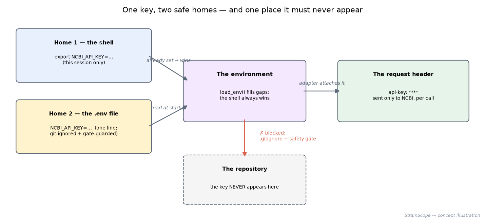
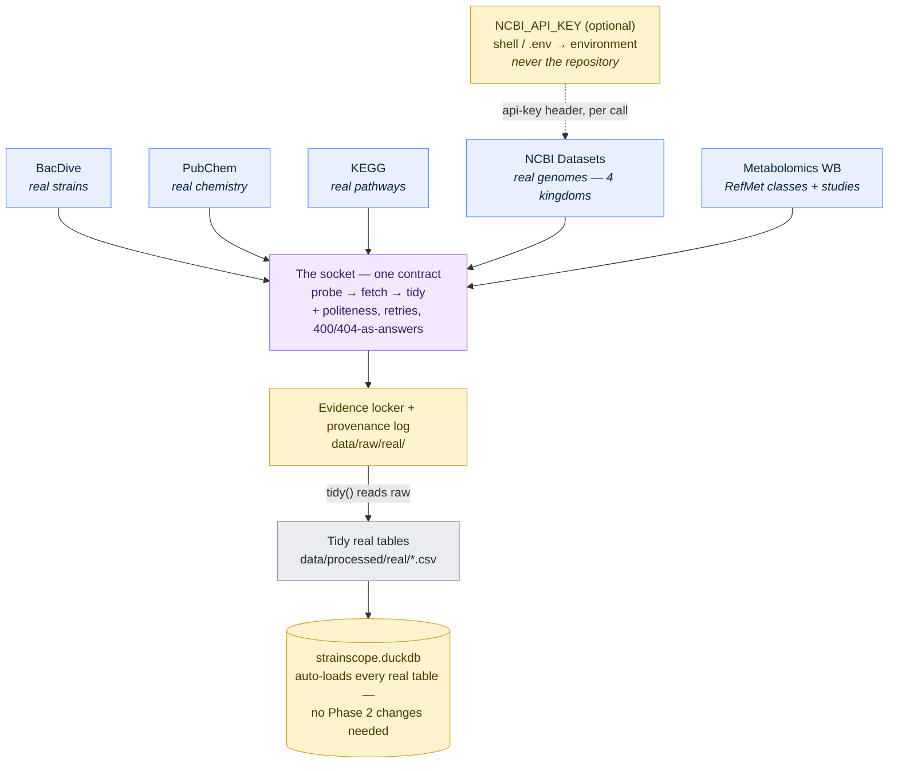

# 02c · Phase 1c — More real sources, and the secrets lesson (NCBI · Metabolomics Workbench)

[← Phase 2: cleaning & the database](03-harmonization-qc.md) · [All docs in order](../README.md#the-tutorial-in-order) · [Glossary](GLOSSARY.md)

**Prerequisites:** Phase 1b done (the ingestion framework exists and you've fetched with it once). Internet for the fetch steps; everything else works offline.
**Learning goal:** after this phase you will know how professionals handle **API keys and secrets** — the environment, the `.env` file, the `.env.example` pattern, and why a key can never reach Git; you'll have fetched **real genomes for all four kingdoms** (and seen with your own data that a fungal genome dwarfs a bacterial one); and you'll have pulled our metabolites' **official classifications** plus real studies from the NIH's metabolomics archive. Two new plugs go into the existing socket — and you'll watch the framework absorb them without touching anything else.
**Why this phase exists in a real workflow:** almost every data team touches an API that wants credentials, and leaked keys are among the most common (and most embarrassing) security failures in the industry. Learning the discipline on a key that's *optional and free* — NCBI's — means the stakes are zero and the habit is permanent. And the new data is the multi-kingdom payoff: BacDive could only speak for bacteria; NCBI's genome catalogue speaks for everyone.

**Session plan:**
- **Session A (~1–1.5 h):** concepts & the secrets lesson (§1–2) + meet the sources and touch them in a browser (§3–4) + files in, tests green (§5).
- **Session B (~1 h):** (optional) get your free key (§6) + probe, fetch, tidy (§7) + figures + checkpoint + commit (§8–12).

---

## 1. The secrets lesson (this phase's big idea)

**What is an API key?** A personal access code some services ask for — like a **membership card** for a library: the library is open to everyone, but the card lets them recognise you (and, here, serve you faster). NCBI's key is free, optional, and raises your allowance from 5 to 10 requests per second. We use it *because* it's low-stakes: the perfect place to build the habit that matters everywhere.

**The one iron rule: a secret never enters the repository.** Not in code, not in a config file, not in a commit "just for a second." A public repo is photographed forever (history, forks, caches) — and automated scrapers harvest exposed keys within *minutes*. So where does a key live? In the **environment** — the private set of named values every running program carries in its pockets. Two ways to put it there:

- **Home 1 — the shell, per session:** `export NCBI_API_KEY=abc123` before running. Gone when the terminal closes.
- **Home 2 — the `.env` file, per project:** one `KEY=VALUE` line in a file named `.env` at the project root. Our `load_env()` reads it at startup. And crucially: `.env` is in `.gitignore` **and** watched by `check-public-safe.sh` — two independent layers making the mistake physically hard.

If both homes define the key, **the shell wins** (already-set values are never overwritten) — so you can temporarily override the file without editing it.



**The `.env.example` pattern** (a professional habit you now own): since `.env` itself can't be committed, how does a stranger know what keys the project *can* use? You commit a **template** — `.env.example` — with the variable names and empty values plus instructions. They copy it to `.env` and fill in their own. Template public, values private.

## 2. Meet the two new sources

| | **NCBI Datasets** | **Metabolomics Workbench** |
|---|---|---|
| Who runs it | US NIH (NCBI) | US NIH |
| What it is | the world's central catalogue of **genome assemblies** | the open home of **metabolomics**: real studies + **RefMet**, the official names-and-classification register for metabolites |
| What we take | genome metadata for our genera across **all four kingdoms** — organism, assembly quality, genome length, GC % | RefMet entries for our metabolites (standard name, formula, exact mass, class ladder) + real studies whose titles mention our genera/habitat |
| Key needed | **Optional** — free key doubles the rate limit (the lesson) | No |
| The honest boundary | genome *metadata*, not matched multi-omics | classification + study catalogues, not matched outcomes |

**Why NCBI is the multi-kingdom win:** BacDive (Phase 1b) is bacteria-only by scope. NCBI covers all life — so `real_genomes.csv` will hold *Bacillus* **and** *Trichoderma* **and** *Pythium*, finally backing the whole multi-kingdom story with real records. And the genome lengths alone teach real biology: bacterial genomes run ~4–8 million letters; fungal ones ~30–40 million. You'll *see* that in your own fetched data.

**Why RefMet matters beyond names:** every entry carries a classification ladder (super-class → main class → sub-class) — chemistry's shelving system. "Beauvericin and destruxin sit on the same shelf" is exactly the kind of real relationship the knowledge-graph phase will draw edges from.

## 3. How the two plugs fit the socket



Note what *isn't* in this diagram: any change to Phase 2. The database loader was built to load "whatever is in `data/processed/real/`" — so the two new tables join it automatically the next time `harmonize.py` runs. Designing that in advance is why Tier 2 costs two files, not a refactor.

## 4. Touch the APIs with your bare hands (browser, no code)

1. **NCBI Datasets** — paste:
   ```
   https://api.ncbi.nlm.nih.gov/datasets/v2/genome/taxon/Trichoderma/dataset_report?page_size=2
   ```
   JSON comes back: a `reports` list (each with `accession`, `organism`, `assemblyInfo`, `assemblyStats` — find `totalLength` and marvel at the number) and a `totalCount` of how many *Trichoderma* genomes exist. Swap in `Bacillus` and compare the counts and lengths.

2. **Metabolomics Workbench (RefMet)** — paste:
   ```
   https://www.metabolomicsworkbench.org/rest/refmet/name/beauvericin/all
   ```
   A compact JSON entry: the standardised `refmet_name`, `formula`, `exactmass`, and the classification ladder (`super_class` / `main_class` / `sub_class`). Now try a name it *won't* know — the reply is an empty body, which by now you can read fluently: **an empty answer is an answer** (the KEGG lesson, again).

## 5. Get the Phase 1c files into your repo

| File | Goes in | Its job |
|---|---|---|
| `base.py` | `src/strainscope/sources/` | **replace** — gains `load_env()` (the `.env` reader) and a `headers` hook on `get()` |
| `ncbi_datasets.py` | `src/strainscope/sources/` | plug: real genomes, four kingdoms, optional key |
| `metabolomics_wb.py` | `src/strainscope/sources/` | plug: RefMet classes + real studies |
| `__init__.py` | `src/strainscope/sources/` | **replace** — the registry now lists five plugs |
| `.env.example` | project root | the committed template for optional secrets |
| `test_sources.py` | `tests/` | **replace** — three new tests (both tidies + the env loader) |
| `make_phase2c_figures.py` | `figures/` | the secrets illustration + post-fetch data figures |

Then:

```bash
ls src/strainscope/sources/ncbi_datasets.py src/strainscope/sources/metabolomics_wb.py \
   .env.example figures/make_phase2c_figures.py
pytest -q          # expected: 17 passed — before touching any network
```

**Read `ncbi_datasets.py` first** — it's the one that carries the key lesson, and its `_headers()` method is the entire secrets mechanism in six lines.

## 6. (Optional) get your free NCBI key — the lesson, hands-on

Everything works without this; do it for the habit (and the doubled rate limit).

1. Go to `https://www.ncbi.nlm.nih.gov/account/` and sign in / create a free account.
2. Open **Account settings** → **API Key Management** → create a key. Copy it.
3. In the project root: `cp .env.example .env`, then open `.env` and paste the key after `NCBI_API_KEY=`. Save.
4. **Prove the guards work** (the satisfying part):
   ```bash
   git status                    # .env must NOT appear — .gitignore at work
   ./check-public-safe.sh        # still ✓ — the gate confirms no secret is tracked
   ```
5. The next probe will greet you with `API key: found, 10 req/s allowed`.

> Never paste the key into `.env.example`, code, a doc, or a chat. If a key ever leaks, revoke it on the same NCBI page and make a new one — keys are disposable; reputations aren't.

## 7. Probe, fetch, tidy

```bash
python src/strainscope/fetch_real.py --probe --source ncbi_datasets
python src/strainscope/fetch_real.py --probe --source metabolomics_wb
```

**Expected shape** (live databases grow — **your numbers WILL differ**):

```
[ncbi_datasets] probing — real genomes per genus (API key: none — fine, 5 req/s)
  genus          kingdom    genomes available
  --------------------------------------------
  Bacillus       Bacteria        xx,xxx
  …
  Trichoderma    Fungi              xxx
  Pythium        Oomycete           xxx
  Saccharomyces  Yeast            x,xxx
  Metschnikowia  Yeast              xxx
  --------------------------------------------
  TOTAL                          xx,xxx

[metabolomics_wb] probe — 11 RefMet lookups + 4 study searches planned.
  API reachable: yes
```

Then the fetch (and automatic tidy):

```bash
python src/strainscope/fetch_real.py --source ncbi_datasets
python src/strainscope/fetch_real.py --source metabolomics_wb
```

Per source, expect: NCBI saving up to 25 genome reports per genus → `real_genomes.csv` (with a `kingdom` column — the tidy summary should say **4 kingdoms**); Metabolomics WB resolving most metabolites to RefMet entries (a `no RefMet entry (recorded)` or two is honest, not broken) → `real_refmet.csv` + `real_mw_studies.csv`. The provenance log grows as always:

```bash
tail -8 data/raw/real/fetch_log.csv
```

Finally, watch Phase 2 absorb the new tables **with zero changes**:

```bash
python src/strainscope/harmonize.py
```

The `Tables loaded:` line now ends with **7 real tables** — the four from Phase 1b plus `real_genomes`, `real_refmet`, `real_mw_studies`. Query one immediately:

```bash
python src/strainscope/sql.py "SELECT kingdom, COUNT(*) AS genomes, ROUND(AVG(genome_length_bp)/1e6,1) AS avg_Mb FROM real_genomes GROUP BY kingdom ORDER BY avg_Mb"
```

That `avg_Mb` column is the multi-kingdom biology, in your own real data: bacteria a few Mb, fungi an order of magnitude more.

## 8. See it (figures + interactive)

```bash
python figures/make_phase2c_figures.py
```

- **`real_genome_sizes.png`** — every fetched genome as a dot, by kingdom, log scale: the bacterial cloud sits low, the fungal cloud high. Real data teaching real biology.
- **▶ `docs/interactive/real_genomes.html`** — genome length vs GC content, coloured by kingdom; **hover any dot** for the organism, accession, and assembly level.
- **`real_refmet_classes.png`** — which chemistry "shelves" our metabolites occupy (lipopeptides cluster together — a preview of knowledge-graph edges).
- **`real_mw_studies.png`** — how many real studies mention each of our search words: proof that actual labs measure this exact chemistry.

## 9. Checkpoint — did the phase work?

1. Files landed (§5's `ls`), and `pytest -q` → **17 passed** *before* any fetching.
2. Both probes reach their APIs (with or without a key).
3. `real_genomes.csv` exists **and its tidy summary reports all four kingdoms**; `real_refmet.csv` has mostly `found` rows; `real_mw_studies.csv` is non-empty.
4. `harmonize.py` reports **7 real tables** loaded, untouched-code.
5. If you made a key: `git status` never shows `.env`, and the gate still passes.

## 10. What could go wrong (mini-FAQ)

- **One genus shows a tiny, implausible count (e.g. `Bacillus: 3`)** — a taxonomy name collision: NCBI holds another genus by the same name (for Bacillus: stick insects), and the bare-name query resolved to it. Query by taxid instead — see `TAXON_OVERRIDES` in the adapter; adding an override is one line.
- **The probe shows 0 genomes for every genus** — you're running an old copy of `ncbi_datasets.py` that read the documentation's camelCase field names; the live API answers in snake_case. Update the adapter (it now accepts both). The quick self-diagnosis: open §4's browser URL — if the browser shows a `total_count` while the probe says 0, it's parsing, not connectivity.
- **NCBI returns 404 on the probe URL** — NCBI has historically served this API under `/v2alpha/` before `/v2/`; if `/v2/` ever misbehaves, edit `BASE` in `ncbi_datasets.py` to `…/datasets/v2alpha` (one line) — the raw responses and everything downstream are unchanged. Live services move; adapters absorb.
- **`429 Too Many Requests`** — you've exceeded the rate (unlikely at our pace). Wait a minute; consider the free key (§6), which doubles your allowance.
- **The probe says `API key: none` although I made one** — the key isn't reaching the environment: is it in `.env` at the *project root*, named exactly `NCBI_API_KEY`, no quotes needed? (Or `export` it in the shell — remember the shell wins.)
- **A RefMet lookup returns `no RefMet entry`** — honest and expected for family-names; recorded, not hidden. (Pyoverdine, ever the family, may do this here too.)
- **Metabolomics WB returns something oddly shaped for studies** — one hit arrives as a flat record, many as a numbered dictionary; the adapter handles both. If a *new* shape ever appears, the raw JSON is in the evidence locker and `tidy()` is a small edit — the BacDive lesson, again.
- **`git status` shows `.env`!** — stop; do not commit. Check `.gitignore` contains the `.env` line (it does in this repo) and that you're in the project root. The safety gate is the second net: run it.

## 11. Notes from the build (kept on purpose)

- **The documentation spoke camelCase; the live API answers snake_case.** The first probe returned **0 genomes for every genus** — while the very same URL in a browser showed `"total_count": 277` for *Trichoderma*. The two views disagreeing is the diagnostic gold: the connection was fine, so the *parsing* had to be wrong. NCBI's docs render field names as `totalCount`/`assemblyInfo`; the API itself sends `total_count`/`assembly_info` (and genome lengths as *strings*). RefMet pulled the same trick in miniature: docs suggest `refmet_name`, the live entry says `name`. Both adapters now accept either form, and the canned tests mirror the live shapes. **Lessons:** (1) documentation describes, the live response decides — the BacDive lesson, now a pattern; (2) when a probe returns implausible zeros, compare it against the same URL in a browser: identical-URL-different-answer isolates a parsing bug from a connectivity one in thirty seconds.
- **The tidy summary said "3 kingdoms" — and thereby confessed a missing one.** The first genome fetch printed `200 real genome records, 3 kingdoms`: no Yeast, because the genus list simply lacked yeast genera — quietly contradicting this doc's own "all four kingdoms" promise. The fix added *Saccharomyces*, *Metschnikowia* and *Aureobasidium* (the latter two are real commercial biocontrol yeasts). **Lesson:** put small self-describing summaries ("N rows, K kingdoms") on every output — they cost one line and catch incompleteness that no error message ever would, because *nothing was wrong*, something was merely absent.
- **Three genomes for the most-sequenced genus on Earth — the sniff test, then the stick insects.** The first live probe reported `Bacillus: 3`, an absurdity that demanded investigation rather than acceptance. The cause: NCBI's taxonomy contains *two* genera named "Bacillus" — the famous bacteria, and a genus of **stick insects** — and queried by bare name, the API resolved to the insects. Left unfixed, three stick-insect genomes would have entered `real_genomes.csv` labelled "Bacteria." The fix is the glossary's own rule made real — **IDs beat names**: ambiguous genera now query by permanent taxonomy ID (Bacillus → taxid 1386), with the readable name kept for display. **Lessons:** (1) implausible numbers are invitations, not answers — a probe exists precisely so absurdities surface before data lands; (2) names are for humans, IDs are for queries, and biology's naming collisions (bacteria vs stick insects!) are exactly why.
- **The key travels through one narrow door.** Rather than sprinkling key-handling through the code, the environment is read in exactly one place (`load_env()` + `_headers()`), and the socket's `get()` gained a single optional `headers` hook. **Lesson:** secrets should have the smallest possible surface area — one reader, one attach point, everything else ignorant of them.
- **The framework absorbed two sources without a single change elsewhere.** No edits to `fetch_real.py`, the provenance log, the database loader, or Phase 2 — two new files plus two registry lines. **Lesson:** the "one socket, many plugs" investment pays off precisely here; good architecture is measured by what you *don't* have to touch.
- **The live APIs couldn't be pre-tested from the build environment** — same constraint as Phase 1b, same response: defensive parsing, raw responses always saved, canned-response tests offline, and the expected outputs written as *shapes* ("your numbers WILL differ"). The first live run on your machine is part of the process — and after Phase 1b's three bumps, both of us know how that goes and why it's fine.

## 12. Two ways to run everything (running tally)

| Capability | Manual path (now) | Automatic path (later) |
|---|---|---|
| Generate synthetic data | `python src/strainscope/generate_data.py` | the one-command pipeline (Phase 7) |
| Probe / fetch real data — **now five sources** | `python src/strainscope/fetch_real.py [--probe] [--source …]` | the app's **Upload · Synthetic · Fetch-real** picker, per source |
| Manage an API key | `.env` (from `.env.example`) or `export` | the deployed app's secrets console (Phase 8 — same idea, hosted) |
| Clean + build the database | `python src/strainscope/harmonize.py` | runs automatically inside the pipeline |
| Question the data | `python src/strainscope/sql.py` + the [Cookbook](QUERY_COOKBOOK.md) | the app's SQL console, cookbook built in |

## 13. Same task, different language (optional, 5 min)

The NCBI call as a raw `curl` — worth seeing once, because this is how engineers poke APIs from any terminal on Earth, and it shows a header being attached by hand:

```bash
curl -s "https://api.ncbi.nlm.nih.gov/datasets/v2/genome/taxon/Bacillus/dataset_report?page_size=1" \
     -H "api-key: $NCBI_API_KEY" | head -c 400
```

(Without a key, drop the `-H` line — it works the same, just rate-limited lower.) `curl` speaks HTTP and nothing else; Python's `requests` is the same conversation with a friendlier accent. Notice `$NCBI_API_KEY` — even on the command line, the key comes from the *environment*, never typed inline where shell history would record it.

## 14. Save your work (commit ritual + safety gate)

```bash
pytest -q                     # 17 passed
./check-public-safe.sh        # ✓ — and now you know two of the things it's guarding
git switch develop
git add -A
git commit -m "feat: add NCBI Datasets and Metabolomics Workbench adapters with API-key handling"
git push origin develop develop:beta develop:master
git switch master && git pull --ff-only origin master && git switch develop
```

`git status` before committing: code, docs, figures, and `.env.example` — **never `.env`**.

## 15. What you learned, and what's next

**You learned:** how secrets are really handled — the environment, `.env` vs the shell, the `.env.example` template, one-narrow-door key plumbing, and the two independent guards that make the classic leak physically hard; that a free, optional key is the right place to build a permanent habit; and, in data: real genomes across all four kingdoms (with fungal-vs-bacterial genome sizes seen in your own fetch), the RefMet classification ladder, and real studies measuring this chemistry. Plus a structural lesson: the framework took two new sources without touching anything else — architecture measured by what stays still.

**Tier 3, honestly scoped:** MGnify (environmental microbiomes) and ENA (raw sequence archives) remain roadmap — both are heavyweights (nested pagination; large files) that deserve proper treatment when the app and deployment phases can use them, not a rushed adapter now.

**Next:** [`04-integration.md`](04-integration.md) — **Phase 3**, the specialised heart: multi-omics **integration** (DIABLO in R via mixOmics — what setup installed it for — plus a Python companion), finding the cross-layer signatures that separate the winners from the rest.
