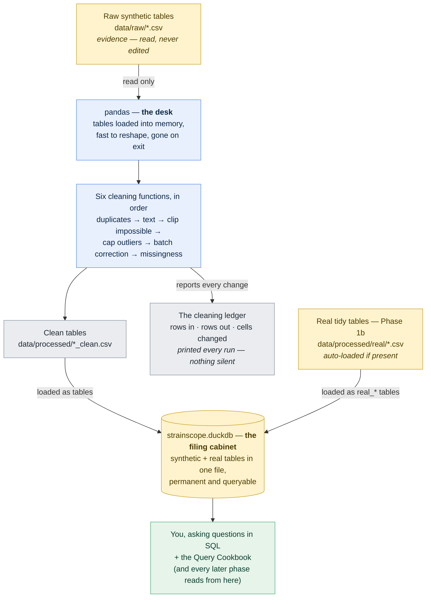
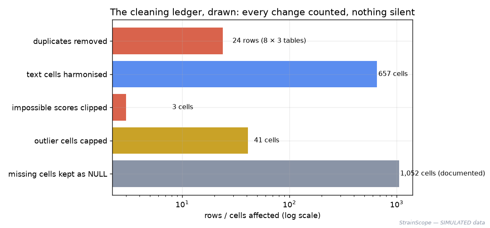
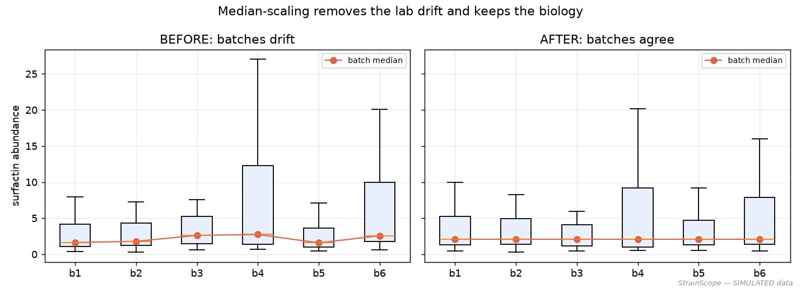
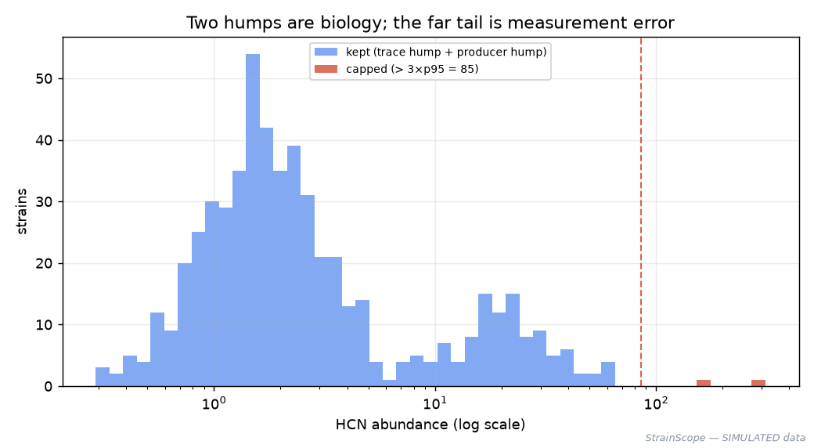
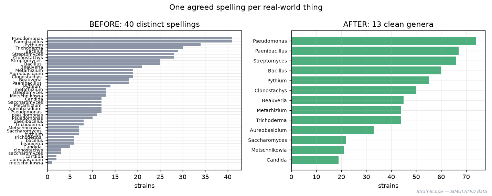
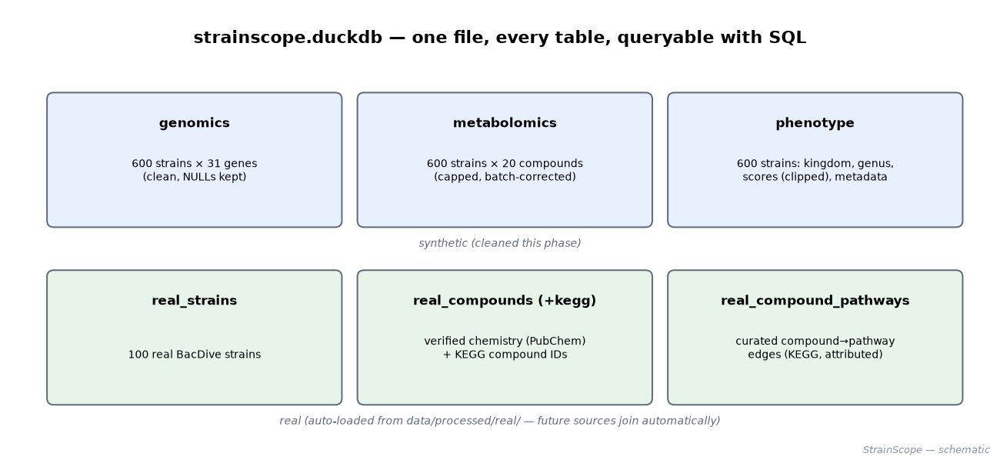

# 03 · Phase 2 — Cleaning the mess & building the database (DuckDB + SQL)

[← Phase 1b: real data](02b-real-data-ingestion.md) · [All docs in order](../README.md#the-tutorial-in-order) · [Glossary](GLOSSARY.md) · [Query Cookbook](QUERY_COOKBOOK.md)

**Prerequisites:** Phase 1 complete (the raw synthetic tables exist — rerun `python src/strainscope/generate_data.py` if `data/raw/` is empty). Phase 1b is a bonus, not a requirement: if you fetched real data, it joins the database automatically; if not, everything here still works.
**Learning goal:** after this phase you will understand why raw data is *evidence* that must never be edited; how professionals clean data — rules written in English first, every change counted in a **ledger**, decisions justified; what a **database** is and why analysts keep one next to their dataframes; and enough **SQL** to question 600 strains in one line. You'll also watch a textbook cleaning rule *fail* on our data — and learn the deeper lesson that failure teaches.
**Why this phase exists in a real workflow:** models trained on dirty data learn the dirt. Duplicates inflate counts, batch drift masquerades as biology, one spiked reading drags averages, and two spellings of one genus split every statistic in half. Cleaning is where analysis earns its trustworthiness — and the ledger is how you *prove* nothing was changed silently.

**Session plan:**
- **Session A (~1–1.5 h):** concepts (§1–2) + the cleaning rules in English (§3) + read the engine (§4) + run it and study the ledger (§5).
- **Session B (~1–1.5 h):** the figures (§6) + meet the database and run your first SQL (§7, with the [Query Cookbook](QUERY_COOKBOOK.md)) + tests + checkpoint + commit (§8–13).

> **How this guide works:** every action step tells you what **You should see**, **What it means**, and — when things can wobble — **If instead**. Nothing should surprise you.

---

## 1. Concepts, plainly

**Raw data is evidence; cleaning produces new files.** Everyday analogy: a crime-scene photo. You can *annotate a copy*; you never draw on the original. Our raw CSVs in `data/raw/` are never edited — cleaning reads them and writes *new* files into `data/processed/`. That's why cleaning can be re-run forever (and why mistakes cost nothing).

**The desk and the filing cabinet.** When Python loads a table with pandas, it sits in memory — papers spread on your **desk**: fast to shuffle, gone when you stand up, and only you can see them. A **database** is the **filing cabinet**: organised, permanent, shared, and equipped with a precise question-asking language (**SQL**). Analysts use both — desk for wrangling, cabinet for storing and querying. Our cabinet is **DuckDB**: a full SQL database that lives in *one ordinary file* (`strainscope.duckdb`), needs no server or installation drama, and is built for analysis. ("A filing cabinet you can zip up and email.")

**SQL, in one breath.** A ~50-year-old language for asking tables questions, and still the single most-demanded data skill. It reads almost like English: `SELECT kingdom, COUNT(*) FROM phenotype GROUP BY kingdom` = *"for each kingdom, count the strains."* You'll run real queries in §7; the [Query Cookbook](QUERY_COOKBOOK.md) collects them from now on.

**NULL — the honest gap.** In a database, a missing value isn't zero and isn't an empty string; it's `NULL`, a first-class "no value here." Keeping gaps as NULLs (instead of quietly filling them) is how the database stays honest about what was never measured.

**The ledger.** Every cleaning step reports rows in, rows out, and cells changed. It's the project's accounting: if a number in a later chart looks odd, the ledger says exactly what cleaning did and didn't touch. You'll see it *catch a real bug* in §5's "notes from the build."

**Idempotent** (a word worth owning): run the cleaning twice → identical result. No accumulation, no drift. Everything in this phase is idempotent, which is what makes it safe to re-run casually.

## 2. The data round trip



Read it top to bottom: raw files are **read, never modified** (evidence stays evidence); the desk holds them while the six functions clean in order, with every change reported to the **ledger**; the clean tables — joined by any real Phase 1b tables — land in the **cabinet**, and from that one file, you (and every later phase) ask questions.

## 3. The cleaning rules — in English, before any code

Six rules, in a deliberate order. Each exists because Phase 1 planted a specific, known mess (that's the beauty of synthetic data: we *know* the dirt, so we can check our cleaning catches it).

1. **Remove duplicate strains first** (8 strains recorded twice). Duplicates distort every count and statistic computed after them — so de-duplication always leads. Keep the first occurrence (with exact duplicates the choice is cosmetic; stating it makes the rule reproducible).
2. **Harmonise the text**: strip stray spaces, unify case (genera Title-case, sites lower-case), then fix known typos from a *written-down list* (`Psuedomonas → Pseudomonas`) — never by guessing. One agreed spelling per real-world thing.
3. **Clip impossible scores**: a suppression *percentage* can't be below 0 or above 100; the 3 values outside get clipped to the boundary. Clip, don't delete — the strain is real, only the reading overshot.
4. **Cap the outlier spikes** — *after* much thought; see the notes-from-the-build, because the textbook rule fails here. Final rule: per metabolite, cap anything above **3 × its 95th percentile** ("three times the upper edge of plausible production is an artifact, not biology").
5. **Correct the batch effect** — per batch, per metabolite, divide by (batch median ÷ overall median), so a batch running 15 % hot is cooled by exactly 15 %. Medians, not means, so leftover extremes can't drag the correction. **Order matters:** this runs *after* outlier capping, or one spike could poison its whole batch's factor.
6. **Count the missing values — and leave them missing.** 338 gene cells + 714 metabolite cells become proper `NULL`s. Filling gaps (*imputation*) bakes in assumptions that depend on the downstream method, so it's a **modelling** decision made openly later — cleaning's job is to make missingness *visible and counted*, not to hide it.

### What we deliberately do NOT do (documented honesty)

- **No imputation** (rule 6 — it belongs to modelling).
- **No removal of the undetectable spikes.** A spike of a *trace* value lands inside the legitimate producer range — indistinguishable from real production without gene context. We cap what's provably absurd and *tell the modelling phases* the rest exists.
- **No editing of raw files, ever.**
- **No "fixing" of the class imbalance** — 24 % effective is the truth of the data; handling imbalance is a modelling technique, not a cleaning one.

## 4. Get the Phase 2 files into your repo

| File | Goes in | Its job |
|---|---|---|
| `harmonize.py` | `src/strainscope/` | the cleaning engine: six documented functions + the ledger + the DuckDB loader |
| `test_harmonize.py` | `tests/` | seven offline tests — one per cleaning behaviour, ledger included |
| `make_phase2_figures.py` | `figures/` | before/after evidence figures + the interactive comparison |
| `QUERY_COOKBOOK.md` | `docs/` | tested, ready-to-run SQL recipes (grows every phase) |
| `sql.py` | `src/strainscope/` | the project's **SQL console** — run any query, read-only, no installation |

**Files-landed check:**

```bash
ls src/strainscope/harmonize.py src/strainscope/sql.py tests/test_harmonize.py \
   figures/make_phase2_figures.py docs/QUERY_COOKBOOK.md
```

**Read the engine before running it.** Open `src/strainscope/harmonize.py` top to bottom. It's written to be read: the golden rules at the top, then one function per cleaning rule — each docstring explains *why*, not just *what*. Ten minutes here is the phase's best investment.

## 5. Run the cleaning

```bash
python src/strainscope/harmonize.py
```

**You should see** (exact numbers — fixed seed):

```
  wrote data/processed/genomics_clean.csv  (600 rows, 32 columns)
  wrote data/processed/metabolomics_clean.csv  (600 rows, 21 columns)
  wrote data/processed/phenotype_clean.csv  (600 rows, 9 columns)

  ── Cleaning ledger — every change, counted ─────────────────
  drop_duplicates        genomics      608→600 rows (−8)           0 cells   8 duplicate strain rows removed
  drop_duplicates        metabolomics  608→600 rows (−8)           0 cells   8 duplicate strain rows removed
  drop_duplicates        phenotype     608→600 rows (−8)           0 cells   8 duplicate strain rows removed
  harmonize_text         phenotype     600→600 rows              657 cells   stripped spaces, unified case, fixed known typos
  clip_impossible        phenotype     600→600 rows                3 cells   3 scores clipped into [0, 100]
  cap_outliers           metabolomics  600→600 rows               41 cells   values above 3.0×p95 capped (41 cells); moderate spikes are indistinguishable from real producers — documented
  correct_batch          metabolomics  600→600 rows            12000 cells   per-batch median-scaling toward the overall median
  account_missing        genomics      600→600 rows              338 cells   338 missing cells kept as NULL …
  account_missing        metabolomics  600→600 rows              714 cells   714 missing cells kept as NULL …
  account_missing        phenotype     600→600 rows                0 cells   0 missing cells kept as NULL …
  ────────────────────────────────────────────────────────────

  Database: data/processed/strainscope.duckdb
  Tables loaded: genomics, metabolomics, phenotype, real_compound_pathways, real_compounds, real_kegg_compounds, real_strains
  (4 real table(s) auto-loaded from data/processed/real/ — future sources join automatically)
```

**What it means, line by line:** the 8 duplicates Phase 1 planted are gone from every table (608→600 — the counts *reconcile with the known mess*, which is the whole point of a ledger). 657 text cells were harmonised. The 3 impossible scores are clipped. Only **41** outlier cells were capped — see the notes below for why that small number is the *correct* one. The batch step touches all 12,000 metabolite cells (every value gets its batch's scaling). And 1,052 missing cells are counted, kept, and explained.

**If instead** your `Tables loaded` line shows only the three synthetic tables and `0 real table(s)`: you haven't run Phase 1b's fetch (or its tables are elsewhere). That's fine — everything in this phase works; the real tables simply join whenever you fetch.

### Notes from the build (kept on purpose) — the ledger catches a bug

- **The textbook outlier rule would have flattened the biology — and the ledger caught it.** The first version used the classic fence (Q3 + 5×IQR, the rule most courses teach). The ledger reported **779 capped cells** against a *known* injected mess of ~120 spikes — the numbers didn't reconcile, and that discrepancy was the alarm. Investigation showed why: our abundances are **bimodal** (a trace hump for strains without the producing gene, a producer hump for strains with it), and for weapons carried by only one kingdom the quartiles sit inside the trace hump — putting the fence *below* the genuine producers and capping real biology wholesale. The fix judges extremes against the *upper edge* instead (3 × p95), which caps 41 provably-absurd cells and spares both humps. **Lessons, in order of importance:** (1) a ledger isn't bureaucracy — reconciling its counts against what you *know* is how silent damage gets caught; (2) textbook rules carry silent assumptions (one-humped data) that real data violates; (3) when you *know* the planted mess, you can grade your own cleaning — one of synthetic data's quiet superpowers.
- **Some corruption is honestly undetectable at cleaning time.** The injected spikes multiplied *whatever value was there*; a spiked trace value lands at ~16 — squarely inside the legitimate producer range. No cleaning rule can catch those without using gene information (which would entangle cleaning with modelling). So they stay, *documented*, and the modelling phases are told. **Lesson:** great cleaning isn't removing everything suspicious — it's knowing precisely what you can and cannot justify touching.
- **Integer columns bite.** A test table with whole numbers made the batch-correction crash: scaling produces decimals, and modern pandas refuses to write decimals into an integer column. The function now coerces to float first — because a user-uploaded CSV of whole numbers would parse as integers too. **Lesson:** tests with *unrealistically simple* data find real bugs; that's a feature of tiny hand-made test tables, not an accident.

## 6. See the evidence (figures + interactive)

```bash
python figures/make_phase2_figures.py
```

### The ledger, drawn



Everything cleaning did, on one log-scale chart — from 3 clipped scores to 1,052 documented NULLs. If a reviewer asks "what did cleaning change?", this is the answer.

### The batch drift, removed



Left: the six batches disagree — the red median line wanders (that's the lab drift Phase 1 injected). Right: after median-scaling, the medians sit level, while the *spread within each batch* — the actual biology — survives untouched. **▶ Interactive version:** [`docs/interactive/batch_before_after.html`](interactive/batch_before_after.html) — flip between BEFORE and AFTER with the buttons and watch the medians snap into line.

### Two humps are biology; the far tail is error



The picture behind the notes-from-the-build story: HCN's distribution on a log scale. The two blue humps are *real* — trace producers and gene-carrying producers. Only the far-right red tail (beyond 3×p95, dashed line) gets capped. A fence between the humps — where the textbook rule landed — would have been a massacre.

### One voice per genus



Left: the raw genus column's many spellings (trailing spaces, case chaos, the typo). Right: the clean set of genera, one bar each. Every downstream group-by, count, and chart depends on this step having happened.

### What the cabinet now holds



The whole database at a glance: three cleaned synthetic tables (blue) and the real tables from Phase 1b (green), side by side in one file — *deliberately* one file, so a single SQL query can reach across both worlds.

## 7. Meet the database — your first SQL

The cabinet is built; now ask it questions. The project ships its own **SQL
console** — read-only, so nothing you type can break or lock anything:

```bash
python src/strainscope/sql.py
```

**You should see** a `sql>` prompt. Ask your first question:

```
sql> SELECT kingdom, COUNT(*) AS n FROM phenotype GROUP BY kingdom;
```

Helpers worth knowing: `.tables` lists every table, `.schema phenotype` lists a
table's columns, `exit` leaves. **Multi-line statements are welcome** — paste a
whole cookbook recipe and it runs when a line ends with `;` (the `  ->`
continuation prompt shows the console is still listening; an empty line also
runs whatever's buffered). A typo just prints the error and the prompt
returns — experiment freely. (One-shot mode works too:
`python src/strainscope/sql.py "SELECT ..."`.)

**Under the hood** the console is ~40 lines around DuckDB's Python interface —
the same thing you can do by hand in any Python session, which is how the app
will do it later:

```python
import duckdb
con = duckdb.connect("data/processed/strainscope.duckdb", read_only=True)
con.execute("SELECT kingdom, COUNT(*) AS n FROM phenotype GROUP BY kingdom").fetchdf()
# ... keep querying `con` as long as you like ...
```

> **The one rule of connections:** a connection is an open phone line, and
> `con.close()` hangs up. A closed connection **stays** closed — trying to use
> it raises `Connection already closed!`, and the fix is simply to *dial
> again* (run the `duckdb.connect(...)` line to make a new one). Close when
> you're genuinely done exploring, not between queries. (The console manages
> all of this for you — another reason it's the recommended front door.)

**You should see** the four kingdoms with 267/183/95/55 — matching Phase 1's ledger exactly, which is itself a check: *cleaning preserved the biology*.

Now the one that shows why databases earn their keep — three tables, one question:

```python
con.execute("""
    SELECT p.strain_id, p.kingdom, p.suppression_score, g.ituA, m.iturin
    FROM phenotype p
    JOIN genomics g USING (strain_id)
    JOIN metabolomics m USING (strain_id)
    WHERE p.is_effective = 1
    ORDER BY p.suppression_score DESC LIMIT 5
""").fetchdf()
```

**What it means:** the top strains all show `ituA = 1` and high iturin — the hidden signal Phase 1 planted, surfacing through five lines of SQL before any model exists. When you're done: `con.close()`.

From here, work through the **[Query Cookbook](QUERY_COOKBOOK.md)** — every recipe is tested, explained in English, and includes the queries that reach into the *real* tables (your BacDive strains, the PubChem chemistry, the KEGG edges).

## 8. The tests

```bash
pytest -q
```

**You should see:** `14 passed` — Phase 1b's six ingestion tests plus seven new ones, one per cleaning behaviour: duplicates, text (space/case/typo), clipping, the bimodality-safe outlier cap, batch-median equalisation, the DuckDB loader's real-table auto-load, and idempotency (build the database twice → identical). As always, they run offline in under a second, on tiny hand-made dirty tables.

## 9. Two ways to run everything (running tally)

| Capability | Manual path (now) | Automatic path (later) |
|---|---|---|
| Generate synthetic data | `python src/strainscope/generate_data.py` | the one-command pipeline (Phase 7) |
| Probe / fetch real data | `python src/strainscope/fetch_real.py [--probe]` | the app's **Upload · Synthetic · Fetch-real** picker |
| **Clean + build the database** | `python src/strainscope/harmonize.py` | runs automatically inside the pipeline |
| **Question the data** | the SQL console: `python src/strainscope/sql.py` + the [Cookbook](QUERY_COOKBOOK.md) | the app's SQL console (Phase 6), cookbook built in |
| Make the figures | `python figures/make_phase2_figures.py` (etc.) | regenerated on demand; interactive in the app |

## 10. Same task, different language (optional, 10 min)

*"Remove duplicate strains, then count per kingdom"* — in the two tools this phase joined together:

**pandas (the desk):**
```python
import pandas as pd
(pd.read_csv("data/raw/phenotype.csv")
   .drop_duplicates("strain_id")
   .groupby("kingdom").size())
```

**SQL (the cabinet):**
```sql
SELECT kingdom, COUNT(*) AS n
FROM (SELECT DISTINCT ON (strain_id) * FROM 'data/raw/phenotype.csv')
GROUP BY kingdom;
```
*(DuckDB can query a CSV file directly — a party trick worth knowing. Paste it into the console from the project root; the `;` on the last line is what tells the console the statement is complete.)*

Same answer both ways. The honest trade-off: pandas shines for *transforming* (our cleaning functions are pandas); SQL shines for *questioning* what's stored — and for being the language every data team, tool, and warehouse already speaks. This project uses each where it's strongest, which is exactly what you'd do on a job.

## 11. What could go wrong (mini-FAQ)

- **`FileNotFoundError: data/raw/genomics.csv`** — Phase 1's data isn't there (fresh clone, or you cleaned up). Regenerate: `python src/strainscope/generate_data.py` — same seed, identical data.
- **`ModuleNotFoundError: No module named 'duckdb'`** — venv not active, or requirements not installed: `pip install -r requirements.txt`.
- **My ledger numbers differ from §5's.** Almost always the raw data was generated with a modified seed or an older generator. Regenerate with the committed `generate_data.py` (SEED = 42) and re-run — cleaning is idempotent, so this is free.
- **`0 real table(s)` loaded** — Phase 1b hasn't been fetched on this machine. Optional; run `python src/strainscope/fetch_real.py` whenever, then re-run `harmonize.py` and the tables appear.
- **`database is locked` or similar when re-running `harmonize.py`** — some session holds the file open for *writing*. (The SQL console can't be the culprit — it opens read-only.) Close stray Python sessions and re-run.
- **I pasted a multi-line query and got several strange errors, one per line** — you're on an old copy of `sql.py` (the first version executed line-by-line). Update to the current console: it buffers until a `;` or an empty line completes the statement.
- **`No files found that match the pattern "data/raw/…"`** — the query reads a CSV by *relative* path, so start the console from the project root (the folder with `docs/` in it).
- **`Connection Error: Connection already closed!`** — you ran `con.close()` (perhaps as the last line of a pasted snippet) and then queried the same `con`. Closed connections can't be revived; make a new one: rerun the `duckdb.connect(...)` line, then your query. The SQL console avoids this entirely.
- **The interactive HTML shows only one view** — you're looking at the static PNG; the buttons live in `docs/interactive/batch_before_after.html` (double-click to open in a browser).

## 12. Save your work (commit ritual + safety gate)

```bash
pytest -q                     # 14 passed
./check-public-safe.sh        # ✓ SAFE TO PUSH  (the .duckdb file is gitignored — data is regenerated, never committed)
git switch develop
git add -A
git commit -m "feat: add cleaning pipeline with ledger and DuckDB database; seed the SQL cookbook"
git push origin develop develop:beta develop:master
git switch master && git pull --ff-only origin master && git switch develop
```

## 13. What you learned, and what's next

**You learned:** raw data is evidence, cleaning writes new files; the six cleaning rules and *why their order matters*; the ledger habit — and you watched it catch a real bug that a textbook rule caused; why bimodal data breaks one-humped rules; what honestly *can't* be cleaned and how to document it; the desk-vs-cabinet mental model; and enough SQL to filter, group, join, and respect `NULL` — with a tested cookbook to grow from.

**Try it yourself (extensions):**
- In §7's session, find the *worst* effective strain (`ORDER BY … ASC LIMIT 1`) and look at its genes — what's it winning with?
- Change the outlier `mult` from 3.0 to 1.5 in `harmonize.py`, re-run, and watch the ledger count jump — then look at `outliers_capped.png` to see *what* you'd be flattening. (Put it back.)
- Write one cookbook query of your own — e.g. effective rate per `collection_site` — and add it to `QUERY_COOKBOOK.md`. It's your cookbook now.

**Next:** [`04-integration.md`](04-integration.md) — **Phase 3**, where the layers stop being separate tables: multi-omics **integration** (DIABLO in R, with a Python companion) finds the cross-layer signatures that separate winners from the rest — the specialised heart of the project.
